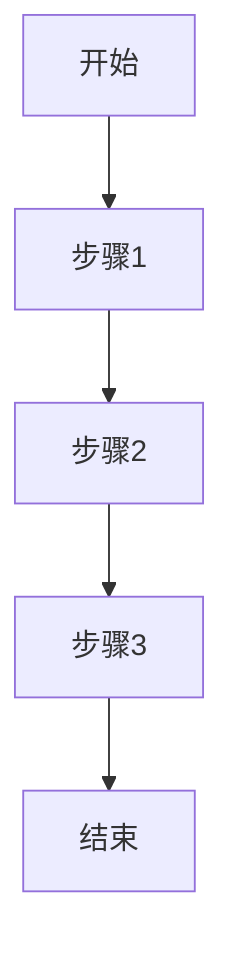
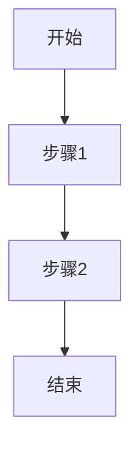

# 产品需求文档 (PRD) - [项目名称]

## 1. 项目背景与愿景

### 1.1 项目概述
- **项目名称**: [项目名称]
- **版本**: v1.0
- **创建日期**: [日期]
- **最后更新**: [日期]

### 1.2 问题背景
[描述项目要解决的核心问题和市场机会]

### 1.3 产品愿景
[描述产品的长期愿景和最终目标]

### 1.4 项目范围
- **包含内容**: [明确包含的功能和特性]
- **排除内容**: [明确排除的功能和特性]

## 2. 目标用户画像与场景

### 2.1 主要用户画像

#### 用户画像 1: [用户类型]
- **基本信息**: 年龄、职业、技术水平等
- **目标和动机**:
- **痛点描述**:
- **使用场景**:
- **技术能力**:

#### 用户画像 2: [用户类型]
- **基本信息**: 年龄、职业、技术水平等
- **目标和动机**:
- **痛点描述**:
- **使用场景**:
- **技术能力**:

### 2.2 用户场景分析

#### 场景 1: [场景名称]
- **触发条件**:
- **用户目标**:
- **操作步骤**:
- **期望结果**:

#### 场景 2: [场景名称]
- **触发条件**:
- **用户目标**:
- **操作步骤**:
- **期望结果**:

## 3. 产品目标与成功指标

### 3.1 业务目标
- **主要目标**: [核心业务目标]
- **次要目标**: [辅助业务目标]

### 3.2 用户目标
- **核心价值**: [为用户提供的核心价值]
- **用户满意度**: [期望达到的用户满意度水平]

### 3.3 成功指标 (KPIs)

#### 3.3.1 业务指标
- **用户增长率**: [具体指标和目标值]
- **活跃用户数**: [具体指标和目标值]
- **转化率**: [具体指标和目标值]
- **收入指标**: [具体指标和目标值]

#### 3.3.2 产品指标
- **功能使用率**: [具体指标和目标值]
- **用户留存率**: [具体指标和目标值]
- **任务完成率**: [具体指标和目标值]
- **错误率**: [具体指标和目标值]

#### 3.3.3 技术指标
- **系统性能**: [具体指标和目标值]
- **可用性**: [具体指标和目标值]
- **响应时间**: [具体指标和目标值]

## 4. 功能列表与优先级

### 4.1 功能优先级定义
- **P0 - 必须有**: 核心功能，产品发布必须具备
- **P1 - 应该有**: 重要功能，尽快实现
- **P2 - 可以有**: 期望功能，资源允许时实现
- **P3 - 暂不考虑**: 延期功能，后续版本考虑

### 4.2 核心功能 (P0)

#### 功能 1: [功能名称]
- **功能描述**:
- **用户价值**:
- **技术要求**:
- **验收标准**:

#### 功能 2: [功能名称]
- **功能描述**:
- **用户价值**:
- **技术要求**:
- **验收标准**:

### 4.3 重要功能 (P1)

#### 功能 3: [功能名称]
- **功能描述**:
- **用户价值**:
- **技术要求**:
- **验收标准**:

### 4.4 期望功能 (P2)

#### 功能 4: [功能名称]
- **功能描述**:
- **用户价值**:
- **技术要求**:
- **验收标准**:

## 5. 用户流程与线框图

### 5.1 核心用户流程

#### 流程 1: [流程名称]


**流程说明**:
1. **步骤1**: [详细说明]
2. **步骤2**: [详细说明]
3. **步骤3**: [详细说明]

#### 流程 2: [流程名称]


**流程说明**:
1. **步骤1**: [详细说明]
2. **步骤2**: [详细说明]

### 5.2 页面线框图

#### 页面 1: [页面名称]

**布局结构**:
```
┌─────────────────────────────────┐
│           Header                │
├─────────────────────────────────┤
│ Sidebar │     Main Content      │
│         │                       │
│         │                       │
│         │                       │
├─────────────────────────────────┤
│           Footer                │
└─────────────────────────────────┘
```

**主要元素**:
- **导航**: [导航元素说明]
- **主要内容**: [内容区域说明]
- **交互元素**: [按钮、表单等交互元素]

#### 页面 2: [页面名称]

**布局结构**:
```
┌─────────────────────────────────┐
│           Header                │
├─────────────────────────────────┤
│                                 │
│        Main Content             │
│                                 │
│                                 │
├─────────────────────────────────┤
│           Footer                │
└─────────────────────────────────┘
```

**主要元素**:
- **主要内容**: [内容区域说明]
- **交互元素**: [按钮、表单等交互元素]

### 5.3 交互设计要点

#### 交互模式 1: [交互名称]
- **触发条件**:
- **操作步骤**:
- **系统响应**:
- **用户反馈**:

#### 交互模式 2: [交互名称]
- **触发条件**:
- **操作步骤**:
- **系统响应**:
- **用户反馈**:

## 6. 技术要求与约束

### 6.1 技术栈
- **前端技术**: [技术栈列表]
- **后端技术**: [技术栈列表]
- **数据库**: [数据库技术]
- **第三方服务**: [服务列表]

### 6.2 性能要求
- **响应时间**: [具体要求]
- **并发用户**: [具体要求]
- **数据处理**: [具体要求]

### 6.3 兼容性要求
- **浏览器支持**: [支持的浏览器版本]
- **移动设备**: [支持的设备类型]
- **操作系统**: [支持的操作系统]

## 7. 风险与约束

### 7.1 技术风险
- **风险描述**: [具体风险]
- **影响程度**: [高/中/低]
- **缓解措施**: [具体措施]

### 7.2 业务风险
- **风险描述**: [具体风险]
- **影响程度**: [高/中/低]
- **缓解措施**: [具体措施]

### 7.3 时间约束
- **发布时间**: [具体时间要求]
- **里程碑**: [重要里程碑]

## 8. 附录

### 8.1 术语表
- **术语1**: [定义]
- **术语2**: [定义]

### 8.2 参考文档
- [相关文档链接或说明]

### 8.3 变更记录
| 版本 | 日期 | 变更内容 | 变更人 |
|------|------|----------|--------|
| v1.0 | [日期] | 初始版本 | [姓名] |