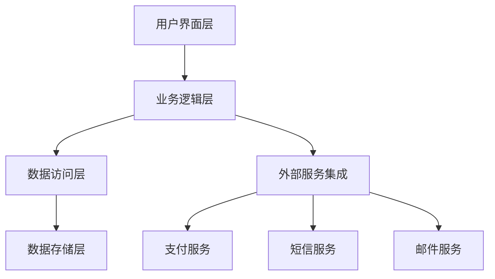
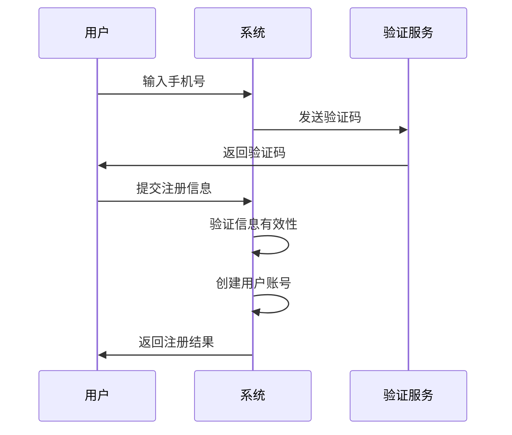
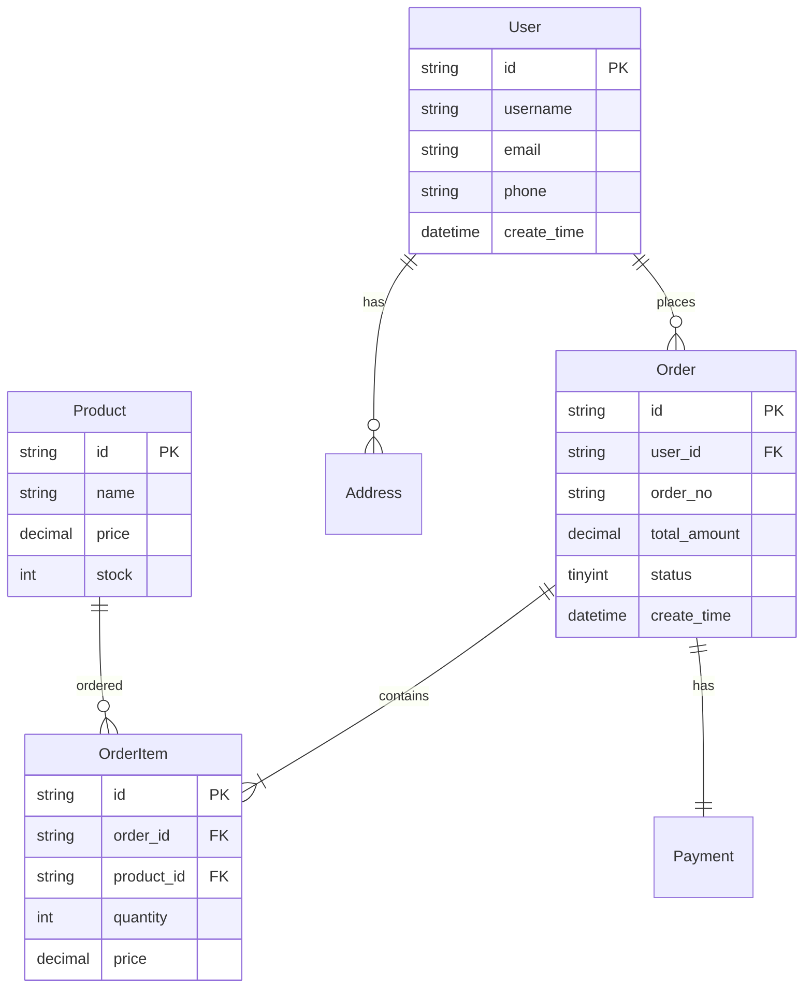
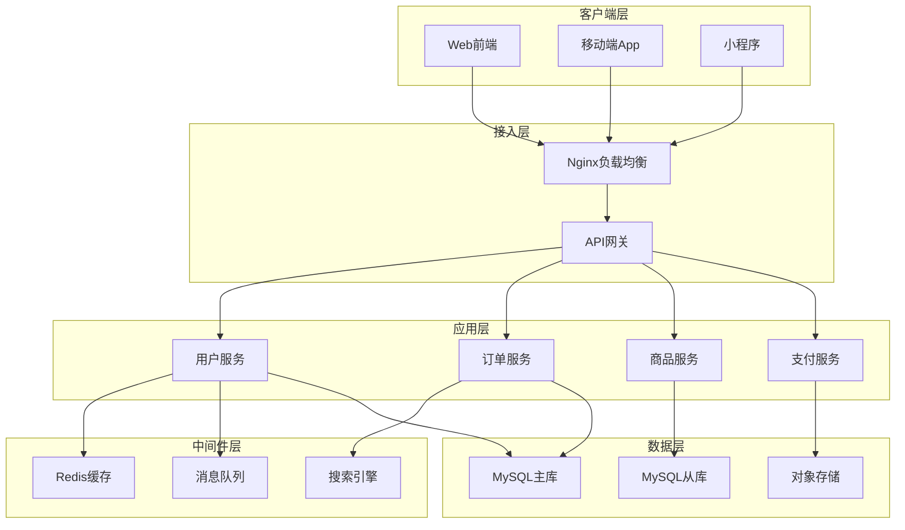
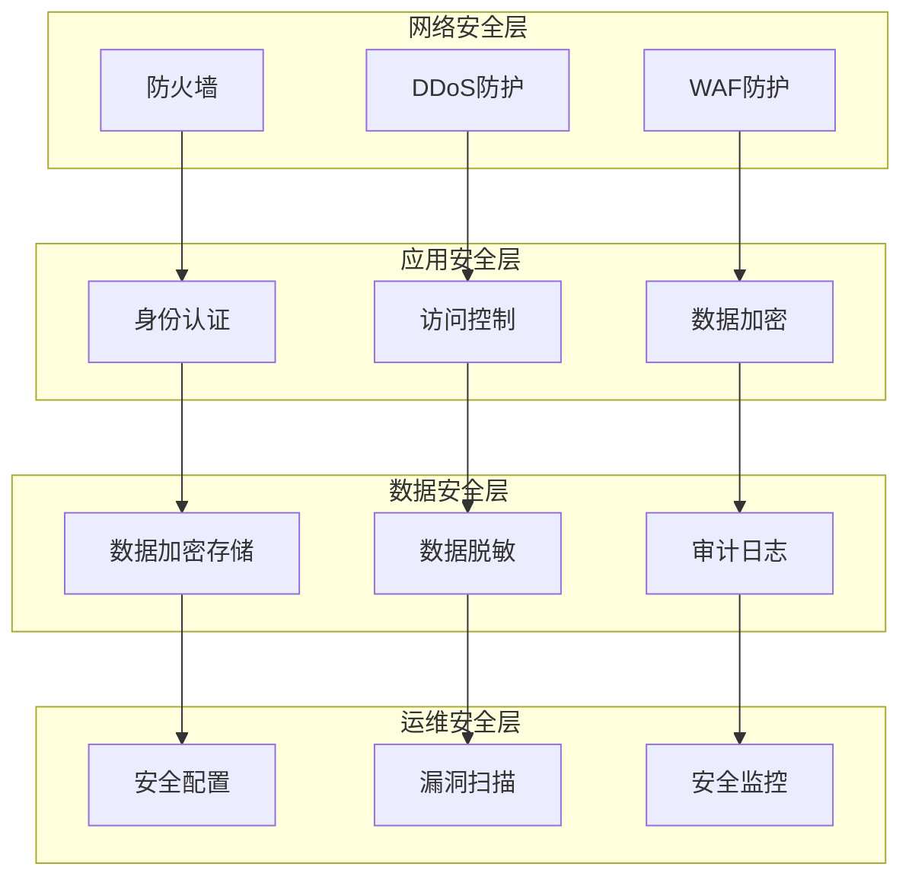

# [项目名称] - 软件需求规格说明书

> **文档版本**: [版本号]
> **创建日期**: [日期]
> **最后更新**: [日期]
> **创建者**: [创建者姓名]
> **审核者**: [审核者姓名]

---

## 📋 文档信息

| 项目 | 内容 |
|------|------|
| **项目名称** | [项目名称] |
| **项目代号** | [项目代号] |
| **业务部门** | [业务部门] |
| **技术部门** | [技术部门] |
| **项目经理** | [项目经理姓名] |
| **技术负责人** | [技术负责人姓名] |
| **产品负责人** | [产品负责人姓名] |

---

## 🎯 1. 引言

### 1.1 文档目的

本文档旨在详细描述 **[项目名称]** 的软件需求规格，作为开发、测试、验收的最终依据。通过明确的功能性和非功能性需求定义，确保项目各相关方对需求有一致的理解，为项目成功实施奠定基础。

### 1.2 项目背景

**业务背景**: [描述项目产生的业务背景和动机]

**项目目标**: [列出项目的主要目标和预期成果]

**项目价值**: [说明项目为业务带来的价值和意义]

### 1.3 项目范围

#### 包含范围
- ✅ [功能模块1]
- ✅ [功能模块2]
- ✅ [功能模块3]

#### 排除范围
- ❌ [不包含的功能1]
- ❌ [不包含的功能2]
- ❌ [不包含的功能3]

### 1.4 术语定义

| 术语 | 英文 | 定义 |
|------|------|------|
| [术语1] | [English Term] | [详细定义] |
| [术语2] | [English Term] | [详细定义] |
| [术语3] | [English Term] | [详细定义] |

### 1.5 参考文档

| 文档名称 | 版本 | 作者 | 日期 |
|----------|------|------|------|
| [产品需求文档(PRD)] | v[版本] | [作者] | [日期] |
| [系统架构设计] | v[版本] | [作者] | [日期] |
| [API接口文档] | v[版本] | [作者] | [日期] |

---

## 🏗️ 2. 总体描述

### 2.1 产品愿景

**愿景描述**: [描述产品的长期愿景和战略目标]

**目标用户**: [详细描述目标用户群体]

**核心价值**: [阐述产品为用户提供的核心价值]

### 2.2 产品功能架构



### 2.3 用户特征

| 用户类型 | 描述 | 主要需求 | 使用频率 |
|----------|------|----------|----------|
| **普通用户** | [用户描述] | [需求列表] | [频率] |
| **管理员** | [用户描述] | [需求列表] | [频率] |
| **运营人员** | [用户描述] | [需求列表] | [频率] |

### 2.4 运行环境

#### 2.4.1 硬件环境

| 环境 | 最低配置 | 推荐配置 |
|------|----------|----------|
| **服务器CPU** | 4核 | 8核+ |
| **服务器内存** | 8GB | 16GB+ |
| **服务器存储** | 100GB SSD | 500GB SSD |
| **网络带宽** | 10Mbps | 100Mbps+ |

#### 2.4.2 软件环境

| 软件 | 版本要求 | 说明 |
|------|----------|------|
| **操作系统** | CentOS 7.6+ / Ubuntu 18.04+ | Linux服务器 |
| **数据库** | MySQL 8.0+ / PostgreSQL 12+ | 关系型数据库 |
| **缓存** | Redis 6.0+ | 内存数据库 |
| **Web服务器** | Nginx 1.18+ | 反向代理 |

#### 2.4.3 客户端环境

| 环境 | 支持版本 | 说明 |
|------|----------|------|
| **浏览器** | Chrome 90+, Firefox 88+, Safari 14+ | 现代浏览器 |
| **移动端** | iOS 13+, Android 8+ | 移动设备支持 |
| **屏幕分辨率** | 1024x768+ | 最低分辨率要求 |

### 2.5 设计约束

#### 技术约束
- **开发语言**: [指定开发语言]
- **框架选择**: [指定框架]
- **数据库**: [指定数据库类型]
- **部署方式**: [指定部署方式]

#### 业务约束
- **合规要求**: [相关法规要求]
- **安全标准**: [安全等级要求]
- **性能指标**: [具体性能要求]
- **时间约束**: [项目时间限制]

---

## ⚙️ 3. 功能性需求

### 3.1 功能模块概览

| 模块ID | 模块名称 | 优先级 | 复杂度 | 负责人 |
|--------|----------|--------|--------|--------|
| F001 | [模块名称1] | 高 | 中 | [负责人] |
| F002 | [模块名称2] | 中 | 高 | [负责人] |
| F003 | [模块名称3] | 低 | 低 | [负责人] |

### 3.2 [功能模块1]

#### 3.2.1 用户注册功能

**功能描述**: 用户可以通过手机号或邮箱注册系统账号

**前置条件**:
- 用户未注册
- 手机号/邮箱可用

**业务规则**:
1. 手机号必须经过验证码验证
2. 密码必须符合安全策略（8-20位，包含字母、数字、特殊字符）
3. 同一IP地址1小时内最多注册5个账号
4. 注册成功后自动发送欢迎邮件

**输入数据**:
| 数据项 | 类型 | 必填 | 约束 | 示例 |
|--------|------|------|------|------|
| 手机号 | String | 是 | 11位数字 | 13812345678 |
| 验证码 | String | 是 | 6位数字 | 123456 |
| 密码 | String | 是 | 8-20位字符 | Pass@123 |
| 确认密码 | String | 是 | 与密码一致 | Pass@123 |

**处理流程**:


**输出数据**:
| 数据项 | 类型 | 描述 |
|--------|------|------|
| 用户ID | String | 系统生成的唯一标识 |
| 注册状态 | Boolean | true:成功, false:失败 |
| 错误信息 | String | 失败时的错误描述 |

**异常处理**:
| 异常情况 | 处理方式 | 用户提示 |
|----------|----------|----------|
| 手机号已存在 | 返回错误信息 | "该手机号已被注册" |
| 验证码错误 | 返回错误信息 | "验证码错误，请重新输入" |
| 密码不符合要求 | 返回错误信息 | "密码必须8-20位，包含字母、数字、特殊字符" |

**验收标准**:
- [ ] 用户可以使用有效的手机号成功注册
- [ ] 系统正确处理重复注册请求
- [ ] 验证码验证机制正常工作
- [ ] 密码安全策略得到执行

#### 3.2.2 用户登录功能

**功能描述**: 已注册用户可以通过账号密码登录系统

**前置条件**:
- 用户已完成注册
- 账号状态正常

**业务规则**:
1. 支持手机号/邮箱登录
2. 连续3次登录失败锁定账号30分钟
3. 登录成功后生成JWT令牌
4. 支持记住登录状态（7天）

**输入数据**:
| 数据项 | 类型 | 必填 | 约束 | 示例 |
|--------|------|------|------|------|
| 登录账号 | String | 是 | 手机号或邮箱 | user@example.com |
| 密码 | String | 是 | 6-50位字符 | password123 |
| 记住我 | Boolean | 否 | true/false | true |

**处理逻辑**:
1. 验证账号格式有效性
2. 查询用户信息
3. 验证密码正确性
4. 检查账号状态
5. 生成访问令牌
6. 记录登录日志

**输出数据**:
| 数据项 | 类型 | 描述 |
|--------|------|------|
| 访问令牌 | String | JWT认证令牌 |
| 用户信息 | Object | 用户基本信息 |
| 登录状态 | Boolean | true:成功, false:失败 |

**异常处理**:
| 异常情况 | 处理方式 | 用户提示 |
|----------|----------|----------|
| 账号不存在 | 返回错误信息 | "账号或密码错误" |
| 密码错误 | 返回错误信息 | "账号或密码错误" |
| 账号被锁定 | 返回错误信息 | "账号已被锁定，请30分钟后重试" |

**验收标准**:
- [ ] 用户可以使用正确的账号密码登录
- [ ] 系统正确处理错误登录尝试
- [ ] JWT令牌正常生成和验证
- [ ] 记住登录状态功能正常

### 3.3 [功能模块2]

#### 3.3.1 数据查询功能

**功能描述**: 用户可以根据条件查询系统中的数据

**前置条件**:
- 用户已登录
- 具有查询权限

**业务规则**:
1. 支持多条件组合查询
2. 支持模糊匹配和精确匹配
3. 查询结果分页显示
4. 支持结果导出功能

**查询条件**:
| 条件项 | 类型 | 必填 | 说明 |
|--------|------|------|------|
| 关键词 | String | 否 | 支持模糊匹配 |
| 时间范围 | Date Range | 否 | 开始时间-结束时间 |
| 状态 | Enum | 否 | 状态枚举值 |
| 分类 | String | 否 | 分类筛选 |

**输出格式**:
```json
{
  "code": 200,
  "message": "查询成功",
  "data": {
    "total": 100,
    "page": 1,
    "pageSize": 20,
    "list": [
      {
        "id": "001",
        "name": "数据项1",
        "status": "active",
        "createTime": "2024-01-01 10:00:00"
      }
    ]
  }
}
```

**性能要求**:
- 简单查询响应时间 < 500ms
- 复杂查询响应时间 < 2s
- 支持并发查询数 > 100

**验收标准**:
- [ ] 各种查询条件组合正常工作
- [ ] 分页功能正确实现
- [ ] 查询性能满足要求
- [ ] 导出功能正常工作

---

## 🔒 4. 非功能性需求

### 4.1 性能需求

#### 4.1.1 响应时间要求

| 操作类型 | 响应时间要求 | 测试条件 |
|----------|--------------|----------|
| 页面加载 | < 3秒 | 正常网络条件下 |
| API接口调用 | < 500ms | 单用户请求 |
| 数据查询 | < 2秒 | 复杂查询条件 |
| 文件上传 | < 30秒 | 10MB文件 |

#### 4.1.2 并发处理能力

| 指标 | 要求 | 测试方法 |
|------|------|----------|
| 同时在线用户 | > 10,000 | 压力测试 |
| 每秒请求数(RPS) | > 1,000 | 性能测试 |
| 数据库连接池 | > 100 | 连接池监控 |
| 缓存命中率 | > 90% | 缓存监控 |

#### 4.1.3 系统可用性

- **可用性目标**: 99.9% (每月宕机时间 < 43.2分钟)
- **故障恢复时间**: < 30分钟
- **数据备份**: 每日自动备份，保留30天
- **监控告警**: 7x24小时监控，5分钟内告警响应

### 4.2 安全性需求

#### 4.2.1 身份认证与授权

**认证要求**:
- 支持多种认证方式：密码、短信验证码、第三方登录
- 密码策略：8-20位，包含大小写字母、数字、特殊字符
- 会话管理：超时时间30分钟，支持续期
- 单点登录：支持企业级单点登录

**授权要求**:
- 基于角色的访问控制(RBAC)
- 细粒度权限控制到功能级别
- 支持权限继承和委托
- 敏感操作需要二次验证

#### 4.2.2 数据安全

**传输安全**:
- 全站HTTPS加密
- API接口签名验证
- 敏感数据传输加密
- 防止重放攻击

**存储安全**:
- 敏感数据加密存储
- 数据库访问加密
- 定期安全审计
- 数据脱敏处理

#### 4.2.3 安全防护

**攻击防护**:
- SQL注入防护
- XSS攻击防护
- CSRF攻击防护
- 文件上传安全检查

**安全监控**:
- 异常访问检测
- 攻击行为识别
- 安全事件告警
- 安全日志分析

### 4.3 可靠性需求

#### 4.3.1 故障处理

**故障检测**:
- 应用健康检查
- 数据库连接监控
- 外部服务依赖检查
- 系统资源监控

**故障恢复**:
- 自动故障转移
- 服务重启机制
- 数据备份恢复
- 降级服务策略

#### 4.3.2 数据可靠性

**数据备份**:
- 每日增量备份
- 每周全量备份
- 异地备份存储
- 备份数据验证

**数据一致性**:
- 事务一致性保证
- 分布式事务处理
- 数据同步机制
- 冲突解决策略

### 4.4 可用性需求

#### 4.4.1 用户体验

**界面设计**:
- 响应式设计，支持多种设备
- 符合用户操作习惯
- 视觉层次清晰
- 操作反馈及时

**交互设计**:
- 操作流程简化
- 减少用户记忆负担
- 提供操作引导和帮助
- 错误提示友好明确

#### 4.4.2 可访问性

**无障碍设计**:
- 支持屏幕阅读器
- 键盘导航支持
- 色彩对比度符合WCAG 2.1 AA标准
- 字体大小可调节

**国际化**:
- 多语言支持（中文、英文）
- 本地化适配
- 时区自动处理
- 货币格式化

### 4.5 兼容性需求

#### 4.5.1 浏览器兼容性

| 浏览器 | 最低版本 | 测试覆盖 |
|--------|----------|----------|
| Chrome | 90+ | ✅ |
| Firefox | 88+ | ✅ |
| Safari | 14+ | ✅ |
| Edge | 90+ | ✅ |

#### 4.5.2 移动端兼容性

| 平台 | 最低版本 | 测试覆盖 |
|------|----------|----------|
| iOS | 13.0+ | ✅ |
| Android | 8.0+ | ✅ |
| HarmonyOS | 2.0+ | ✅ |

---

## 🔌 5. 接口需求

### 5.1 用户界面规范

#### 5.1.1 设计原则

**一致性原则**:
- 统一的视觉风格和交互模式
- 相同功能在不同页面保持一致
- 遵循平台设计规范

**简洁性原则**:
- 界面布局简洁明了
- 信息层次清晰
- 减少不必要的视觉元素

**可用性原则**:
- 操作流程简单直观
- 提供清晰的反馈信息
- 容错性强

#### 5.1.2 响应式设计

| 设备类型 | 屏幕宽度 | 布局特点 |
|----------|----------|----------|
| 桌面端 | > 1200px | 多列布局，功能完整 |
| 平板端 | 768px - 1200px | 两列布局，功能适配 |
| 手机端 | < 768px | 单列布局，核心功能 |

### 5.2 硬件接口

#### 5.2.1 输入设备支持

- **键盘**: 标准QWERTY键盘，支持快捷键
- **鼠标**: 标准鼠标，支持滚轮操作
- **触摸屏**: 支持多点触控操作
- **摄像头**: 支持人脸识别、扫码功能

#### 5.2.2 输出设备支持

- **显示器**: 支持多种分辨率（1024x768到4K）
- **打印机**: 支持PDF导出和打印功能
- **音响**: 支持音频播放和语音提示

### 5.3 软件接口

#### 5.3.1 内部接口

**模块间通信**:
- 通信协议：HTTP/HTTPS, WebSocket
- 数据格式：JSON
- 调用方式：RESTful API
- 错误处理：统一错误码和错误信息

**示例接口**:
```http
GET /api/v1/users/{id}
Authorization: Bearer {token}
Content-Type: application/json

Response:
{
  "code": 200,
  "message": "success",
  "data": {
    "id": "123",
    "name": "张三",
    "email": "zhangsan@example.com"
  }
}
```

#### 5.3.2 外部接口

**第三方服务集成**:

| 服务类型 | 服务提供商 | 接口协议 | 用途 |
|----------|------------|----------|------|
| 支付服务 | 支付宝/微信支付 | HTTPS API | 在线支付 |
| 短信服务 | 阿里云/腾讯云 | HTTPS API | 短信验证码 |
| 邮件服务 | SendGrid/阿里云 | SMTP/HTTPS API | 邮件发送 |
| 地图服务 | 高德地图/百度地图 | HTTPS API | 地理位置服务 |

### 5.4 数据接口

#### 5.4.1 数据库接口

**连接规范**:
- 数据库类型：MySQL 8.0+
- 连接池：HikariCP
- 事务隔离级别：READ_COMMITTED
- 连接超时：30秒

**数据访问层**:
- ORM框架：MyBatis Plus / Hibernate
- 缓存策略：Redis + 本地缓存
- 读写分离：支持主从数据库
- 分库分表：支持水平扩展

#### 5.4.2 文件接口

**文件存储**:
- 存储方式：对象存储（OSS/S3）
- 支持格式：图片、文档、视频等
- 文件大小：单文件最大100MB
- 安全控制：访问权限控制

**文件处理**:
- 图片处理：缩放、裁剪、压缩
- 文档转换：PDF、Office文档预览
- 视频处理：转码、切片、水印

---

## 📊 6. 数据需求

### 6.1 数据实体模型

#### 6.1.1 核心实体

**用户实体 (User)**:
| 属性名 | 数据类型 | 长度 | 是否为空 | 默认值 | 说明 |
|--------|----------|------|----------|--------|------|
| id | VARCHAR | 32 | NOT NULL | - | 用户唯一标识 |
| username | VARCHAR | 50 | NOT NULL | - | 用户名 |
| email | VARCHAR | 100 | NOT NULL | - | 邮箱地址 |
| phone | VARCHAR | 20 | NULL | - | 手机号码 |
| password | VARCHAR | 255 | NOT NULL | - | 加密密码 |
| status | TINYINT | 1 | NOT NULL | 1 | 用户状态 |
| create_time | DATETIME | - | NOT NULL | NOW() | 创建时间 |
| update_time | DATETIME | - | NOT NULL | NOW() | 更新时间 |

**订单实体 (Order)**:
| 属性名 | 数据类型 | 长度 | 是否为空 | 默认值 | 说明 |
|--------|----------|------|----------|--------|------|
| id | VARCHAR | 32 | NOT NULL | - | 订单唯一标识 |
| user_id | VARCHAR | 32 | NOT NULL | - | 用户ID |
| order_no | VARCHAR | 20 | NOT NULL | - | 订单号 |
| total_amount | DECIMAL | 10,2 | NOT NULL | 0.00 | 订单总金额 |
| status | TINYINT | 1 | NOT NULL | 1 | 订单状态 |
| create_time | DATETIME | - | NOT NULL | NOW() | 创建时间 |
| update_time | DATETIME | - | NOT NULL | NOW() | 更新时间 |

#### 6.1.2 实体关系图



### 6.2 数据字典

#### 6.2.1 状态码定义

**用户状态 (User Status)**:
| 值 | 含义 | 说明 |
|----|------|------|
| 0 | 禁用 | 账号被禁用，无法登录 |
| 1 | 正常 | 账号正常，可以正常使用 |
| 2 | 锁定 | 账号被临时锁定 |
| 3 | 注销 | 账号已注销 |

**订单状态 (Order Status)**:
| 值 | 含义 | 说明 |
|----|------|------|
| 1 | 待支付 | 订单创建，等待支付 |
| 2 | 已支付 | 支付完成，等待发货 |
| 3 | 已发货 | 商品已发货 |
| 4 | 已完成 | 订单完成 |
| 5 | 已取消 | 订单被取消 |
| 6 | 已退款 | 订单已退款 |

#### 6.2.2 枚举值定义

**支付方式 (Payment Method)**:
- `alipay`: 支付宝
- `wechat`: 微信支付
- `unionpay`: 银联支付
- `balance`: 余额支付

**物流公司 (Logistics Company)**:
- `sf`: 顺丰快递
- `sto`: 申通快递
- `yt`: 圆通快递
- `zto`: 中通快递

### 6.3 数据约束

#### 6.3.1 完整性约束

**主键约束**:
- 每个表必须有主键
- 主键值不能为空
- 主键值必须唯一

**外键约束**:
- 外键必须引用存在的主键
- 删除主键时处理相关外键
- 更新主键时同步更新外键

**唯一约束**:
- 用户名必须唯一
- 邮箱地址必须唯一
- 手机号必须唯一
- 订单号必须唯一

#### 6.3.2 业务约束

**数据范围约束**:
- 年龄范围：0-150岁
- 金额范围：>= 0
- 库存数量：>= 0
- 评分范围：1-5星

**数据格式约束**:
- 邮箱格式：符合RFC标准
- 手机号格式：11位数字
- 身份证号：18位字符
- URL格式：符合URI标准

#### 6.3.3 安全约束

**敏感数据加密**:
- 用户密码：BCrypt加密
- 身份证号：AES加密存储
- 银行卡号：部分脱敏显示
- 支付密码：独立加密存储

**访问控制**:
- 基于角色的数据访问控制
- 行级安全策略
- 敏感操作审计
- 数据访问日志记录

### 6.4 数据质量

#### 6.4.1 数据准确性

**输入验证**:
- 前端格式验证
- 后端业务验证
- 数据库约束验证
- 第三方数据验证

**数据清洗**:
- 重复数据检测和清理
- 异常数据识别和处理
- 数据标准化
- 数据补全

#### 6.4.2 数据一致性

**事务处理**:
- ACID特性保证
- 分布式事务处理
- 补偿机制设计
- 幂等性保证

**数据同步**:
- 主从数据同步
- 缓存数据一致性
- 搜索引擎数据同步
- 统计数据一致性

---

## 🏛️ 7. 系统架构

### 7.1 技术架构

#### 7.1.1 总体架构



#### 7.1.2 技术栈选择

**前端技术栈**:
- **框架**: React 18+ / Vue 3+
- **UI库**: Ant Design / Element Plus
- **状态管理**: Redux / Vuex
- **构建工具**: Webpack 5 / Vite
- **TypeScript**: TypeScript 4.5+

**后端技术栈**:
- **开发语言**: Java 17 / Python 3.9+
- **Web框架**: Spring Boot 3.0 / FastAPI
- **ORM框架**: MyBatis Plus / SQLAlchemy
- **安全框架**: Spring Security / JWT
- **微服务**: Spring Cloud / FastAPI微服务

**中间件技术栈**:
- **缓存**: Redis 6.0+
- **消息队列**: RabbitMQ / Apache Kafka
- **搜索引擎**: Elasticsearch 7.x
- **API网关**: Spring Cloud Gateway / Kong

#### 7.1.3 架构设计原则

**高可用性**:
- 无单点故障设计
- 服务冗余部署
- 自动故障转移
- 健康检查机制

**高性能**:
- 异步处理架构
- 缓存策略优化
- 数据库读写分离
- CDN加速

**可扩展性**:
- 水平扩展支持
- 微服务架构
- 容器化部署
- 自动伸缩

**安全性**:
- 纵深防御策略
- 数据加密传输
- 访问权限控制
- 安全审计机制

### 7.2 部署架构

#### 7.2.1 环境规划

| 环境 | 用途 | 配置 | 数据 |
|------|------|------|------|
| **开发环境** | 功能开发和调试 | 2核4G | 测试数据 |
| **测试环境** | 功能测试和集成测试 | 4核8G | 测试数据 |
| **预生产环境** | 性能测试和验收测试 | 8核16G | 脱敏生产数据 |
| **生产环境** | 正式运行环境 | 16核32G+ | 生产数据 |

#### 7.2.2 容器化部署

**Docker镜像**:
```dockerfile
FROM openjdk:17-jre-slim
WORKDIR /app
COPY target/app.jar app.jar
EXPOSE 8080
ENTRYPOINT ["java", "-jar", "app.jar"]
```

**Kubernetes部署**:
```yaml
apiVersion: apps/v1
kind: Deployment
metadata:
  name: user-service
spec:
  replicas: 3
  selector:
    matchLabels:
      app: user-service
  template:
    metadata:
      labels:
        app: user-service
    spec:
      containers:
      - name: user-service
        image: user-service:latest
        ports:
        - containerPort: 8080
        env:
        - name: DB_HOST
          value: "mysql-service"
```

#### 7.2.3 监控体系

**应用监控**:
- APM工具：SkyWalking / Pinpoint
- 指标收集：Prometheus + Grafana
- 日志收集：ELK Stack
- 链路追踪：Zipkin / Jaeger

**基础设施监控**:
- 服务器监控：Node Exporter
- 网络监控：Netdata
- 数据库监控：MySQL Exporter
- 缓存监控：Redis Exporter

### 7.3 安全架构

#### 7.3.1 安全层次



#### 7.3.2 安全措施

**网络安全**:
- HTTPS全站加密
- 防火墙规则配置
- DDoS攻击防护
- 安全组访问控制

**应用安全**:
- JWT令牌认证
- RBAC权限控制
- API接口签名
- 输入数据验证

**数据安全**:
- 敏感数据加密
- 数据备份加密
- 访问日志记录
- 数据脱敏处理

---

## 🧪 8. 测试需求

### 8.1 测试策略

#### 8.1.1 测试类型

**单元测试**:
- 覆盖率要求：> 80%
- 测试框架：JUnit / PyTest
- 自动化程度：100%
- 执行频率：每次代码提交

**集成测试**:
- 服务间接口测试
- 数据库集成测试
- 第三方服务集成测试
- 消息队列测试

**系统测试**:
- 功能完整性测试
- 性能压力测试
- 安全漏洞测试
- 兼容性测试

**用户验收测试**:
- 业务场景测试
- 用户体验测试
- 真实数据测试
- 多角色权限测试

#### 8.1.2 测试环境

**环境配置**:
- 硬件配置：与生产环境一致
- 软件版本：与生产环境一致
- 网络配置：模拟真实网络环境
- 数据准备：使用脱敏的生产数据

**测试数据**:
- 正常数据：覆盖正常业务场景
- 异常数据：覆盖异常情况处理
- 边界数据：测试边界条件
- 性能数据：大量数据用于性能测试

### 8.2 性能测试

#### 8.2.1 性能指标

| 指标 | 目标值 | 测试方法 |
|------|--------|----------|
| **响应时间** | P95 < 2s | 压力测试 |
| **吞吐量** | > 1000 TPS | 负载测试 |
| **并发用户** | > 5000 | 并发测试 |
| **系统可用性** | > 99.9% | 稳定性测试 |

#### 8.2.2 测试场景

**基准测试**:
- 单用户操作
- 简单查询
- 基础功能操作

**负载测试**:
- 正常业务负载
- 峰值业务负载
- 持续压力测试

**压力测试**:
- 极限并发测试
- 资源耗尽测试
- 恢复能力测试

### 8.3 安全测试

#### 8.3.1 安全漏洞扫描

**自动化扫描**:
- OWASP Top 10漏洞扫描
- 依赖库漏洞扫描
- 配置安全扫描
- 代码安全审计

**渗透测试**:
- SQL注入测试
- XSS攻击测试
- CSRF攻击测试
- 权限绕过测试

#### 8.3.2 数据安全测试

**数据传输安全**:
- HTTPS证书验证
- API接口加密验证
- 敏感数据传输验证

**数据存储安全**:
- 数据加密验证
- 数据脱敏验证
- 访问权限验证

### 8.4 验收标准

#### 8.4.1 功能验收

**核心功能**:
- [ ] 所有核心功能正常工作
- [ ] 业务流程完整无误
- [ ] 异常情况正确处理
- [ ] 数据一致性保证

**用户界面**:
- [ ] 界面显示正常
- [ ] 交互操作流畅
- [ ] 响应式设计适配
- [ ] 用户体验良好

#### 8.4.2 性能验收

**响应性能**:
- [ ] 页面加载时间达标
- [ ] API接口响应时间达标
- [ ] 查询操作响应时间达标
- [ ] 文件上传下载时间达标

**系统性能**:
- [ ] 并发用户数达标
- [ ] 系统吞吐量达标
- [ ] 资源利用率合理
- [ ] 系统稳定性达标

#### 8.4.3 安全验收

**认证授权**:
- [ ] 身份认证机制正常
- [ ] 权限控制有效
- [ ] 会话管理安全
- [ ] 密码策略执行

**数据安全**:
- [ ] 数据传输加密
- [ ] 数据存储加密
- [ ] 敏感信息保护
- [ ] 访问日志完整

---

## 📈 9. 项目管理

### 9.1 开发计划

#### 9.1.1 项目里程碑

| 阶段 | 开始时间 | 结束时间 | 主要交付物 | 负责人 |
|------|----------|----------|------------|--------|
| **需求分析** | [日期] | [日期] | SRS文档 | 产品经理 |
| **系统设计** | [日期] | [日期] | 架构设计文档 | 架构师 |
| **开发实施** | [日期] | [日期] | 系统功能 | 开发团队 |
| **测试验证** | [日期] | [日期] | 测试报告 | 测试团队 |
| **部署上线** | [日期] | [日期] | 生产系统 | 运维团队 |

#### 9.1.2 迭代计划

**迭代周期**: 2周
**团队规模**: [团队人数]人
**开发方式**: 敏捷开发

**迭代内容**:
- **Sprint 1**: 基础架构搭建
- **Sprint 2**: 用户管理模块
- **Sprint 3**: 核心业务模块
- **Sprint 4**: 集成测试和优化
- **Sprint 5**: 用户验收测试
- **Sprint 6**: 生产部署

### 9.2 质量保证

#### 9.2.1 代码质量

**编码规范**:
- 遵循团队编码规范
- 代码注释完整清晰
- 命名规范统一
- 代码结构合理

**代码审查**:
- 所有代码必须经过审查
- 审查重点：安全性、性能、可维护性
- 审查工具：GitLab / GitHub Pull Request
- 审查记录：完整的审查日志

**质量指标**:
- 代码覆盖率 > 80%
- 代码重复率 < 5%
- 圈复杂度 < 10
- 技术债务控制在合理范围

#### 9.2.2 过程质量

**需求管理**:
- 需求变更控制流程
- 需求追踪机制
- 需求评审制度
- 需求验证标准

**配置管理**:
- 版本控制规范
- 分支管理策略
- 发布流程管理
- 回滚机制设计

### 9.3 风险管理

#### 9.3.1 风险识别

| 风险类型 | 风险描述 | 可能性 | 影响 | 风险等级 |
|----------|----------|--------|------|----------|
| **技术风险** | 新技术学习成本高 | 中 | 高 | 中 |
| **进度风险** | 需求变更频繁 | 高 | 中 | 中 |
| **资源风险** | 关键人员离职 | 低 | 高 | 中 |
| **质量风险** | 测试不充分 | 中 | 高 | 中 |

#### 9.3.2 风险应对

**技术风险应对**:
- 技术预研和原型验证
- 技术培训计划
- 专家咨询支持
- 备选技术方案

**进度风险应对**:
- 需求变更控制
- 进度缓冲时间
- 资源弹性调配
- 功能优先级管理

**资源风险应对**:
- 知识文档化
- 人员备份计划
- 外部资源支持
- 团队建设

---

## 📚 10. 附录

### 10.1 变更历史

| 版本 | 日期 | 变更内容 | 变更人 | 审核人 |
|------|------|----------|--------|--------|
| v1.0 | 2024-01-01 | 初始版本创建 | [姓名] | [姓名] |
| v1.1 | 2024-01-15 | 添加性能需求 | [姓名] | [姓名] |
| v1.2 | 2024-02-01 | 更新安全需求 | [姓名] | [姓名] |

### 10.2 相关文档

| 文档类型 | 文档名称 | 版本 | 存储位置 |
|----------|----------|------|----------|
| **需求文档** | 产品需求文档(PRD) | v2.0 | [链接] |
| **设计文档** | 系统架构设计 | v1.0 | [链接] |
| **接口文档** | API接口规范 | v1.5 | [链接] |
| **测试文档** | 测试计划和用例 | v1.0 | [链接] |
| **运维文档** | 部署和运维手册 | v1.0 | [链接] |

### 10.3 联系信息

#### 项目团队

| 角色 | 姓名 | 联系方式 | 邮箱 |
|------|------|----------|------|
| **项目经理** | [姓名] | [电话] | [邮箱] |
| **产品经理** | [姓名] | [电话] | [邮箱] |
| **技术负责人** | [姓名] | [电话] | [邮箱] |
| **测试负责人** | [姓名] | [电话] | [邮箱] |
| **运维负责人** | [姓名] | [电话] | [邮箱] |

#### 紧急联系

| 情况 | 联系人 | 电话 | 邮箱 |
|------|--------|------|------|
| **系统故障** | [姓名] | [电话] | [邮箱] |
| **安全事件** | [姓名] | [电话] | [邮箱] |
| **数据问题** | [姓名] | [电话] | [邮箱] |

### 10.4 审批记录

| 审批环节 | 审批人 | 审批意见 | 审批日期 |
|----------|--------|----------|----------|
| **需求评审** | [姓名] | [意见] | [日期] |
| **架构评审** | [姓名] | [意见] | [日期] |
| **安全评审** | [姓名] | [意见] | [日期] |
| **最终审批** | [姓名] | [意见] | [日期] |

---

> **文档说明**:
> 本文档为 **[项目名称]** 的软件需求规格说明书，是项目开发、测试、验收的重要依据。
>
> **版权声明**: © 2024 [公司名称]. 保留所有权利。
>
> **文档状态**: ✅ 已审批 ✅ 可执行 🔄 持续更新