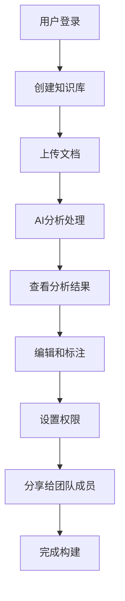
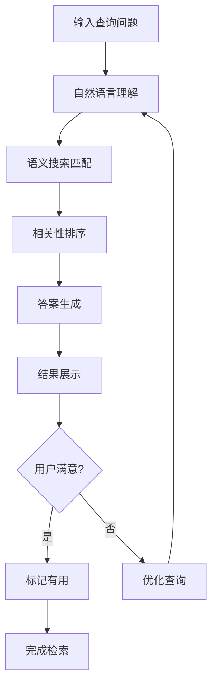

# 产品需求文档 (PRD) - Cognee

## 1. 项目背景与愿景

### 1.1 项目概述
- **项目名称**: Cognee
- **版本**: v1.0
- **创建日期**: 2025-11-03
- **最后更新**: 2025-11-03
- **项目地址**: https://github.com/topoteretes/cognee

### 1.2 问题背景
在信息爆炸的时代，个人和团队面临着知识管理的巨大挑战：
- 信息碎片化：知识分散在文档、聊天记录、邮件等各种渠道
- 检索困难：传统关键词搜索无法理解语义和上下文
- 知识孤岛：缺乏有效的知识连接和组织方式
- 学习效率低：无法快速从海量信息中提取有价值的洞见
- 协作障碍：团队成员间知识共享和传承困难

### 1.3 产品愿景
Cognee 致力于成为下一代AI驱动的知识管理平台，通过先进的自然语言处理和机器学习技术，帮助用户：
- 构建智能化的个人和团队知识库
- 实现语义化的信息检索和知识发现
- 提供个性化的知识推荐和学习路径
- 促进团队间的高效知识协作与共享

### 1.4 项目范围
- **包含内容**:
  - AI驱动的文档分析和知识提取
  - 语义搜索和智能问答系统
  - 知识图谱构建和可视化
  - 多模态内容支持（文本、图片、音频）
  - 团队协作和权限管理
  - API集成和扩展能力

- **排除内容**:
  - 实时音视频通话功能
  - 复杂的项目管理功能
  - 企业级ERP集成

## 2. 目标用户画像与场景

### 2.1 主要用户画像

#### 用户画像 1: 知识工作者
- **基本信息**: 25-45岁，研究员、顾问、分析师等专业人士
- **技术水平**: 中等，熟悉常用办公软件，对AI工具有一定接受度
- **目标和动机**:
  - 高效整理和检索专业资料
  - 从大量信息中快速提取关键洞察
  - 构建个人专业知识体系
  - 提升工作质量和效率
- **痛点描述**:
  - 文档管理混乱，查找困难
  - 信息过载，难以识别重点
  - 知识不成体系，缺乏连接
  - 重复性工作较多
- **使用场景**:
  - 研究报告分析和整理
  - 会议纪要和决策记录管理
  - 行业资讯收集和分析
  - 个人知识库构建
- **技术能力**: 能够使用SaaS工具，理解基本的搜索和分类概念

#### 用户画像 2: 产品团队
- **基本信息**: 20-40岁，产品经理、设计师、工程师等
- **技术水平**: 较高，熟悉各种协作工具和技术栈
- **目标和动机**:
  - 高效管理产品文档和需求
  - 促进团队知识共享和协作
  - 快速获取项目相关信息
  - 减少重复沟通和问答
- **痛点描述**:
  - 产品信息分散在不同工具中
  - 新成员上手周期长
  - 决策依据难以追溯
  - 跨部门协作效率低
- **使用场景**:
  - 产品需求文档管理
  - 用户研究和反馈分析
  - 技术文档和API文档管理
  - 团队知识传承
- **技术能力**: 熟练使用各种协作工具，能够进行API集成

#### 用户画像 3: 教育工作者
- **基本信息**: 30-55岁，教师、教授、培训师等
- **技术水平**: 中等偏下，对新技术接受程度不一
- **目标和动机**:
  - 整理教学资源和课件
  - 回答学生常见问题
  - 个性化学习内容推荐
  - 提升教学效率和质量
- **痛点描述**:
  - 教学材料版本管理混乱
  - 重复回答相似问题
  - 难以跟踪学生学习进度
  - 缺乏有效的知识评估工具
- **使用场景**:
  - 课程资料管理和检索
  - 学生问答和答疑
  - 学习资源推荐
  - 知识点关联分析
- **技术能力**: 基础的办公软件技能，需要简单易用的界面

### 2.2 用户场景分析

#### 场景 1: 研究资料分析
- **触发条件**: 用户上传多份研究报告和文档
- **用户目标**: 快速理解核心观点，找出相关性和差异性
- **操作步骤**:
  1. 批量上传PDF/Word文档
  2. 系统自动分析和提取关键信息
  3. 通过语义搜索查找特定主题
  4. 查看知识图谱了解概念关联
  5. 生成摘要和洞察报告
- **期望结果**:
  - 节省80%的阅读和整理时间
  - 发现隐藏的知识连接
  - 获得结构化的知识总结

#### 场景 2: 团队知识问答
- **触发条件**: 团队成员遇到技术或业务问题
- **用户目标**: 快速从团队知识库中获得准确答案
- **操作步骤**:
  1. 用自然语言描述问题
  2. 系统在相关知识中搜索匹配内容
  3. 返回相关答案和引用来源
  4. 如果答案不完整，标记需要补充
  5. 专家可以补充和完善答案
- **期望结果**:
  - 问题响应时间从小时级降到分钟级
  - 答案准确性和可追溯性提升
  - 减少重复性问答

#### 场景 3: 学习路径规划
- **触发条件**: 用户需要学习新领域或技能
- **用户目标**: 获得个性化的学习建议和资源推荐
- **操作步骤**:
  1. 输入学习目标和当前水平
  2. 系统分析现有知识库中的相关内容
  3. 生成结构化的学习路径
  4. 推荐相关的文档、视频等资源
  5. 跟踪学习进度并提供反馈
- **期望结果**:
  - 学习效率提升50%
  - 知识掌握更加系统和全面
  - 避免重复学习已知内容

## 3. 产品目标与成功指标

### 3.1 业务目标
- **主要目标**: 成为AI知识管理领域的领先平台，10万+活跃用户
- **次要目标**:
  - 建立开放的知识管理生态系统
  - 推动AI技术在知识管理领域的普及
  - 为企业客户提供定制化解决方案

### 3.2 用户目标
- **核心价值**: 让知识管理从负担变成生产力工具
- **用户满意度**: NPS评分达到50+，用户留存率达到80%

### 3.3 成功指标 (KPIs)

#### 3.3.1 业务指标
- **用户增长率**: 月活跃用户增长15%
- **活跃用户数**: 6个月内达到1万MAU
- **转化率**: 免费用户到付费用户转化率达到8%
- **收入指标**: ARR达到100万美元

#### 3.3.2 产品指标
- **功能使用率**: 核心功能日使用率达到60%
- **用户留存率**:
  - 1日留存: 70%
  - 7日留存: 45%
  - 30日留存: 25%
- **任务完成率**: 知识检索任务成功率达到95%
- **错误率**: 系统错误率控制在0.1%以下

#### 3.3.3 技术指标
- **系统性能**:
  - 搜索响应时间: <500ms
  - 文档处理速度: <10秒/文档
- **可用性**: 99.9%系统可用性
- **响应时间**: API调用平均响应时间<200ms

## 4. 功能列表与优先级

### 4.1 功能优先级定义
- **P0 - 必须有**: 核心功能，产品发布必须具备
- **P1 - 应该有**: 重要功能，尽快实现
- **P2 - 可以有**: 期望功能，资源允许时实现
- **P3 - 暂不考虑**: 延期功能，后续版本考虑

### 4.2 核心功能 (P0)

#### 功能 1: 智能文档上传与分析
- **功能描述**:
  - 支持多种格式文档上传（PDF、Word、TXT、Markdown等）
  - AI自动提取文档关键信息、主题和实体
  - 智能分类和标签生成
  - 文档预处理和格式标准化
- **用户价值**:
  - 消除手动整理文档的工作
  - 快速获得文档内容概览
  - 为后续搜索和分析提供基础
- **技术要求**:
  - 支持常见文档格式解析
  - 集成NLP模型进行文本分析
  - 可扩展的文档处理流水线
- **验收标准**:
  - 支持10+种文档格式
  - 文档处理成功率>95%
  - 关键信息提取准确率>85%

#### 功能 2: 语义搜索与问答
- **功能描述**:
  - 自然语言查询理解
  - 语义相似度匹配
  - 答案提取和摘要生成
  - 相关文档推荐
- **用户价值**:
  - 像对话一样找到所需信息
  - 获得准确和相关的答案
  - 发现相关知识连接
- **技术要求**:
  - 向量搜索引擎集成
  - 大语言模型API集成
  - 查询优化和排序算法
- **验收标准**:
  - 查询响应时间<1秒
  - 答案相关性评分>4.0/5.0
  - 支持复杂查询和上下文理解

#### 功能 3: 知识图谱可视化
- **功能描述**:
  - 自动构建知识实体关系网络
  - 交互式图谱展示
  - 实体关联路径探索
  - 知识发现和洞察推荐
- **用户价值**:
  - 直观理解知识结构和关联
  - 发现隐藏的知识连接
  - 支持深度分析和研究
- **技术要求**:
  - 图数据库集成
  - 前端可视化组件
  - 实体识别和关系抽取
- **验收标准**:
  - 支持1000+节点的图谱渲染
  - 交互响应时间<200ms
  - 关系准确率>80%

#### 功能 4: 用户与权限管理
- **功能描述**:
  - 用户注册、登录和认证
  - 角色和权限管理
  - 团队和组织管理
  - 数据安全和隐私保护
- **用户价值**:
  - 安全的知识管理环境
  - 灵活的团队协作支持
  - 数据所有权和控制权
- **技术要求**:
  - OAuth2.0支持
  - RBAC权限模型
  - 数据加密和备份
- **验收标准**:
  - 支持多种登录方式
  - 权限控制准确率100%
  - 符合GDPR等隐私法规

### 4.3 重要功能 (P1)

#### 功能 5: 协作与分享
- **功能描述**:
  - 知识库共享和协作编辑
  - 评论和讨论功能
  - 版本控制和变更追踪
  - 知识推荐和推送
- **用户价值**:
  - 促进团队知识共享
  - 提高协作效率
  - 保持知识更新和质量
- **技术要求**:
  - 实时协作编辑
  - 通知和消息系统
  - 版本管理机制
- **验收标准**:
  - 支持50+用户同时协作
  - 实时同步延迟<100ms
  - 版本冲突解决率>95%

#### 功能 6: API集成与扩展
- **功能描述**:
  - RESTful API接口
  - Webhook支持
  - 第三方应用集成
  - 插件和扩展机制
- **用户价值**:
  - 与现有工作流无缝集成
  - 支持定制化开发
  - 扩展平台能力
- **技术要求**:
  - 完整的API文档
  - SDK和工具支持
  - 安全的API认证
- **验收标准**:
  - API响应时间<500ms
  - API可用性>99.5%
  - 支持10+种第三方集成

### 4.4 期望功能 (P2)

#### 功能 7: 多语言支持
- **功能描述**:
  - 跨语言文档分析
  - 多语言搜索和问答
  - 自动翻译功能
  - 本地化界面支持
- **用户价值**:
  - 支持国际化团队
  - 突破语言障碍
  - 扩大用户群体
- **技术要求**:
  - 多语言NLP模型
  - 翻译API集成
  - 国际化框架
- **验收标准**:
  - 支持5+种主要语言
  - 翻译准确率>85%
  - 本地化完整性>90%

#### 功能 8: 高级分析报告
- **功能描述**:
  - 知识趋势分析
  - 用户行为洞察
  - 知识质量评估
  - 自定义报告生成
- **用户价值**:
  - 了解知识使用情况
  - 优化知识管理策略
  - 证明知识管理价值
- **技术要求**:
  - 数据分析和可视化
  - 报告模板系统
  - 导出功能支持
- **验收标准**:
  - 支持20+种分析维度
  - 报告生成时间<30秒
  - 数据准确性>95%

## 5. 用户流程与线框图

### 5.1 核心用户流程

#### 流程 1: 知识库构建流程


**流程说明**:
1. **用户登录**: 通过邮箱或第三方账号登录系统
2. **创建知识库**: 设置知识库名称、描述和基本信息
3. **上传文档**: 批量上传各类文档文件
4. **AI分析处理**: 系统自动分析文档内容，提取关键信息
5. **查看分析结果**: 检查提取的实体、主题和标签
6. **编辑和标注**: 手动修正和补充分析结果
7. **设置权限**: 配置团队成员的访问和编辑权限
8. **分享给团队成员**: 邀请团队成员加入知识库
9. **完成构建**: 知识库准备就绪，可以开始使用

#### 流程 2: 知识检索流程


**流程说明**:
1. **输入查询问题**: 用户用自然语言描述问题或需求
2. **自然语言理解**: 系统分析查询意图和关键信息
3. **语义搜索匹配**: 在知识库中查找相关内容和文档
4. **相关性排序**: 根据相关性和权威性对结果排序
5. **答案生成**: 提取关键信息生成简洁答案
6. **结果展示**: 展示答案和相关文档片段
7. **用户满意度判断**: 评估答案是否满足用户需求
8. **标记有用**: 用户标记有用答案，改善后续搜索
9. **优化查询**: 如果答案不满意，用户可以重新查询
10. **完成检索**: 用户获得满意答案，结束检索过程

### 5.2 页面线框图

#### 页面 1: 主控制台

**布局结构**:
```
┌─────────────────────────────────────────────────────────┐
│  Logo    Cognee    搜索框 [🔍]     用户菜单 [▼]          │
├─────────────────────────────────────────────────────────┤
│ 侧边栏                │        主内容区域                │
│                       │                                   │
│ 📁 知识库             │  ┌─────────────────────────────┐  │
│   - 项目A             │  │     欢迎使用Cognee           │  │
│   - 项目B             │  │                             │  │
│                       │  │  📊 今日统计                │  │
│ 🔍 最近搜索           │  │  📄 处理文档: 1,234         │  │
│   - 搜索记录1         │  │  ❓ 解答问题: 456            │  │
│   - 搜索记录2         │  │  👥 团队成员: 23             │  │
│                       │  │                             │  │
│ ⚙️ 设置               │  │  🚀 快速开始                │  │
│                       │  │  [上传文档] [新建知识库]      │  │
│                       │  └─────────────────────────────┘  │
├─────────────────────────────────────────────────────────┤
│                       状态栏                        │
└─────────────────────────────────────────────────────────┘
```

**主要元素**:
- **导航**:
  - Logo和产品名称
  - 全局搜索框
  - 用户头像和下拉菜单
- **侧边栏**:
  - 知识库列表
  - 最近搜索历史
  - 设置入口
- **主内容**:
  - 欢迎信息和统计数据
  - 快速操作按钮
- **交互元素**:
  - 可展开的侧边栏项目
  - 搜索框支持语音输入
  - 快速操作按钮有hover效果

#### 页面 2: 搜索结果页

**布局结构**:
```
┌─────────────────────────────────────────────────────────┐
│  ← 返回    搜索框 [AI如何提高工作效率]     筛选 [▼]     │
├─────────────────────────────────────────────────────────┤
│                       搜索结果                           │
│                                                       │
│  📋 最佳答案                                          │
│  ┌─────────────────────────────────────────────────┐  │
│  │ 基于您的搜索，AI提高工作效率的主要方法包括...     │  │
│  │ [📝 详细答案] [🔗 相关文档] [👍 有用]           │  │
│  └─────────────────────────────────────────────────┘  │
│                                                       │
│  📄 相关文档                                          │
│  ┌─────────────────────────────────────────────────┐  │
│  │ 📄 AI应用指南.pdf              匹配度: 95%     │  │
│  │    ...摘要内容... [查看全文]                     │  │
│  └─────────────────────────────────────────────────┘  │
│                                                       │
│  🏷️ 相关主题                                          │
│  [AI工具] [效率提升] [自动化办公]                      │
│                                                       │
└─────────────────────────────────────────────────────────┘
```

**主要元素**:
- **搜索框**:
  - 显示当前搜索词
  - 支持实时搜索建议
  - 高级筛选选项
- **最佳答案**:
  - AI生成的简洁答案
  - 答案来源引用
  - 用户反馈按钮
- **相关文档**:
  - 文档列表和匹配度
  - 文档摘要和预览
  - 快速查看链接
- **相关主题**:
  - 主题标签云
  - 点击可展开相关搜索
- **交互元素**:
  - 搜索历史快捷访问
  - 结果排序选项
  - 导出搜索结果

### 5.3 交互设计要点

#### 交互模式 1: 智能问答
- **触发条件**: 用户在搜索框输入问题或点击"AI助手"
- **操作步骤**:
  1. 用户输入自然语言问题
  2. 系统实时显示搜索建议
  3. 用户确认或修改问题
  4. 系统返回AI生成的答案
  5. 用户可追问或反馈
- **系统响应**:
  - 输入时实时显示搜索建议
  - 搜索时显示加载动画
  - 答案支持语音播放
  - 相关内容自动推荐
- **用户反馈**:
  - 点赞/点踩按钮
  - 答案准确性评分
  - 改进建议收集

#### 交互模式 2: 知识图谱探索
- **触发条件**: 用户点击"知识图谱"或实体链接
- **操作步骤**:
  1. 显示交互式知识图谱
  2. 点击节点查看详细信息
  3. 拖拽移动图谱视角
  4. 使用缩放控制查看细节
  5. 点击关系边探索连接
- **系统响应**:
  - 节点hover显示摘要
  - 点击展开详细信息面板
  - 平滑的动画过渡效果
  - 支持键盘快捷键操作
- **用户反馈**:
  - 图谱布局满意度
  - 交互流畅度评价
  - 功能使用统计

## 6. 技术要求与约束

### 6.1 技术栈

#### 前端技术
- **框架**: React 18+ with TypeScript
- **状态管理**: Redux Toolkit / Zustand
- **UI组件库**: Ant Design / Material-UI
- **可视化**: D3.js / Cytoscape.js (知识图谱)
- **构建工具**: Vite / Webpack 5
- **样式**: Styled-components / Tailwind CSS

#### 后端技术
- **框架**: FastAPI (Python) / Node.js Express
- **AI/ML**:
  - LangChain / LlamaIndex
  - OpenAI GPT API / Anthropic Claude API
  - Hugging Face Transformers
  - Sentence Transformers (嵌入模型)
- **搜索引擎**:
  - Elasticsearch / OpenSearch
  - Vector DB: Pinecone / Weaviate / Chroma
- **图数据库**: Neo4j / Amazon Neptune
- **消息队列**: Redis / RabbitMQ

#### 数据库
- **关系型**: PostgreSQL (主数据库)
- **NoSQL**: MongoDB (文档存储)
- **缓存**: Redis (缓存和会话)
- **文件存储**: AWS S3 / MinIO (文件对象存储)

#### 第三方服务
- **认证**: Auth0 / Firebase Auth
- **CDN**: CloudFlare / AWS CloudFront
- **监控**: Datadog / New Relic
- **日志**: ELK Stack / Sentry
- **容器化**: Docker + Kubernetes

### 6.2 性能要求
- **响应时间**:
  - API响应: <200ms (95th percentile)
  - 页面加载: <2秒 (首次加载)
  - 搜索响应: <500ms
  - 文档处理: <10秒/文档
- **并发用户**:
  - 支持10,000并发用户
  - 1,000用户同时搜索
  - 100用户同时上传文档
- **数据处理**:
  - 单文档最大100MB
  - 批量上传最大1000个文件
  - 支持日处理100万次查询

### 6.3 兼容性要求
- **浏览器支持**:
  - Chrome 90+, Firefox 88+, Safari 14+, Edge 90+
  - 移动端: iOS Safari 14+, Android Chrome 90+
- **移动设备**:
  - 响应式设计支持
  - PWA (Progressive Web App) 支持
  - 离线功能缓存
- **操作系统**:
  - 跨平台Web应用
  - 桌面端可选 (Electron)
  - API支持所有主流OS

## 7. 风险与约束

### 7.1 技术风险

#### 风险 1: AI模型准确性和可靠性
- **风险描述**: AI生成答案的准确性和可靠性可能不稳定
- **影响程度**: 高
- **缓解措施**:
  - 多模型集成和验证
  - 答案来源标注和可追溯性
  - 用户反馈和质量监控机制
  - 定期模型更新和优化

#### 风险 2: 大规模数据处理性能
- **风险描述**: 随着用户和数据量增长，系统性能可能下降
- **影响程度**: 高
- **缓解措施**:
  - 微服务架构和水平扩展
  - 分布式缓存和数据库优化
  - 异步处理和任务队列
  - 性能监控和自动扩缩容

#### 风险 3: 数据安全和隐私保护
- **风险描述**: 用户知识资产的安全和隐私保护挑战
- **影响程度**: 高
- **缓解措施**:
  - 端到端加密
  - 权限最小化原则
  - 定期安全审计
  - 符合GDPR、SOC2等标准

### 7.2 业务风险

#### 风险 1: 市场竞争激烈
- **风险描述**: 知识管理市场竞争激烈，差异化难度大
- **影响程度**: 中
- **缓解措施**:
  - 聚焦AI驱动的差异化功能
  - 建立用户粘性和网络效应
  - 快速迭代和用户反馈机制
  - 建立合作伙伴生态

#### 风险 2: 用户采用阻力
- **风险描述**: 用户习惯传统知识管理方式，对新技术接受度有限
- **影响程度**: 中
- **缓解措施**:
  - 简化用户上手流程
  - 提供详细的使用指南
  - 渐进式功能引导
  - 客户成功服务支持

### 7.3 时间约束
- **发布时间**:
  - MVP版本: 3个月内
  - Beta测试: 2周
  - 正式发布: 6个月内
- **重要里程碑**:
  - Week 4: 核心架构设计完成
  - Week 8: 基础搜索功能上线
  - Week 12: AI问答功能完成
  - Week 16: 用户测试和反馈收集
  - Week 20: 产品正式发布

## 8. 附录

### 8.1 术语表
- **NLP (Natural Language Processing)**: 自然语言处理，让计算机理解和生成人类语言的技术
- **Vector Database**: 向量数据库，专门用于存储和检索高维向量数据的数据库
- **Knowledge Graph**: 知识图谱，用图结构表示知识和实体关系的网络
- **Semantic Search**: 语义搜索，基于内容和语义理解而非简单关键词匹配的搜索技术
- **Embedding**: 嵌入，将文本、图像等转换为数值向量的表示方法
- **RAG (Retrieval Augmented Generation)**: 检索增强生成，结合信息检索和大语言模型的技术

### 8.2 参考文档
- [LangChain Documentation](https://python.langchain.com/)
- [Vector Database Comparison](https://weaviate.io/blog/vector-database-comparison)
- [Knowledge Graph Best Practices](https://neo4j.com/developer-graph/data-modeling/)
- [AI Product Management Guidelines](https://www.productboard.com/blog/ai-product-management/)

### 8.3 变更记录
| 版本 | 日期 | 变更内容 | 变更人 |
|------|------|----------|--------|
| v1.0 | 2025-11-03 | 初始版本，基于Cognee项目分析的完整PRD | Claude AI Assistant |

---

*本文档为Cognee项目的初步产品需求文档，基于对项目的理解和AI知识管理领域最佳实践编写。在实际开发过程中，需要根据用户反馈和技术实现情况持续更新和完善。*