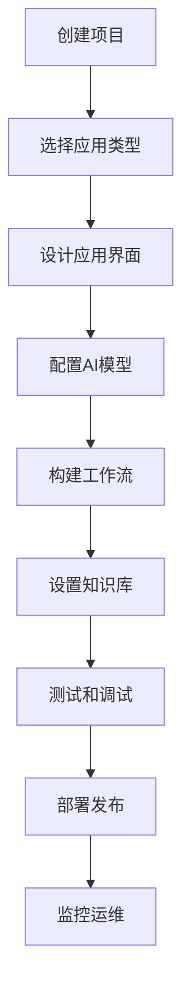
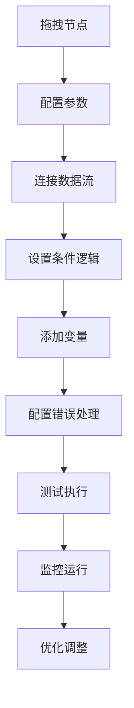

# 产品需求文档 (PRD) - Dify

## 1. 项目背景与愿景

### 1.1 项目概述
- **项目名称**: Dify
- **版本**: v1.0
- **创建日期**: 2025-11-03
- **最后更新**: 2025-11-03
- **项目地址**: https://github.com/langgenius/dify

### 1.2 问题背景
在AI应用开发的时代，开发者和企业面临着诸多挑战：
- **开发门槛高**: 需要深度学习、后端开发、前端设计等多领域技能
- **工具链分散**: 缺乏统一的AI应用开发平台和工具
- **模型选择困难**: 难以评估和选择合适的AI模型
- **部署运维复杂**: 从开发到生产的全链路管理复杂
- **团队协作困难**: 缺乏统一的开发环境和协作流程

### 1.3 产品愿景
Dify 致力于打造下一代AI应用开发平台，实现：
- 一站式AI应用开发解决方案
- 可视化的应用构建和配置
- 灵活的模型集成和管理
- 强大的工作流编排能力
- 优秀的团队协作和开发体验

### 1.4 项目范围
- **包含内容**:
  - AI应用开发和编排平台
  - 多模型支持和集成
  - 丰富的应用模板和组件
  - 企业级协作和管理
  - 完善的部署和运维
  - 开放的API和生态

- **排除内容**:
  - 自定义模型训练
  - 硬件基础设施管理
  - 深度学习框架开发

## 2. 目标用户画像与场景

### 2.1 主要用户画像

#### 用户画像 1: AI应用开发者
- **基本信息**: 22-40岁，AI工程师、全栈开发者、产品经理
- **技术水平**: 高等，熟悉AI技术和软件工程
- **目标和动机**:
  - 快速构建和部署AI应用
  - 提高开发效率和代码质量
  - 降低技术实现复杂度
  - 专注产品逻辑和用户体验
- **痛点描述**:
  - AI技术栈复杂，学习成本高
  - 模型API集成和调试繁琐
  - 缺乏统一的开发框架
  - 团队协作和版本管理困难
- **使用场景**:
  - AI应用快速原型开发
  - 产品功能AI化改造
  - 企业内部工具开发
  - 创新AI产品孵化
- **技术能力**: 熟练使用各种开发工具和云服务

#### 用户画像 2: 产品和业务负责人
- **基本信息**: 25-50岁，产品总监、业务负责人、创业公司CEO
- **技术水平**: 中等，理解技术价值但关注业务结果
- **目标和动机**:
  - 快速验证AI产品想法
  - 降低AI技术实施风险
  - 提高团队开发效率
  - 加速产品上市时间
- **痛点描述**:
  - AI技术概念抽象，难以转化为产品价值
  - 技术开发周期长，无法快速响应市场
  - 缺乏对开发进度和质量的把控
  - AI应用成本难以预估和控制
- **使用场景**:
  - AI产品概念验证
  - 业务流程智能化
  - 客户服务升级
  - 数据驱动决策
- **技术能力**: 重视结果导向，希望简化技术复杂性

#### 用户画像 3: 企业技术管理者
- **基本信息**: 30-55岁，CTO、技术总监、IT部门负责人
- **技术水平**: 中等到高等，理解技术架构和管理
- **目标和动机**:
  - 建立企业AI开发能力
  - 统一技术栈和开发规范
  - 提高开发团队效率
  - 控制技术风险和成本
- **痛点描述**:
  - 团队技术栈不统一
  - AI项目管理和监控困难
  - 缺乏可复用的技术资产
  - 技术人才培养周期长
- **使用场景**:
  - 企业AI平台建设
  - 技术标准和规范制定
  - 团队能力建设
  - 技术风险评估
- **技术能力**: 深度理解技术架构，重视系统稳定性

### 2.2 用户场景分析

#### 场景 1: 企业智能客服系统构建
- **触发条件**: 企业需要构建新一代智能客服系统
- **用户目标**: 快速部署功能强大、易于维护的客服应用
- **操作步骤**:
  1. 使用Dify创建客服应用项目
  2. 选择合适的AI模型和配置
  3. 设计对话流程和知识库
  4. 集成企业业务系统和数据
  5. 部署和监控客服系统
- **期望结果**:
  - 开发时间缩短70%
  - 系统维护成本降低60%
  - 客户满意度提升40%
  - 团队开发效率提升80%

#### 场景 2: AI内容创作平台开发
- **触发条件**: 媒体公司需要AI驱动的内容创作工具
- **用户目标**: 构建支持多场景的内容生成平台
- **操作步骤**:
  1. 设计内容创作应用架构
  2. 配置多种生成模型和模板
  3. 集成编辑器和发布系统
  4. 建立质量控制和审核流程
  5. 部署和优化创作工具
- **期望结果**:
  - 内容创作效率提升3倍
  - 创作质量一致性提升50%
  - 运营成本降低40%
  - 创作者满意度>4.5/5.0

#### 场景 3: 企业知识库和问答系统
- **触发条件**: 大型企业需要智能化知识管理系统
- **用户目标**: 构建企业级的知识检索和问答平台
- **操作步骤**:
  1. 整理企业知识资产和数据
  2. 构建知识库和索引系统
  3. 设计智能问答和检索功能
  4. 集成企业现有信息系统
  5. 部署企业级知识平台
- **期望结果**:
  - 信息查找效率提升90%
  - 员工知识获取时间减少80%
  - 知识重用率提升200%
  - 系统可用性>99.9%

## 3. 产品目标与成功指标

### 3.1 业务目标
- **主要目标**: 成为全球领先的AI应用开发平台
- **次要目标**:
  - 推动AI技术的民主化应用
  - 构建繁荣的开发者生态
  - 建立行业标准和最佳实践

### 3.2 用户目标
- **核心价值**: 让AI应用开发变得简单、高效、可靠
- **用户满意度**: 开发者满意度>4.7/5.0，开发效率提升>80%

### 3.3 成功指标 (KPIs)

#### 3.3.1 平台指标
- **注册开发者**: 500K+ registered developers
- **活跃应用**: 100K+ active applications
- **API调用量**: 100M+ daily API calls
- **社区贡献者**: 10K+ active contributors

#### 3.3.2 产品指标
- **应用开发成功率**: >95%
- **部署时间**: <30 minutes (average)
- **系统稳定性**: >99.9% uptime
- **用户留存率**: >75%

#### 3.3.3 商业指标
- **付费用户**: 50K+ paid users
- **企业客户**: 5000+ enterprise customers
- **年收入**: $50M+ ARR
- **生态合作伙伴**: 500+ technology partners

## 4. 功能列表与优先级

### 4.1 功能优先级定义
- **P0 - 必须有**: 核心AI应用开发功能，平台价值基础
- **P1 - 应该有**: 重要增强功能，用户体验保证
- **P2 - 可以有**: 期望功能，丰富应用场景
- **P3 - 暂不考虑**: 未来版本考虑

### 4.2 核心功能 (P0)

#### 功能 1: 可视化应用构建
- **功能描述**:
  - 拖拽式应用设计界面
  - 丰富的预置组件库
  - 实时预览和调试
  - 多设备响应式设计
  - 应用模板和最佳实践
- **用户价值**:
  - 零代码构建AI应用
  - 直观的设计体验
  - 快速原型验证
  - 跨平台兼容性
- **技术要求**:
  - 现代化前端框架
  - 可视化编辑引擎
  - 组件化架构
  - 实时预览技术
- **验收标准**:
  - 支持100+UI组件
  - 构建时间<10分钟
  - 预览延迟<2秒
  - 跨设备兼容性100%

#### 功能 2: 大语言模型集成
- **功能描述**:
  - 多模型支持和管理
  - 统一的模型API接口
  - 模型性能监控和优化
  - 成本控制和预警
  - A/B测试和模型对比
- **用户价值**:
  - 灵活的模型选择
  - 成本效益优化
  - 性能持续改进
  - 供应风险降低
- **技术要求**:
  - 模型API标准化
  - 性能监控系统
  - 成本计算引擎
  - 实验管理平台
- **验收标准**:
  - 支持50+主流模型
  - 模型切换无缝
  - 成本监控准确率>98%
  - API响应时间<1秒

#### 功能 3: 工作流编排引擎
- **功能描述**:
  - 可视化流程设计
  - 丰富的处理节点
  - 复杂逻辑支持
  - 实时流程监控
  - 错误处理和恢复
- **用户价值**:
  - 灵活的应用逻辑
  - 强大的处理能力
  - 可靠的系统稳定性
  - 全面的流程监控
- **技术要求**:
  - 工作流引擎
  - 节点标准化
  - 状态管理系统
  - 监控告警系统
- **验收标准**:
  - 支持100+处理节点
  - 流程执行成功率>99.5%
  - 支持复杂嵌套逻辑
  - 监控延迟<5秒

#### 功能 4: 知识库管理
- **功能描述**:
  - 多格式文档处理
  - 智能内容解析
  - 向量化存储和检索
  - 知识图谱构建
  - 实时更新和维护
- **用户价值**:
  - 高效的知识管理
  - 智能的信息检索
  - 结构化的知识表示
  - 持续的知识更新
- **技术要求**:
  - 文档解析引擎
  - 向量化技术
  - 图数据库
  - 检索算法优化
- **验收标准**:
  - 支持50+文档格式
  - 检索准确率>95%
  - 处理速度>20MB/s
  - 知识更新延迟<1分钟

### 4.3 重要功能 (P1)

#### 功能 5: 企业级协作
- **功能描述**:
  - 多人协作开发
  - 版本控制和回滚
  - 权限管理
  - 团队工作空间
  - 代码审查和评审
- **用户价值**:
  - 高效的团队协作
  - 可靠的版本管理
  - 安全的权限控制
  - 清晰的工作分工
- **技术要求**:
  - 协作引擎
  - 版本控制系统
  - 权限管理系统
  - 工作空间管理
- **验收标准**:
  - 支持100+人协作
  - 版本操作成功率100%
  - 权限控制准确性100%
  - 协作延迟<100ms

#### 功能 6: 部署和运维
- **功能描述**:
  - 一键部署功能
  - 多环境支持
  - 自动扩缩容
  - 监控和告警
  - 灾备和恢复
- **用户价值**:
  - 简化的部署流程
  - 弹性的资源管理
  - 全面的监控覆盖
  - 可靠的业务连续性
- **技术要求**:
  - 容器编排技术
  - 资源调度系统
  - 监控告警系统
  - 灾备方案
- **验收标准**:
  - 部署成功率>99%
  - 扩容响应时间<5分钟
  - 监控覆盖率100%
  - 故障恢复时间<10分钟

### 4.4 期望功能 (P2)

#### 功能 7: 应用市场和生态
- **功能描述**:
  - 应用模板市场
  - 组件和插件生态
  - 开发者社区
  - 技术支持和培训
  - 合作伙伴网络
- **用户价值**:
  - 丰富的应用资源
  - 强大的扩展能力
  - 活跃的社区支持
  - 专业的技术支持
- **技术要求**:
  - 市场平台系统
  - 插件架构
  - 社区管理系统
  - 支持服务平台
- **验收标准**:
  - 应用模板>1000个
  - 插件>500个
  - 社区活跃度>80%
  - 支持满意度>95%

#### 功能 8: 高级分析和洞察
- **功能描述**:
  - 应用性能分析
  - 用户行为分析
  - 业务指标监控
  - 预测分析
  - 智能优化建议
- **用户价值**:
  - 深度的业务洞察
  - 数据驱动优化
  - 科学的决策支持
  - 持续的性能改进
- **技术要求**:
  - 数据分析引擎
  - 机器学习模型
  - 可视化技术
  - 报表生成系统
- **验收标准**:
  - 分析维度>100种
  - 预测准确性>85%
  - 报表生成时间<30秒
  - 优化建议有效性>80%

## 5. 用户流程与线框图

### 5.1 核心用户流程

#### 流程 1: AI应用创建和部署流程


**流程说明**:
1. **创建项目**: 在Dify平台创建新的AI应用项目
2. **选择应用类型**: 选择聊天机器人、文本生成等应用类型
3. **设计应用界面**: 使用可视化设计器构建用户界面
4. **配置AI模型**: 选择和配置大语言模型参数
5. **构建工作流**: 设计应用的处理逻辑和数据流
6. **设置知识库**: 上传文档或配置知识库
7. **测试和调试**: 在测试环境中验证应用功能
8. **部署发布**: 将应用部署到生产环境
9. **监控运维**: 监控应用运行状态和用户行为

#### 流程 2: 工作流设计和执行


**流程说明**:
1. **拖拽节点**: 从节点库拖拽处理组件到工作流画布
2. **配置参数**: 设置每个组件的具体参数和配置
3. **连接数据流**: 连接组件形成完整的数据处理流程
4. **设置条件逻辑**: 配置条件分支、循环等复杂逻辑
5. **添加变量**: 定义工作流中的变量和状态管理
6. **配置错误处理**: 设置异常处理和重试机制
7. **测试执行**: 在测试环境中执行工作流验证功能
8. **监控运行**: 在生产环境中监控工作流执行状态
9. **优化调整**: 基于监控数据优化工作流性能

### 5.2 页面线框图

#### 页面 1: AI应用构建工作台

**布局结构**:
```
┌─────────────────────────────────────────────────────────┐
│  🚀 Dify   [应用▼] [模型▼] [数据▼]  [协作▼]  [设置▼]      │
├─────────────────────────────────────────────────────────┤
│  左侧工具栏             │        中央画布               │
│                        │                            │
│ 🎨 应用构建             │  ┌──────────────────────┐   │
│   • 界面设计器         │  │    应用构建画布       │   │
│   • 工作流编排         │  │                      │   │
│   • 知识库管理         │  │ [用户输入界面]        │   │
│                        │  │       ↓              │   │
│ 🤖 AI模型              │  │   [LLM处理模块]       │   │
│   • 模型选择           │  │       ↓              │   │
│   • 参数配置           │  │   [知识库检索]        │   │
│   • 性能监控           │  │       ↓              │   │
│                        │  │   [结果生成]          │   │
│ 📊 数据管理            │  │                      │   │
│   • 数据集管理         │  └──────────────────────┘   │
│   • 数据预处理         │                            │
│   • 数据标注           │ 🔧 右侧属性面板          │   │
│                        │ ┌──────────────────────┐   │
│ 👥 团队协作            │ │ 组件属性配置         │   │
│   • 成员管理           │ │ • 节点类型: LLM调用   │   │
│   • 权限设置           │ │ • 模型: GPT-4         │   │
│   • 项目管理           │ │ • 温度: 0.7          │   │
│                        │ │ • 最大长度: 4000     │   │
├─────────────────────────────────────────────────────────┤
│                🚀 Dify - 让AI应用开发变得简单高效          │
└─────────────────────────────────────────────────────────┘
```

**主要元素**:
- **左侧工具栏**:
  - 分类的功能模块（构建、模型、数据、协作）
  - 快速访问常用功能
  - 项目和资源管理
- **中央画布**:
  - 可视化的应用设计界面
  - 支持界面设计和工作流编排
  - 实时预览和调试功能
- **右侧属性面板**:
  - 详细的组件配置选项
  - 参数验证和提示
  - 实时保存和同步

#### 页面 2: 模型管理和配置

**布局结构**:
```
┌─────────────────────────────────────────────────────────┐
│  ← 返回    🤖 模型管理    [添加模型] [批量测试] [成本分析]  │
├─────────────────────────────────────────────────────────┤
│  模型列表                │        配置面板               │
│                        │                            │
│ 🔥 热门模型             │ ┌──────────────────────┐   │
│ [✓] GPT-4              │ │  模型配置详情         │   │
│ [✓] GPT-3.5-turbo      │ │                      │   │
│ [✓] Claude-3-Opus      │ │ 🎯 基本信息           │   │
│ [✓] Gemini-Pro         │ │ 模型名称: GPT-4       │   │
│                        │ │ 提供商: OpenAI       │   │
│ 🏢 企业模型            │ │ 版本: gpt-4-1106     │   │
│ [✓] Qwen-Max           │ │                      │   │
│ [✓] ChatGLM-4          │ │ ⚙️ 参数配置           │   │
│ [✓] Baichuan2          │ │ • 最大长度: 4000      │   │
│                        │ │ • 温度: 0.7          │   │
│ 🔬 开源模型            │ │ • Top_P: 1.0         │   │
│ [✓] Llama2-70B         │ │ • 频率惩罚: 0.0      │   │
│ [✓] Mistral-7B         │ │                      │   │
│ [✓] Vicuna-33B         │ │ 📊 性能统计           │   │
│                        │ │ 响应时间: 1.2s       │   │
│ 📊 自定义模型          │ │ 成本: $0.03/1K       │   │
│ [+] 添加自定义模型      │ │ 使用次数: 1,234      │   │
│                        │ │ 成功率: 99.2%        │   │
├─────────────────────────────────────────────────────────┤
│               🚀 Dify - 50+主流AI模型任你选择              │
└─────────────────────────────────────────────────────────┘
```

**主要元素**:
- **模型列表**:
  - 分类展示不同类型的模型
  - 热门模型、企业模型、开源模型分类
  - 模型状态和使用统计
- **配置面板**:
  - 详细的模型配置信息
  - 参数调整和优化选项
  - 性能和成本统计数据
  - 模型测试和对比功能

### 5.3 交互设计要点

#### 交互模式 1: 可视化应用构建
- **触发条件**: 用户需要创建新的AI应用
- **操作步骤**:
  1. 从左侧工具栏选择构建功能
  2. 在中央画布拖拽和配置组件
  3. 在右侧面板设置详细参数
  4. 实时预览应用效果
  5. 保存和测试应用功能
- **系统响应**:
  - 流畅的拖拽体验
  - 实时的界面预览
  - 智能的配置建议
  - 自动的错误检查和提示
- **用户反馈**:
  - 构建体验评价
  - 功能完整性反馈
  - 学习成本评估

#### 交互模式 2: 模型性能监控
- **触发条件**: 用户需要监控和优化AI模型性能
- **操作步骤**:
  1. 进入模型管理界面
  2. 选择目标模型进行监控
  3. 查看实时性能指标
  4. 进行A/B测试对比
  5. 调整参数并优化配置
- **系统响应**:
  - 实时的性能数据更新
  - 可视化的性能图表
  - 智能的优化建议
  - 历史数据对比分析
- **用户反馈**:
  - 监控功能实用性
  - 数据准确性评价
  - 优化建议有效性

## 6. 技术要求与约束

### 6.1 技术栈

#### 前端技术
- **框架**: React 18+ / Next.js
- **UI组件**: Ant Design / Material-UI
- **状态管理**: Redux Toolkit / Zustand
- **可视化**: D3.js / ECharts / Fabric.js
- **编辑器**: Monaco Editor / Slate.js

#### 后端技术
- **框架**: Python / FastAPI / Node.js
- **数据库**: PostgreSQL / Redis / MongoDB
- **消息队列**: RabbitMQ / Apache Kafka
- **搜索引擎**: Elasticsearch / Meilisearch
- **图数据库**: Neo4j / JanusGraph

#### AI和ML
- **大语言模型**:
  - OpenAI: GPT-4, GPT-3.5系列
  - Anthropic: Claude系列
  - Google: Gemini系列
  - 开源: Llama, Mistral, Qwen等
- **向量数据库**: Pinecone, Weaviate, Milvus, Chroma
- **ML平台**: Hugging Face, LangChain, LlamaIndex

#### 部署和运维
- **容器化**: Docker, Kubernetes
- **云平台**: AWS, Azure, GCP, 阿里云
- **监控**: Prometheus, Grafana, Sentry
- **CI/CD**: GitHub Actions, GitLab CI
- **服务网格**: Istio, Linkerd

### 6.2 性能要求
- **应用构建**:
  - 页面加载时间: <2 seconds
  - 组件拖拽响应: <50ms
  - 实时预览延迟: <1 second
  - 应用保存时间: <3 seconds
- **应用运行**:
  - API响应时间: <300ms (P95)
  - 并发用户数: 100,000+
  - 请求处理能力: 1M+ QPS
  - 系统可用性: >99.9%

### 6.3 兼容性要求
- **浏览器支持**:
  - Chrome 90+, Firefox 88+, Safari 14+, Edge 90+
- **移动设备**:
  - 响应式设计适配
  - PWA支持
- **API兼容性**:
  - RESTful API标准
  - OpenAPI 3.0规范
  - GraphQL支持

## 7. 风险与约束

### 7.1 技术风险

#### 风险 1: 平台复杂度管理
- **风险描述**: 随着功能丰富，平台可能变得复杂难用
- **影响程度**: 中
- **缓解措施**:
  - 分层设计架构
  - 持续的用户体验优化
  - 详细的文档和培训
  - 分级功能展示

#### 风险 2: AI模型依赖
- **风险描述**: 过度依赖第三方AI模型服务
- **影响程度**: 高
- **缓解措施**:
  - 多模型供应商策略
  - 本地模型部署支持
  - 模型性能监控
  - 降级和容错机制

#### 风险 3: 数据安全和隐私
- **风险描述**: 用户和企业数据的安全保护挑战
- **影响程度**: 高
- **缓解措施**:
  - 企业级安全架构
  - 数据加密和隔离
  - 权限管理和审计
  - 合规性认证

### 7.2 业务风险

#### 风险 1: 市场竞争激烈
- **风险描述**: AI开发平台市场竞争白热化
- **影响程度**: 中
- **缓解措施**:
  - 差异化产品定位
  - 强大的社区建设
  - 持续的技术创新
  - 生态合作伙伴网络

#### 风险 2: 技术更新迅速
- **风险描述**: AI技术发展迅速，存在技术过时风险
- **影响程度**: 中
- **缓解措施**:
  - 模块化和可扩展架构
  - 持续的技术研究
  - 快速的技术适应能力
  - 与学术界合作

### 7.3 时间约束
- **发布计划**:
  - Alpha版本: 6个月内
  - Beta版本: 12个月内
  - 正式版本: 18个月内
- **重要里程碑**:
  - Month 3: 核心构建器
  - Month 6: 模型集成
  - Month 9: 工作流引擎
  - Month 12: 企业协作
  - Month 15: 部署运维
  - Month 18: 生态系统

## 8. 附录

### 8.1 术语表
- **LLMOps**: 大语言模型运维，涵盖模型的部署、监控和优化
- **工作流编排**: 将复杂业务流程分解为可管理的步骤
- **知识库**: 结构化存储和管理知识的系统
- **可视化开发**: 通过图形界面而非代码来构建应用

### 8.2 参考文档
- [Dify GitHub Repository](https://github.com/langgenius/dify)
- [LLM Application Architecture](https://arxiv.org/abs/2312.05878)
- [AI Platform Design Patterns](https://aiplatform.design/)
- [Enterprise AI Adoption](https://hbr.org/topic/artificial-intelligence)

### 8.3 变更记录
| 版本 | 日期 | 变更内容 | 变更人 |
|------|------|----------|--------|
| v1.0 | 2025-11-03 | 初始版本，基于Dify项目分析的完整PRD | Claude AI Assistant |

---

*本文档为Dify项目的详细产品需求文档，专注于新一代AI应用开发平台。Dify通过可视化构建、多模型集成、工作流编排等核心能力，为开发者和企业提供了一站式的AI应用开发解决方案，加速AI技术的普及和应用创新。*