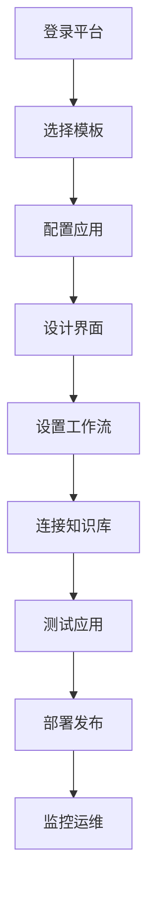
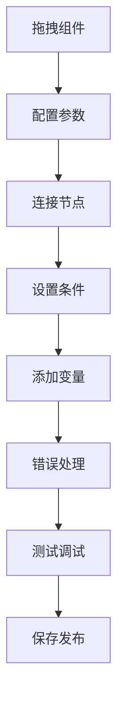

# 产品需求文档 (PRD) - FastGPT

## 1. 项目背景与愿景

### 1.1 项目概述
- **项目名称**: FastGPT
- **版本**: v1.0
- **创建日期**: 2025-11-03
- **最后更新**: 2025-11-03
- **项目地址**: https://github.com/labring/FastGPT

### 1.2 问题背景
在AI应用开发的浪潮中，开发者和企业面临着以下核心挑战：
- **开发门槛高**: 需要深度学习、API集成、前端开发等多领域技能
- **部署复杂**: 涉及模型选择、API配置、系统部署、运维监控等多个环节
- **成本控制难**: GPU资源、API调用、维护成本高昂且难以精确控制
- **定制化困难**: 难以根据具体业务场景进行深度定制和优化
- **集成复杂**: 与现有业务系统的集成需要大量开发工作

### 1.3 产品愿景
FastGPT 致力于打造"快速、简单、强大"的AI应用开发平台，实现：
- 一键部署的AI应用解决方案
- 可视化的应用构建和配置
- 高性能和成本优化的运行环境
- 丰富的预置模板和组件
- 开放的生态和扩展能力

### 1.4 项目范围
- **包含内容**:
  - 可视化AI应用构建平台
  - 内置多种大语言模型支持
  - 丰富的预置应用模板
  - 灵活的工作流编排
  - 企业级的管理和监控
  - 完善的API和集成能力

- **排除内容**:
  - 自定义模型训练功能
  - 复杂的多模态处理
  - 分布式大规模训练

## 2. 目标用户画像与场景

### 2.1 主要用户画像

#### 用户画像 1: 独立开发者和技术创业者
- **基本信息**: 22-40岁，全栈开发者、AI应用开发者、创业者
- **技术水平**: 高等，熟练掌握前端、后端、AI相关技术
- **目标和动机**:
  - 快速验证AI应用想法
  - 降低开发成本和时间
  - 专注业务逻辑而非技术细节
  - 快速迭代和产品化
- **痛点描述**:
  - AI应用开发技术栈复杂
  - 模型API集成和调试耗时
  - 部署和运维工作繁重
  - 缺乏成熟的开发框架
- **使用场景**:
  - AI应用MVP快速开发
  - 原型验证和概念测试
  - 个人项目和副业开发
  - 小团队产品开发
- **技术能力**: 熟练使用各种开发工具，了解云服务和部署

#### 用户画像 2: 企业产品经理和业务负责人
- **基本信息**: 25-45岁，企业产品经理、业务负责人、数字化转型负责人
- **技术水平**: 中等，了解技术概念但更关注业务价值
- **目标和动机**:
  - 快速上线AI功能产品
  - 验证AI技术的商业价值
  - 提高团队开发效率
  - 降低技术实施风险
- **痛点描述**:
  - AI技术概念抽象，难以转化为产品
  - 技术开发周期长，无法快速响应市场
  - 缺乏对技术实现的可控性
  - 预算和资源有限
- **使用场景**:
  - 企业AI功能快速验证
  - 内部工具和效率应用
  - 客户服务智能化
  - 业务流程自动化
- **技术能力**: 更关注易用性和效果，希望降低技术门槛

#### 用户画像 3: 教育机构和培训机构
- **基本信息**: 30-55岁，教育工作者、培训师、教育机构管理者
- **技术水平**: 中等偏上，对教育技术有一定了解
- **目标和动机**:
  - 构建智能教学工具
  - 提供个性化的学习体验
  - 提高教学效率和质量
  - 降低技术使用门槛
- **痛点描述**:
  - 缺乏适合教育的AI工具
  - 技术集成困难，成本高昂
  - 难以根据教学需求定制
  - 师生技术培训成本高
- **使用场景**:
  - 智能答疑和辅导系统
  - 个性化学习推荐
  - 自动化作业批改
  - 教学内容生成
- **技术能力**: 关注教育价值，希望简单易用的解决方案

### 2.2 用户场景分析

#### 场景 1: 快速AI应用原型开发
- **触发条件**: 开发者需要在短时间内构建AI应用原型
- **用户目标**: 跳过复杂的技术细节，快速验证产品想法
- **操作步骤**:
  1. 注册并登录FastGPT平台
  2. 选择合适的应用模板
  3. 通过可视化界面配置功能
  4. 连接数据源和知识库
  5. 测试和发布应用
- **期望结果**:
  - 开发时间缩短80%
  - 技术复杂度降低90%
  - 原型验证周期缩短到天
  - 总开发成本降低70%

#### 场景 2: 企业智能客服系统
- **触发条件**: 中小企业需要快速部署智能客服系统
- **用户目标**: 低成本快速上线客服问答功能
- **操作步骤**:
  1. 使用客服模板创建应用
  2. 上传产品文档和FAQ
  3. 配置客服对话流程
  4. 集成到现有网站或App
  5. 监控对话质量和效果
- **期望结果**:
  - 部署时间<1天
  - 客服响应时间<3秒
  - 问题解决率>85%
  - 客服成本降低60%

#### 场景 3: 智能内容创作平台
- **触发条件**: 内容创作者需要提高创作效率和质量
- **用户目标**: 使用AI辅助进行内容生成和优化
- **操作步骤**:
  1. 选择内容创作模板
  2. 配置创作风格和要求
  3. 输入创作主题和素材
  4. AI生成初稿内容
  5. 人工编辑和优化发布
- **期望结果**:
  - 创作效率提升3倍
  - 内容质量一致性提升
  - 创作成本降低50%
  - 创意枯竭问题缓解

## 3. 产品目标与成功指标

### 3.1 业务目标
- **主要目标**: 成为最受欢迎的AI应用快速开发平台
- **次要目标**:
  - 降低AI应用开发门槛
  - 推动AI技术的普及应用
  - 构建繁荣的开发者生态

### 3.2 用户目标
- **核心价值**: 让AI应用开发变得像搭积木一样简单
- **用户满意度**: 用户满意度>4.6/5.0，开发效率提升>80%

### 3.3 成功指标 (KPIs)

#### 3.3.1 平台指标
- **注册用户**: 100K+ registered users
- **活跃应用**: 50K+ active applications
- **API调用量**: 10M+ daily API calls
- **开发者社区**: 20K+ active developers

#### 3.3.2 产品指标
- **应用创建成功率**: >95%
- **部署时间**: <10 minutes (average)
- **系统稳定性**: >99.5% uptime
- **用户留存率**: >70%

#### 3.3.3 商业指标
- **付费用户**: 10K+ paid users
- **企业客户**: 1000+ enterprise customers
- **年收入**: $5M+ ARR
- **生态合作伙伴**: 100+ technology partners

## 4. 功能列表与优先级

### 4.1 功能优先级定义
- **P0 - 必须有**: 核心应用构建功能，平台价值基础
- **P1 - 应该有**: 重要增强功能，用户体验保证
- **P2 - 可以有**: 期望功能，丰富应用场景
- **P3 - 暂不考虑**: 未来版本考虑

### 4.2 核心功能 (P0)

#### 功能 1: 可视化应用构建器
- **功能描述**:
  - 拖拽式界面设计
  - 丰富的UI组件库
  - 实时预览和调试
  - 响应式布局支持
  - 组件配置和属性编辑
- **用户价值**:
  - 零代码构建AI应用
  - 直观的设计体验
  - 快速原型验证
- **技术要求**:
  - 现代化的前端框架
  - 可视化编辑引擎
  - 组件化架构
  - 实时预览技术
- **验收标准**:
  - 支持50+UI组件
  - 构建时间<5分钟
  - 预览延迟<1秒

#### 功能 2: 多模型集成管理
- **功能描述**:
  - 内置多种大语言模型
  - 模型配置和参数调节
  - 模型切换和A/B测试
  - 成本监控和优化
  - 模型性能评估
- **用户价值**:
  - 灵活的模型选择
  - 成本控制和优化
  - 性能对比和选择
- **技术要求**:
  - 统一的模型API接口
  - 模型参数配置系统
  - 实时成本监控
  - 性能评估框架
- **验收标准**:
  - 支持20+主流模型
  - 模型切换无缝
  - 成本监控准确性>95%

#### 功能 3: 工作流编排引擎
- **功能描述**:
  - 可视化流程设计
  - 丰富的处理节点
  - 条件分支和循环
  - 变量和状态管理
  - 错误处理和重试
- **用户价值**:
  - 灵活的应用逻辑设计
  - 复杂业务流程支持
  - 可靠的异常处理
- **技术要求**:
  - 工作流引擎
  - 节点标准化接口
  - 状态管理系统
  - 错误处理机制
- **验收标准**:
  - 支持30+处理节点
  - 流程执行成功率>99%
  - 支持复杂嵌套逻辑

#### 功能 4: 知识库管理
- **功能描述**:
  - 多格式文档上传
  - 智能文本解析和处理
  - 知识向量化存储
  - 实时检索和匹配
  - 知识更新和维护
- **用户价值**:
  - 便捷的知识管理
  - 高效的信息检索
  - 持续的知识更新
- **技术要求**:
  - 文档解析引擎
  - 向量化处理
  - 检索算法优化
  - 数据管理系统
- **验收标准**:
  - 支持20+文档格式
  - 检索准确率>90%
  - 上传处理速度>10MB/s

### 4.3 重要功能 (P1)

#### 功能 5: 应用模板市场
- **功能描述**:
  - 丰富的预置模板
  - 分类浏览和搜索
  - 模板预览和试用
  - 一键安装和部署
  - 用户评价和反馈
- **用户价值**:
  - 快速应用启动
  - 最佳实践分享
  - 降低学习成本
- **技术要求**:
  - 模板管理系统
  - 分类和搜索功能
  - 版本控制
  - 用户反馈系统
- **验收标准**:
  - 提供100+应用模板
  - 模板安装成功率>99%
  - 用户满意度>4.5/5.0

#### 功能 6: 企业级管理
- **功能描述**:
  - 多租户和权限管理
  - 用户和团队协作
  - 资源配额和计费
  - 审计日志和监控
  - 数据安全和合规
- **用户价值**:
  - 企业级安全保障
  - 团队协作便利
  - 成本可控制
- **技术要求**:
  - 多租户架构
  - 权限管理系统
  - 计费计量系统
  - 安全合规框架
- **验收标准**:
  - 支持1000+租户
  - 权限控制100%准确
  - 计费准确率>99.9%

### 4.4 期望功能 (P2)

#### 功能 7: API和集成
- **功能描述**:
  - 完整的RESTful API
  - 多语言SDK支持
  - Webhook和回调
  - 第三方集成模板
  - 数据导入导出
- **用户价值**:
  - 灵活的系统集成
  - 丰富的开发工具
  - 生态系统扩展
- **技术要求**:
  - API网关和管理
  - SDK开发框架
  - 集成适配器
  - 数据格式标准
- **验收标准**:
  - API响应时间<200ms
  - 提供5+语言SDK
  - 集成成功率>95%

#### 功能 8: 高级分析
- **功能描述**:
  - 应用使用分析
  - 用户行为洞察
  - 性能瓶颈识别
  - A/B测试和实验
  - 预测分析建议
- **用户价值**:
  - 深度业务洞察
  - 数据驱动优化
  - 科学决策支持
- **技术要求**:
  - 数据分析引擎
  - 行为分析算法
  - 实验管理平台
  - 机器学习模型
- **验收标准**:
  - 分析维度>50种
  - 洞察准确性>85%
  - 实验管理效率>90%

## 5. 用户流程与线框图

### 5.1 核心用户流程

#### 流程 1: AI应用创建流程


**流程说明**:
1. **登录平台**: 用户注册并登录FastGPT平台
2. **选择模板**: 从模板市场选择合适的应用模板
3. **配置应用**: 设置应用的基本信息和参数
4. **设计界面**: 使用可视化设计器构建应用界面
5. **设置工作流**: 配置应用的处理逻辑和工作流
6. **连接知识库**: 上传文档或连接外部数据源
7. **测试应用**: 在预览环境中测试应用功能
8. **部署发布**: 将应用部署到生产环境
9. **监控运维**: 监控应用运行状态和用户使用情况

#### 流程 2: 可视化工作流设计


**流程说明**:
1. **拖拽组件**: 从组件库拖拽处理节点到画布
2. **配置参数**: 设置每个组件的参数和属性
3. **连接节点**: 连接组件形成数据处理流程
4. **设置条件**: 配置条件分支和判断逻辑
5. **添加变量**: 定义流程中的变量和状态
6. **错误处理**: 设置异常处理和重试机制
7. **测试调试**: 在调试环境中测试工作流
8. **保存发布**: 保存并发布工作流配置

### 5.2 页面线框图

#### 页面 1: 应用构建工作台

**布局结构**:
```
┌─────────────────────────────────────────────────────────┐
│  ⚡ FastGPT   [应用▼] [模板▼] [数据▼]  [工作台▼]  [👤]   │
├─────────────────────────────────────────────────────────┤
│  组件面板              │        设计画布               │
│                        │                            │
│ 🎨 UI组件              │  ┌──────────────────────┐   │
│   • 文本输入框         │  │   应用设计画布       │   │
│   • 按钮和链接         │  │                      │   │
│   • 图像和媒体         │  │ [用户输入框]          │   │
│                        │  │       ↓              │   │
│ 🔧 处理组件            │  │   [AI处理模块]        │   │
│   • LLM调用            │  │       ↓              │   │
│   • 条件判断           │  │   [结果展示]          │   │
│   • 数据转换           │  │                      │   │
│                        │  └──────────────────────┘   │
│ 📚 数据组件            │                            │
│   • 知识库查询         │ 🔧 属性面板              │   │
│   • 文件处理           │ ┌──────────────────────┐   │
│   • API调用            │ │ 组件属性配置         │   │
│                        │ │ • 组件类型: AI对话   │   │
│ ⚙️ 系统组件            │ │ • 模型: GPT-4        │   │
│   • 变量管理           │ │ • 温度: 0.7          │   │
│   • 错误处理           │ │ • 最大长度: 2000     │   │
│   • 循环控制           │ └──────────────────────┘   │
├─────────────────────────────────────────────────────────┤
│                ⚡ FastGPT - 让AI应用开发变得简单         │
└─────────────────────────────────────────────────────────┘
```

**主要元素**:
- **组件面板**:
  - 分类的组件库（UI、处理、数据、系统）
  - 拖拽式的组件添加
  - 组件搜索和筛选
- **设计画布**:
  - 可视化的应用设计
  - 组件连接和数据流
  - 实时预览和调试
- **属性面板**:
  - 详细的组件配置
  - 参数验证和提示
  - 实时保存和同步

#### 页面 2: 模板市场页面

**布局结构**:
```
┌─────────────────────────────────────────────────────────┐
│  🔍 模板市场    [分类▼] [排序▼] [筛选▼]  [发布模板]       │
├─────────────────────────────────────────────────────────┤
│  分类导航                │        模板展示区             │
│                        │                            │
│ 🏷️ 热门分类             │ ┌────────────────────────┐ │
│   • 客服问答 (123)      │ │   🤖 智能客服助手       │ │
│   • 内容创作 (89)       │ │                        │ │
│   • 教育培训 (67)       │ │ 💡 一键部署专业的智能  │ │
│   • 数据分析 (45)       │ │ 客服系统，支持多轮对  │ │
│                        │ │ 话和知识库问答         │ │
│ 🎯 应用场景             │ │                        │ │
│   • 电商零售            │ │ ⭐ 4.8/5.0  👥 1.2K    │ │
│   • 金融服务            │ │ [📋 详情] [🚀 使用]     │ │
│   • 医疗健康            │ │                        │ │
│   • 教育培训            │ ┌────────────────────────┐ │
│                        │ │   ✍️ 内容创作助手       │ │
│ 📊 最新模板             │ │                        │ │
│   • 文档总结机器人      │ │ 🚀 AI驱动的内容生成   │ │
│   • 代码助手           │ │ 工具，支持多语言和     │ │
│   • 数据分析师         │ │ 多种文体创作           │ │
│                        │ │                        │ │
│ 🔥 热门模板             │ │ ⭐ 4.7/5.0  👥 856     │ │
│   • 智能写作助手       │ │ [📋 详情] [🚀 使用]     │ │
│   • FAQ问答机器人      │ │                        │ │
│   • 学习计划制定       │ ┌────────────────────────┐ │
├─────────────────────────────────────────────────────────┤
│                ⚡ FastGPT - 1000+应用模板任你选择          │
└─────────────────────────────────────────────────────────┘
```

**主要元素**:
- **分类导航**:
  - 热门分类和应用场景
  - 模板数量统计
  - 最新和热门模板推荐
- **模板展示**:
  - 模板卡片式布局
  - 详细介绍和预览
  - 评价和使用统计
  - 一键使用和部署

### 5.3 交互设计要点

#### 交互模式 1: 拖拽式应用构建
- **触发条件**: 用户需要创建新的AI应用
- **操作步骤**:
  1. 从组件面板拖拽UI组件到画布
  2. 配置组件的属性和样式
  3. 添加处理组件并连接数据流
  4. 设置工作流和业务逻辑
  5. 实时预览和测试应用
- **系统响应**:
  - 流畅的拖拽体验
  - 实时的界面预览
  - 智能的连接建议
  - 自动的错误检查
- **用户反馈**:
  - 构建体验评价
  - 组件丰富度反馈
  - 学习成本评估

#### 交互模式 2: 模板快速部署
- **触发条件**: 用户想要快速使用预置模板
- **操作步骤**:
  1. 在模板市场浏览和筛选
  2. 查看模板详情和预览
  3. 点击"一键使用"按钮
  4. 根据需要调整配置
  5. 部署并测试应用
- **系统响应**:
  - 清晰的模板分类
  - 详细的模板介绍
  - 快速的部署流程
  - 智能的配置建议
- **用户反馈**:
  - 模板质量评价
  - 部署体验反馈
  - 功能完整性评估

## 6. 技术要求与约束

### 6.1 技术栈

#### 前端技术
- **框架**: React 18+ / Vue 3+ / Next.js
- **UI组件**: Ant Design / Element Plus / Material-UI
- **状态管理**: Redux / Pinia / Zustand
- **可视化**: D3.js / ECharts / Fabric.js
- **构建工具**: Vite / Webpack / Turbopack

#### 后端技术
- **框架**: Node.js / Go / Python FastAPI
- **数据库**: PostgreSQL / MongoDB / Redis
- **消息队列**: RabbitMQ / Apache Kafka / Redis
- **缓存**: Redis / Memcached / CDN
- **搜索**: Elasticsearch / Meilisearch

#### AI和ML
- **大语言模型**:
  - OpenAI: GPT-4, GPT-3.5
  - Anthropic: Claude系列
  - Google: Gemini, PaLM
  - 开源: Llama2, ChatGLM, Qwen
- **向量数据库**: Chroma, Pinecone, Milvus
- **NLP工具**: transformers, sentence-transformers
- **文本处理**: jieba, spaCy, tiktoken

#### 部署和运维
- **容器化**: Docker, Kubernetes
- **云平台**: AWS, Azure, GCP, 阿里云
- **监控**: Prometheus, Grafana, Sentry
- **CI/CD**: GitHub Actions, GitLab CI

### 6.2 性能要求
- **应用构建**:
  - 页面加载时间: <3 seconds
  - 组件拖拽响应: <100ms
  - 实时预览延迟: <1 second
  - 应用保存时间: <2 seconds
- **应用运行**:
  - API响应时间: <500ms (P95)
  - 并发用户数: 10,000+
  - 请求处理能力: 50,000 QPS
  - 系统可用性: >99.5%

### 6.3 兼容性要求
- **浏览器支持**:
  - Chrome 90+, Firefox 88+, Safari 14+, Edge 90+
- **移动设备**:
  - 响应式设计适配
  - 移动端操作优化
- **API兼容性**:
  - RESTful API标准
  - OpenAPI 3.0规范
  - GraphQL支持（可选）

## 7. 风险与约束

### 7.1 技术风险

#### 风险 1: 平台复杂度管理
- **风险描述**: 随着功能增加，平台可能变得复杂难用
- **影响程度**: 中
- **缓解措施**:
  - 模块化架构设计
  - 用户体验持续优化
  - 分层功能设计
  - 完善的用户指导

#### 风险 2: AI模型依赖风险
- **风险描述**: 过度依赖第三方AI模型，存在供应风险
- **影响程度**: 高
- **缓解措施**:
  - 多模型支持和备份
  - 本地模型部署选项
  - 模型性能监控
  - 降级和容错机制

#### 风险 3: 数据安全和隐私
- **风险描述**: 用户数据的安全和隐私保护挑战
- **影响程度**: 高
- **缓解措施**:
  - 数据加密和隔离
  - 权限控制和审计
  - 合规性检查
  - 安全认证和测试

### 7.2 业务风险

#### 风险 1: 市场竞争激烈
- **风险描述**: 低代码/无代码平台竞争激烈
- **影响程度**: 中
- **缓解措施**:
  - 聚焦AI应用差异化
  - 建设开发者社区
  - 持续产品创新
  - 生态合作伙伴建设

#### 风险 2: 用户采用阻力
- **风险描述**: 传统开发者可能对可视化平台有抵触
- **影响程度**: 低
- **缓解措施**:
  - 混合开发模式支持
  - 代码导出功能
  - 详细的技术文档
  - 开发者友好的API

### 7.3 时间约束
- **发布计划**:
  - Alpha版本: 3个月内
  - Beta版本: 6个月内
  - 正式版本: 9个月内
- **重要里程碑**:
  - Month 1: 核心构建器开发
  - Month 2: 模型集成和管理
  - Month 3: 工作流引擎
  - Month 4: 模板市场
  - Month 5: 企业级功能
  - Month 6: 监控和分析
  - Month 7: 性能优化
  - Month 8: 安全和合规
  - Month 9: 正式发布

## 8. 附录

### 8.1 术语表
- **低代码/无代码**: 通过可视化界面构建应用，减少编码需求
- **工作流引擎**: 管理和执行业务流程的系统
- **组件化架构**: 将应用分解为可复用的组件
- **模板市场**: 提供预置应用模板的市场

### 8.2 参考文档
- [FastGPT GitHub Repository](https://github.com/labring/FastGPT)
- [Low-Code Platform Design Patterns](https://lowcode.platform/)
- [AI Application Architecture](https://aws.amazon.com/ai/)
- [User Experience Design](https://www.nngroup.com/)

### 8.3 变更记录
| 版本 | 日期 | 变更内容 | 变更人 |
|------|------|----------|--------|
| v1.0 | 2025-11-03 | 初始版本，基于FastGPT项目分析的完整PRD | Claude AI Assistant |

---

*本文档为FastGPT项目的详细产品需求文档，专注于AI应用的快速开发平台。FastGPT通过可视化构建、模板市场、工作流编排等核心功能，让AI应用开发变得像搭积木一样简单，帮助开发者和企业快速实现AI产品化和商业化。*