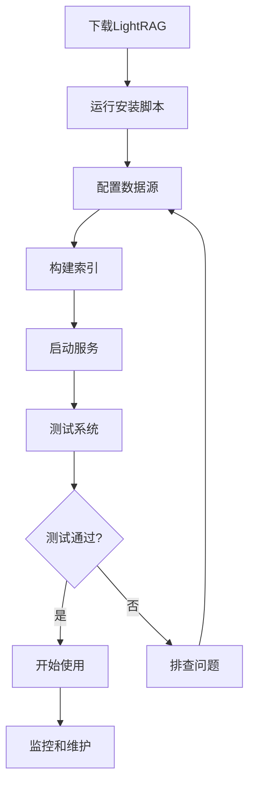
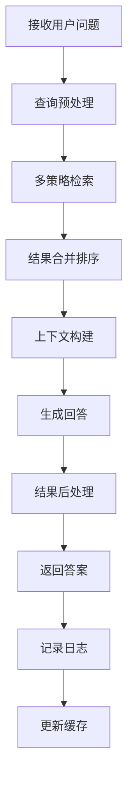

# 产品需求文档 (PRD) - LightRAG

## 1. 项目背景与愿景

### 1.1 项目概述
- **项目名称**: LightRAG
- **版本**: v1.0
- **创建日期**: 2025-11-03
- **最后更新**: 2025-11-03
- **项目地址**: https://github.com/HKUDS/LightRAG

### 1.2 问题背景
在RAG（检索增强生成）系统的实际应用中，开发者面临以下核心挑战：
- **资源消耗高**: 传统RAG系统需要大量计算和存储资源
- **部署复杂**: 系统组件多，部署和运维门槛高
- **响应延迟**: 多步检索和生成导致用户体验不佳
- **灵活性不足**: 难以根据具体需求定制优化
- **成本压力大**: 云服务和API调用成本高昂

### 1.3 产品愿景
LightRAG 致力于打造轻量级、高效的RAG解决方案，实现：
- 简化RAG系统架构，减少资源消耗
- 提供开箱即用的快速部署方案
- 优化检索和生成性能，提升用户体验
- 降低部署和运维成本，扩大应用场景
- 保持功能完整性和扩展能力

### 1.4 项目范围
- **包含内容**:
  - 轻量级RAG框架核心
  - 优化的检索算法和数据结构
  - 简化的部署和配置工具
  - 高效的内存和存储管理
  - 预训练模型和知识库
  - 开发友好的API和工具

- **排除内容**:
  - 复杂的企业级权限管理
  - 分布式多节点部署
  - 自定义模型训练功能

## 2. 目标用户画像与场景

### 2.1 主要用户画像

#### 用户画像 1: 个人开发者
- **基本信息**: 20-35岁，独立开发者、学生、技术爱好者
- **技术水平**: 中等，熟悉Python基础，了解机器学习概念
- **目标和动机**:
  - 快速构建个人RAG应用
  - 学习和实践RAG技术
  - 部署轻量级AI服务
  - 降低开发成本
- **痛点描述**:
  - 资源有限，无法运行重型系统
  - 部署配置复杂，学习曲线陡峭
  - 云服务成本超出预算
  - 缺乏简单易用的工具
- **使用场景**:
  - 个人知识管理系统
  - 学习资料问答助手
  - 小型项目原型开发
  - 技术博客和文档检索
- **技术能力**: 基础Python开发能力，了解Docker基本使用

#### 用户画像 2: 中小企业开发者
- **基本信息**: 25-40岁，中小企业技术团队开发者
- **技术水平**: 中等到高等，有实际项目开发经验
- **目标和动机**:
  - 为企业快速部署RAG解决方案
  - 控制IT基础设施成本
  - 简化系统运维管理
  - 快速响应业务需求
- **痛点描述**:
  - 预算有限，无法承担昂贵的云服务
  - 缺乏专门的AI运维团队
  - 需要快速上线验证想法
  - 现有系统集成困难
- **使用场景**:
  - 企业内部知识库
  - 客服问答系统
  - 产品文档检索
  - 数据分析报告生成
- **技术能力**: 熟悉企业级应用开发，了解系统部署和运维

#### 用户画像 3: 研究人员
- **基本信息**: 25-45岁，高校教师、研究生、科研人员
- **技术水平**: 高等，熟悉AI和机器学习技术
- **目标和动机**:
  - 快速验证RAG相关研究想法
  - 构建轻量级实验平台
  - 复现和对比不同算法
  - 发表高质量学术论文
- **痛点描述**:
  - 实验环境搭建耗时
  - 计算资源受限
  - 算法实现复杂
  - 缺乏标准化评估工具
- **使用场景**:
  - RAG算法研究和改进
  - 学术实验和基准测试
  - 教学演示和课程项目
  - 合作研究和知识共享
- **技术能力**: 深度理解AI算法，熟练使用Python和科学计算库

### 2.2 用户场景分析

#### 场景 1: 个人知识助手
- **触发条件**: 个人用户需要管理大量学习资料和笔记
- **用户目标**: 快速从个人文档中找到准确答案，构建智能知识库
- **操作步骤**:
  1. 下载和安装LightRAG
  2. 导入PDF、Word、Markdown等个人文档
  3. 配置简单的检索参数
  4. 启动本地RAG服务
  5. 通过Web界面或API进行问答
- **期望结果**:
  - 安装配置时间<30分钟
  - 本地检索响应时间<2秒
  - 支持个人电脑运行，内存占用<2GB
  - 答案准确率>85%

#### 场景 2: 企业内部文档检索
- **触发条件**: 中小企业需要快速检索内部文档和政策
- **用户目标**: 部署轻量级内部文档检索系统，降低IT成本
- **操作步骤**:
  1. 在内部服务器部署LightRAG
  2. 连接企业文档存储系统
  3. 配置用户访问权限
  4. 培训员工使用系统
  5. 监控系统运行状态
- **期望结果**:
  - 部署时间<1天
  - 系统资源占用低，现有硬件可运行
  - 支持多用户并发访问
  - 检索准确率>90%

#### 场景 3: 学术研究实验
- **触发条件**: 研究人员需要快速测试新的RAG算法
- **用户目标**: 搭建轻量级实验平台，快速验证研究想法
- **操作步骤**:
  1. 克隆LightRAG项目
  2. 修改或添加新的检索算法
  3. 准备实验数据集
  4. 运行基准测试
  5. 分析实验结果
- **期望结果**:
  - 环境搭建时间<1小时
  - 支持20+种评估指标
  - 实验可重现性高
  - 代码模块化，易于修改

## 3. 产品目标与成功指标

### 3.1 业务目标
- **主要目标**: 成为轻量级RAG领域的首选解决方案
- **次要目标**:
  - 推动RAG技术在资源受限环境中的应用
  - 建立活跃的开源开发者社区
  - 孵化相关的商业应用和工具

### 3.2 用户目标
- **核心价值**: 让RAG技术变得更加轻量、高效、易用
- **用户满意度**: 用户满意度>4.3/5.0，社区活跃度持续增长

### 3.3 成功指标 (KPIs)

#### 3.3.1 项目指标
- **GitHub星标**: 10K+ stars
- **下载量**: 100K+ monthly downloads
- **社区贡献者**: 200+ contributors
- **文档访问量**: 50K+ monthly visits

#### 3.3.2 性能指标
- **启动时间**: <30 seconds cold start
- **内存占用**: <1GB for typical use cases
- **检索延迟**: <500ms average
- **吞吐量**: >100 queries/second

#### 3.3.3 用户体验指标
- **安装成功率**: >95%
- **文档完整性**: >90%
- **问题解决率**: >80%
- **用户留存率**: 60% monthly active users

## 4. 功能列表与优先级

### 4.1 功能优先级定义
- **P0 - 必须有**: 核心轻量化功能，产品特色
- **P1 - 应该有**: 重要增强功能，提升竞争力
- **P2 - 可以有**: 期望功能，丰富应用场景
- **P3 - 暂不考虑**: 未来版本考虑

### 4.2 核心功能 (P0)

#### 功能 1: 轻量级索引系统
- **功能描述**:
  - 优化的向量索引算法
  - 内存友好的数据结构
  - 增量索引更新机制
  - 索引压缩和优化
- **用户价值**:
  - 减少内存和存储占用
  - 提高检索速度和效率
  - 支持大规模数据处理
- **技术要求**:
  - 高效的向量计算库
  - 内存映射文件技术
  - 增量更新算法
  - 数据压缩算法
- **验收标准**:
  - 索引大小<原始数据50%
  - 检索速度>1000 qps
  - 内存占用<1GB

#### 功能 2: 快速部署工具
- **功能描述**:
  - 一键安装和配置脚本
  - Docker容器化部署
  - 配置模板和向导
  - 健康检查和监控
- **用户价值**:
  - 降低部署门槛
  - 减少配置错误
  - 提升部署效率
- **技术要求**:
  - 跨平台支持
  - 自动化脚本
  - 配置验证
  - 容器化技术
- **验收标准**:
  - 部署时间<10分钟
  - 配置成功率>95%
  - 跨平台兼容性100%

#### 功能 3: 优化的检索引擎
- **功能描述**:
  - 多策略混合检索
  - 智能查询理解
  - 结果排序优化
  - 缓存和预加载
- **用户价值**:
  - 提高检索准确性
  - 降低响应延迟
  - 改善用户体验
- **技术要求**:
  - 查询优化算法
  - 多索引融合
  - 缓存策略
  - 性能监控
- **验收标准**:
  - 检索准确率>90%
  - 响应时间<500ms
  - 缓存命中率>60%

#### 功能 4: 简化的API接口
- **功能描述**:
  - RESTful API设计
  - 简单直观的参数
  - 详细的错误处理
  - 完善的文档和示例
- **用户价值**:
  - 快速集成和使用
  - 减少学习成本
  - 提高开发效率
- **技术要求**:
  - Web框架集成
  - 参数验证
  - 错误处理
  - API文档生成
- **验收标准**:
  - API响应时间<100ms
  - 文档覆盖率100%
  - 示例代码完整性>95%

### 4.3 重要功能 (P1)

#### 功能 5: 预训练知识库
- **功能描述**:
  - 通用知识图谱
  - �训练的词向量
  - 领域特定模型
  - 知识更新机制
- **用户价值**:
  - 开箱即用的智能
  - 减少数据准备
  - 提升初始性能
- **技术要求**:
  - 知识图谱构建
  - 模型压缩技术
  - 增量学习
  - 版本管理
- **验收标准**:
  - 支持10+个通用领域
  - 知识准确率>95%
  - 更新频率：每月

#### 功能 6: Web界面管理
- **功能描述**:
  - 直观的管理界面
  - 实时状态监控
  - 可视化配置
  - 操作日志查看
- **用户价值**:
  - 简化系统管理
  - 提供可视化操作
  - 便于问题诊断
- **技术要求**:
  - Web前端框架
  - 实时通信技术
  - 数据可视化
  - 日志系统
- **验收标准**:
  - 界面响应时间<1秒
  - 功能覆盖率>90%
  - 移动端适配

### 4.4 期望功能 (P2)

#### 功能 7: 插件系统
- **功能描述**:
  - 可扩展的插件架构
  - 第三方组件集成
  - 自定义处理器
  - 插件市场
- **用户价值**:
  - 满足特殊需求
  - 扩展系统能力
  - 构建生态系统
- **技术要求**:
  - 插件接口设计
  - 动态加载机制
  - 安全隔离
  - 版本管理
- **验收标准**:
  - 支持20+插件
  - 插件加载成功率>99%
  - 系统稳定性不受影响

#### 功能 8: 性能监控
- **功能描述**:
  - 详细的性能指标
  - 实时监控告警
  - 性能优化建议
  - 历史数据分析
- **用户价值**:
  - 了解系统状态
  - 预防性能问题
  - 指导优化方向
- **技术要求**:
  - 指标收集系统
  - 监控仪表板
  - 告警机制
  - 数据分析工具
- **验收标准**:
  - 指标覆盖率>95%
  - 告警准确率>90%
  - 建议有效性>80%

## 5. 用户流程与线框图

### 5.1 核心用户流程

#### 流程 1: 快速部署流程


**流程说明**:
1. **下载LightRAG**: 从GitHub或PyPI下载最新版本
2. **运行安装脚本**: 执行一键安装，处理依赖和环境配置
3. **配置数据源**: 指定要处理的文档和数据位置
4. **构建索引**: 系统自动处理数据并构建检索索引
5. **启动服务**: 启动RAG服务和API接口
6. **测试系统**: 运行内置测试验证系统功能
7. **测试判断**: 检查测试结果是否满足要求
8. **排查问题**: 如有问题，返回配置步骤进行调整
9. **开始使用**: 系统正常运行，开始提供检索服务
10. **监控维护**: 持续监控系统状态，定期维护更新

#### 流程 2: 问答查询流程


**流程说明**:
1. **接收用户问题**: 获取用户输入的查询请求
2. **查询预处理**: 清洗和标准化查询文本
3. **多策略检索**: 使用向量检索、关键词匹配等多种策略
4. **结果合并排序**: 合并不同策略的检索结果并重新排序
5. **上下文构建**: 为LLM构建合适的上下文信息
6. **生成回答**: 使用轻量级模型生成回答
7. **结果后处理**: 格式化和优化回答内容
8. **返回答案**: 向用户返回最终答案
9. **记录日志**: 记录查询和结果用于优化
10. **更新缓存**: 更新查询缓存提升性能

### 5.2 页面线框图

#### 页面 1: 轻量级管理控制台

**布局结构**:
```
┌─────────────────────────────────────────────────────────┐
│  ⚡ LightRAG    [文档▼] [配置▼] [监控▼]  快速启动 [🚀]    │
├─────────────────────────────────────────────────────────┤
│  侧边导航栏              │        主工作区               │
│                        │                                 │
│ 🏠 仪表盘              │  ┌─────────────────────────┐    │
│   - 系统状态           │  │  ⚡ LightRAG 快速启动     │    │
│   - 性能概览           │  │                         │    │
│                        │  │  🎯 一键部署            │    │
│ 📚 数据管理            │  │  [添加文档] [批量导入]   │    │
│   - 文档列表           │  │                         │    │
│   - 索引状态           │  │  📊 当前状态            │    │
│                        │  │  文档: 1,234  索引: 完成│    │
│ 🔍 问答测试            │  │  内存: 856MB  CPU: 12%  │    │
│   - 快速测试           │  │                         │    │
│   - 批量测试           │  │  🚀 快速操作            │    │
│                        │  │  [系统测试] [性能检查]   │    │
│ ⚙️ 系统设置            │  └─────────────────────────┘    │
│                        │                                 │
├─────────────────────────────────────────────────────────┤
│                💡 提示: 系统运行正常，响应时间优秀        │
└─────────────────────────────────────────────────────────┘
```

**主要元素**:
- **导航栏**:
  - 轻量级品牌标识和名称
  - 快速功能访问
  - 突出的启动按钮
- **侧边导航**:
  - 简化的功能分组
  - 状态指示器
  - 快速操作入口
- **主工作区**:
  - 一键部署功能
  - 系统状态面板
  - 快速测试工具
- **底部状态栏**:
  - 系统健康提示
  - 性能优化建议

#### 页面 2: 问答测试界面

**布局结构**:
```
┌─────────────────────────────────────────────────────────┐
│  ← 返回    问答测试    [清除历史] [导出结果] [性能分析]   │
├─────────────────────────────────────────────────────────┤
│  查询输入区                    │        结果显示区        │
│                             │                         │
│ ┌─────────────────────────┐ │ ┌─────────────────────┐ │
│ │ 请输入您的问题...        │ │ │ 💬 AI回答           │ │
│ │                         │ │ │                     │ │
│ │ 💡 支持自然语言查询      │ │ │ 基于LightRAG的分析...│ │
│ └─────────────────────────┘ │ │                     │ │
│                             │ │ 🔗 相关文档: 3篇      │ │
│ 🎯 查询建议                 │ │ ⏱️ 响应时间: 0.3s     │ │
│ [系统功能] [使用方法] [性能] │ │ 📯 相关性: 92%        │ │
│                             │ └─────────────────────┘ │
│ 📋 查询历史                 │                         │
│ • LightRAG的优势...         │ 📊 性能统计            │
│ • 如何配置索引...           │ 查询数: 156  成功率: 98%│
│ • 内存优化技巧...           │ 平均响应: 0.4s        │
├─────────────────────────────────────────────────────────┤
│                 🚀 系统状态: 优秀  内存使用: 轻量       │
└─────────────────────────────────────────────────────────┘
```

**主要元素**:
- **查询输入区**:
  - 简洁的输入框
  - 查询建议提示
  - 历史查询记录
- **结果显示区**:
  - 清晰的回答展示
  - 相关文档链接
  - 性能指标显示
- **工具栏**:
  - 快速操作按钮
  - 结果导出功能
  - 性能分析工具
- **状态指示**:
  - 实时系统状态
  - 资源使用情况
  - 性能评级显示

### 5.3 交互设计要点

#### 交互模式 1: 一键部署
- **触发条件**: 新用户首次使用系统
- **操作步骤**:
  1. 下载并运行LightRAG
  2. 点击"一键部署"按钮
  3. 选择数据源文件夹
  4. 等待自动配置完成
  5. 系统自动启动并显示状态
- **系统响应**:
  - 显示部署进度和状态
  - 自动检测和配置环境
  - 提供部署成功反馈
  - 生成快速开始指南
- **用户反馈**:
  - 部署时间统计
  - 成功率监控
  - 问题收集和解决

#### 交互模式 2: 智能问答
- **触发条件**: 用户输入查询问题
- **操作步骤**:
  1. 在查询框输入问题
  2. 系统实时显示输入建议
  3. 点击搜索或按回车
  4. 等待系统处理并返回结果
  5. 查看答案和相关文档
- **系统响应**:
  - 实时输入提示和建议
  - 显示处理进度
  - 高亮答案关键词
  - 提供相关文档链接
- **用户反馈**:
  - 答案满意度评分
  - 查询效率统计
  - 改进建议收集

## 6. 技术要求与约束

### 6.1 技术栈

#### 核心技术
- **编程语言**: Python 3.8+
- **机器学习**: scikit-learn, sentence-transformers
- **数值计算**: NumPy, SciPy
- **Web框架**: FastAPI, Flask
- **数据存储**: SQLite, Chroma, FAISS

#### 轻量化优化
- **模型压缩**: ONNX, TensorRT
- **量化技术**: 8-bit量化, 4-bit量化
- **内存优化**: 内存映射, 垃圾回收
- **并发处理**: asyncio, threading

#### 部署和运维
- **容器化**: Docker, Docker Compose
- **进程管理**: supervisor, systemd
- **监控工具**: psutil, prometheus
- **日志系统**: logging, loguru

### 6.2 性能要求
- **轻量化目标**:
  - 内存占用: <1GB (典型工作负载)
  - 磁盘空间: <2GB (包括索引和模型)
  - CPU使用: <50% (单核)
  - 启动时间: <30秒
- **性能指标**:
  - 查询响应: <500ms (平均)
  - 索引构建: >1000 docs/second
  - 并发支持: 100+ 并发查询
  - 可用性: >99.5%

### 6.3 兼容性要求
- **硬件要求**:
  - 最小内存: 4GB RAM
  - 推荐内存: 8GB+ RAM
  - 存储空间: 10GB+
  - CPU: 2+ cores
- **软件要求**:
  - 操作系统: Linux, macOS, Windows
  - Python版本: 3.8, 3.9, 3.10, 3.11
  - 浏览器: Chrome, Firefox, Safari, Edge

## 7. 风险与约束

### 7.1 技术风险

#### 风险 1: 性能vs功能平衡
- **风险描述**: 过度追求轻量化可能影响功能完整性
- **影响程度**: 中
- **缓解措施**:
  - 模块化设计，用户可选择性启用功能
  - 提供多档性能配置
  - 持续优化算法和代码
  - 收集用户反馈平衡需求

#### 风险 2: 兼容性问题
- **风险描述**: 轻量化设计可能导致平台兼容性问题
- **影响程度**: 中
- **缓解措施**:
  - 多平台自动化测试
  - 提供容器化部署方案
  - 详细的兼容性文档
  - 社区反馈和问题修复

#### 风险 3: 模型精度下降
- **风险描述**: 模型压缩和量化可能影响检索精度
- **影响程度**: 高
- **缓解措施**:
  - 多种压缩策略对比
  - 精度损失评估和补偿
  - 用户可配置的精度/速度平衡
  - 持续的模型优化研究

### 7.2 业务风险

#### 风险 1: 市场定位模糊
- **风险描述**: 轻量化定位可能与功能完整性产生冲突
- **影响程度**: 中
- **缓解措施**:
  - 明确目标用户群体
  - 突出差异化优势
  - 建立清晰的版本策略
  - 加强社区建设和推广

#### 风险 2: 竞争压力
- **风险描述**: 面临成熟RAG框架的竞争压力
- **影响程度**: 中
- **缓解措施**:
  - 聚焦轻量化差异化
  - 快速迭代和响应
  - 建设活跃开发者社区
  - 提供优质文档和支持

### 7.3 时间约束
- **发布计划**:
  - Alpha版本: 2个月内
  - Beta版本: 4个月内
  - 正式版本: 6个月内
- **重要里程碑**:
  - Month 1: 核心框架开发
  - Month 2: 轻量化优化
  - Month 3: 部署工具开发
  - Month 4: 用户测试和反馈
  - Month 5: 功能完善和优化
  - Month 6: 正式发布和推广

## 8. 附录

### 8.1 术语表
- **LightRAG**: 轻量级检索增强生成框架
- **Model Quantization**: 模型量化，减少模型大小和计算量的技术
- **Memory Mapping**: 内存映射，将文件映射到内存地址空间的技术
- **Incremental Indexing**: 增量索引，支持数据增量更新的索引技术

### 8.2 参考文档
- [LightRAG GitHub Repository](https://github.com/HKUDS/LightRAG)
- [Model Optimization Techniques](https://huggingface.co/docs/optimum)
- [Lightweight ML Frameworks](https://onnx.ai/)
- [RAG Performance Optimization](https://arxiv.org/abs/2312.05878)

### 8.3 变更记录
| 版本 | 日期 | 变更内容 | 变更人 |
|------|------|----------|--------|
| v1.0 | 2025-11-03 | 初始版本，基于LightRAG项目分析的完整PRD | Claude AI Assistant |

---

*本文档为LightRAG项目的详细产品需求文档，专注于轻量化、高效、易用的RAG解决方案。LightRAG致力于降低RAG技术的使用门槛，让更多开发者和企业能够快速构建和部署智能问答系统，推动AI技术的普及和应用。*