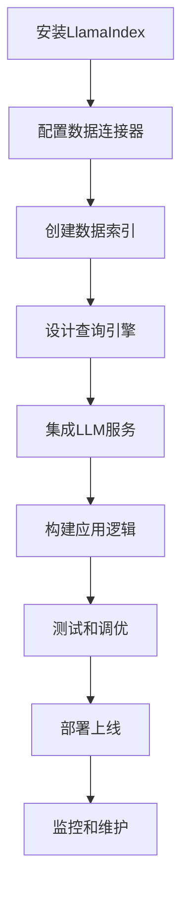
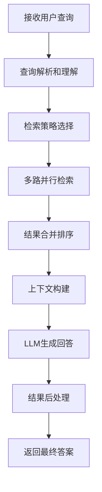

# 产品需求文档 (PRD) - LlamaIndex

## 1. 项目背景与愿景

### 1.1 项目概述
- **项目名称**: LlamaIndex
- **版本**: v1.0
- **创建日期**: 2025-11-03
- **最后更新**: 2025-11-03
- **项目地址**: https://github.com/run-llama/llama_index

### 1.2 问题背景
在大语言模型应用开发中，开发者面临以下核心挑战：
- **数据接入复杂性**: 需要连接各种异构数据源（PDF、数据库、API等）
- **知识更新滞后**: LLM训练数据截止，无法获取最新信息
- **检索效率低下**: 简单向量搜索无法满足复杂查询需求
- **应用开发门槛高**: 缺乏标准化的RAG应用开发框架
- **可解释性不足**: 难以追踪答案来源和推理过程

### 1.3 产品愿景
LlamaIndex 致力于成为领先的数据框架，为LLM应用提供结构化的访问、处理和查询能力，实现：
- 简化复杂数据源接入和处理
- 提供高性能的检索和生成能力
- 构建可扩展的RAG应用生态系统
- 推动LLM应用的标准化和普及化

### 1.4 项目范围
- **包含内容**:
  - 数据连接器和索引系统
  - 多模态数据处理能力
  - 高级检索算法和查询引擎
  - 应用开发框架和工具链
  - 生产部署和监控方案
  - 丰富的集成和扩展能力

- **排除内容**:
  - 底层大语言模型训练
  - 硬件基础设施管理
  - 商业化SaaS服务

## 2. 目标用户画像与场景

### 2.1 主要用户画像

#### 用户画像 1: AI应用开发者
- **基本信息**: 25-40岁，软件工程师、机器学习工程师
- **技术水平**: 高等，熟悉Python、机器学习、LLM技术
- **目标和动机**:
  - 快速构建RAG应用原型
  - 集成多种数据源
  - 优化检索性能和准确性
  - 简化生产部署流程
- **痛点描述**:
  - 数据接入和预处理复杂
  - 缺乏统一的开发框架
  - 检索效果调优困难
  - 性能优化门槛高
- **使用场景**:
  - 企业知识问答系统开发
  - 文档智能分析应用
  - 多模态内容理解系统
  - 聊天机器人后端服务
- **技术能力**: 熟悉Python生态系统，了解向量数据库和LLM API

#### 用户画像 2: 数据科学家
- **基本信息**: 28-45岁，拥有数据科学背景的研究人员
- **技术水平**: 高等，精通数据处理、机器学习算法
- **目标和动机**:
  - 探索和挖掘数据洞察
  - 构建智能数据分析工具
  - 提升研究和分析效率
  - 验证假设和发现模式
- **痛点描述**:
  - 传统分析方法效率低
  - 缺乏交互式数据探索工具
  - 复杂数据关系难以发现
  - 结果解释和可视化困难
- **使用场景**:
  - 学术研究和论文写作
  - 商业智能和报告生成
  - 数据驱动的决策支持
  - 实验结果分析
- **技术能力**: 深度理解数据结构和算法，熟练使用各种数据分析工具

#### 用户画像 3: 企业技术负责人
- **基本信息**: 30-50岁，CTO、技术总监、架构师
- **技术水平**: 中等偏上，理解技术架构和业务需求
- **目标和动机**:
  - 评估和选择AI技术方案
  - 构建企业级AI应用
  - 降低技术实施风险
  - 提升团队开发效率
- **痛点描述**:
  - AI技术选型复杂
  - 团队技能要求高
  - 投资回报难以评估
  - 技术债务管理困难
- **使用场景**:
  - AI技术架构设计
  - 团队技术栈规划
  - 项目可行性评估
  - 技术方案对比
- **技术能力**: 理解系统架构，关注技术趋势和商业价值

### 2.2 用户场景分析

#### 场景 1: 企业知识库问答系统
- **触发条件**: 企业需要构建内部知识问答系统
- **用户目标**: 整合分散的知识文档，提供智能问答服务
- **操作步骤**:
  1. 配置多种数据连接器（SharePoint、Confluence、数据库等）
  2. 建立文档索引和知识图谱
  3. 配置检索策略和查询引擎
  4. 集成大语言模型进行答案生成
  5. 部署API服务和前端界面
- **期望结果**:
  - 查询响应时间<2秒
  - 答案准确率>90%
  - 支持多轮对话和上下文理解
  - 系统可用性>99%

#### 场景 2: 研究文献智能分析
- **触发条件**: 研究人员需要分析大量学术文献
- **用户目标**: 快速提取关键信息，发现研究趋势和关联
- **操作步骤**:
  1. 批量导入PDF文献和引用数据
  2. 使用多模态解析器提取文本和图表信息
  3. 构建主题模型和知识网络
  4. 设计复杂查询进行深度分析
  5. 生成研究报告和可视化图表
- **期望结果**:
  - 文献处理速度提升10倍
  - 发现隐藏的研究关联
  - 自动生成高质量分析报告

#### 场景 3: 多模态内容理解
- **触发条件**: 需要分析包含文本、图像、音视频的复合内容
- **用户目标**: 实现跨模态的信息检索和内容理解
- **操作步骤**:
  1. 配置多模态数据管道
  2. 使用专门的解析器处理不同格式
  3. 建立统一的多模态向量表示
  4. 实现跨模态相似性搜索
  5. 支持混合模态的复杂查询
- **期望结果**:
  - 支持5+种数据模态
  - 跨模态检索准确率>85%
  - 自动生成多模态内容摘要

## 3. 产品目标与成功指标

### 3.1 业务目标
- **主要目标**: 成为LLM应用开发的事实标准框架
- **次要目标**:
  - 构建活跃的开发者社区
  - 推动RAG技术的标准化
  - 孵化成功的商业化产品

### 3.2 用户目标
- **核心价值**: 大幅降低LLM应用开发门槛，提升开发效率
- **用户满意度**: 开发者满意度评分>4.5/5.0，社区活跃度持续增长

### 3.3 成功指标 (KPIs)

#### 3.3.1 社区指标
- **GitHub星标**: 50K+ stars
- **月活跃开发者**: 10K+ active developers
- **社区贡献者**: 1K+ contributors
- **文档访问量**: 100K+ monthly visits

#### 3.3.2 产品指标
- **下载量**: 1M+ monthly downloads
- **使用案例**: 1K+ production use cases
- **集成数量**: 100+ third-party integrations
- **性能基准**: 检索速度>1000 queries/second

#### 3.3.3 技术指标
- **代码覆盖率**: >90%
- **API响应时间**: <100ms (average)
- **系统稳定性**: >99.9% uptime
- **兼容性**: 支持Python 3.8+, 多操作系统

## 4. 功能列表与优先级

### 4.1 功能优先级定义
- **P0 - 必须有**: 核心框架功能，开发者依赖
- **P1 - 应该有**: 重要增强功能，提升用户体验
- **P2 - 可以有**: 期望功能，特定场景需要
- **P3 - 暂不考虑**: 未来版本考虑

### 4.2 核心功能 (P0)

#### 功能 1: 数据连接器系统
- **功能描述**:
  - 丰富的数据源连接器（文件、数据库、API、云服务等）
  - 统一的数据读取和解析接口
  - 增量数据同步和变更检测
  - 数据预处理和清洗工具
- **用户价值**:
  - 一键接入各种数据源
  - 简化数据ETL流程
  - 保证数据质量和一致性
- **技术要求**:
  - 模块化连接器架构
  - 异步数据处理支持
  - 错误处理和重试机制
  - 数据格式标准化
- **验收标准**:
  - 支持50+种数据源类型
  - 连接器插件化架构
  - 数据读取成功率>99%

#### 功能 2: 索引和存储系统
- **功能描述**:
  - 多种索引类型（向量、树、图等）
  - 灵活的存储后端支持
  - 索引优化和压缩算法
  - 元数据管理和版本控制
- **用户价值**:
  - 高效的数据检索性能
  - 灵活的存储选择
  - 降低存储成本
- **技术要求**:
  - 可插拔的索引后端
  - 内存和磁盘混合存储
  - 分布式索引支持
  - 实时索引更新
- **验收标准**:
  - 支持10+种索引类型
  - 检索延迟<10ms
  - 索引构建速度>1000 docs/sec

#### 功能 3: 查询引擎
- **功能描述**:
  - 多样化查询接口（自然语言、结构化、混合查询）
  - 查询优化和执行计划
  - 结果排序和过滤
  - 查询缓存和性能监控
- **用户价值**:
  - 灵活的查询表达能力
  - 高效的查询执行
  - 准确的结果排序
- **技术要求**:
  - 查询解析和优化器
  - 多策略检索算法
  - 结果融合和重排
  - 性能分析和调优
- **验收标准**:
  - 查询响应时间<100ms
  - 支持复杂查询语法
  - 结果相关性>4.0/5.0

#### 功能 4: LLM集成接口
- **功能描述**:
  - 多种LLM提供商支持
  - 统一的调用接口
  - 流式输出和批量处理
  - 提示词工程工具
- **用户价值**:
  - 灵活选择LLM服务
  - 简化LLM调用复杂度
  - 优化生成质量和成本
- **技术要求**:
  - 标准化LLM接口
  - 异步调用支持
  - 错误处理和降级
  - 成本监控和优化
- **验收标准**:
  - 支持20+种LLM服务
  - API调用成功率>99.5%
  - 响应时间<2秒

### 4.3 重要功能 (P1)

#### 功能 5: 多模态数据处理
- **功能描述**:
  - 图像、音频、视频数据处理
  - 跨模态特征提取
  - 多模态融合和检索
  - 多模态内容理解
- **用户价值**:
  - 处理复杂多媒体内容
  - 支持丰富的应用场景
  - 提升内容理解深度
- **技术要求**:
  - 专门的模态解析器
  - 统一的多模态表示
  - 跨模态相似性计算
  - 模态特定优化
- **验收标准**:
  - 支持5+种数据模态
  - 跨模态检索准确率>85%
  - 处理速度>10 files/sec

#### 功能 6: 知识图谱构建
- **功能描述**:
  - 实体识别和关系抽取
  - 知识图谱自动构建
  - 图查询和推理
  - 知识图谱可视化
- **用户价值**:
  - 结构化知识表示
  - 支持复杂推理查询
  - 提升答案可解释性
- **技术要求**:
  - NER和RE算法集成
  - 图数据库后端
  - 图查询语言支持
  - 可视化组件
- **验收标准**:
  - 实体识别准确率>90%
  - 支持1M+节点图谱
  - 图查询响应时间<500ms

### 4.4 期望功能 (P2)

#### 功能 7: 自适应优化
- **功能描述**:
  - 自动参数调优
  - 性能基准测试
  - A/B测试框架
  - 智能推荐系统
- **用户价值**:
  - 减少手动调优工作
  - 持续性能优化
  - 最佳实践推荐
- **技术要求**:
  - 机器学习优化算法
  - 实验管理和跟踪
  - 指标收集和分析
  - 规则引擎
- **验收标准**:
  - 自动调优提升性能>20%
  - 支持多目标优化
  - 调优时间<1小时

#### 功能 8: 企业级功能
- **功能描述**:
  - 用户权限和认证
  - 数据加密和安全
  - 审计日志和合规
  - 多租户支持
- **用户价值**:
  - 满足企业安全要求
  - 支持大规模部署
  - 符合合规标准
- **技术要求**:
  - RBAC权限模型
  - 数据加密传输存储
  - 审计追踪功能
  - 资源隔离和配额
- **验收标准**:
  - 支持企业级认证
  - 数据安全性100%
  - 符合GDPR等法规

## 5. 用户流程与线框图

### 5.1 核心用户流程

#### 流程 1: RAG应用开发流程


**流程说明**:
1. **安装LlamaIndex**: 通过pip安装核心框架和依赖包
2. **配置数据连接器**: 选择和配置所需的数据源连接器
3. **创建数据索引**: 处理数据并构建检索索引
4. **设计查询引擎**: 配置检索策略和查询接口
5. **集成LLM服务**: 选择和配置大语言模型API
6. **构建应用逻辑**: 实现具体的应用业务逻辑
7. **测试和调优**: 功能测试和性能优化
8. **部署上线**: 部署到生产环境
9. **监控和维护**: 运行监控和持续优化

#### 流程 2: 复杂查询处理流程


**流程说明**:
1. **接收用户查询**: 获取用户自然语言或结构化查询
2. **查询解析和理解**: 分析查询意图和关键信息
3. **检索策略选择**: 根据查询类型选择最优检索策略
4. **多路并行检索**: 使用多种算法并行检索相关信息
5. **结果合并排序**: 合并不同检索结果并重新排序
6. **上下文构建**: 为LLM构建合适的提示上下文
7. **LLM生成回答**: 调用大语言模型生成回答
8. **结果后处理**: 对回答进行格式化和优化
9. **返回最终答案**: 向用户返回最终答案和引用

### 5.2 页面线框图

#### 页面 1: 开发者控制台

**布局结构**:
```
┌─────────────────────────────────────────────────────────┐
│  LlamaIndex    [数据源▼] [索引▼] [查询▼]  用户 [▼]       │
├─────────────────────────────────────────────────────────┤
│  侧边导航栏              │        主工作区               │
│                        │                                 │
│ 📊 仪表盘              │  ┌─────────────────────────┐    │
│   - 系统概览           │  │    项目快速创建           │    │
│   - 性能监控           │  │                         │    │
│                        │  │  [新建RAG项目]          │    │
│ 📁 数据管理            │  │  [导入示例项目]          │    │
│   - 数据源配置         │  │                         │    │
│   - 索引管理           │  │  🚀 最近项目             │    │
│                        │  │  • 企业知识库           │    │
│ 🔍 查询设计            │  │  • 研究分析工具         │    │
│   - 查询构建器         │  │  • 客服问答系统         │    │
│   - 性能测试           │  │                         │    │
│                        │  │  📈 系统状态            │    │
│ ⚙️ 设置                │  │  CPU: 45%  内存: 62%     │    │
│                        │  └─────────────────────────┘    │
├─────────────────────────────────────────────────────────┤
│                       状态栏                        │
└─────────────────────────────────────────────────────────┘
```

**主要元素**:
- **导航栏**:
  - Logo和产品名称
  - 快速功能访问下拉菜单
  - 用户账户和设置
- **侧边导航**:
  - 数据管理功能组
  - 查询设计工具
  - 系统监控和设置
- **主工作区**:
  - 快速创建项目入口
  - 最近项目列表
  - 系统状态监控面板
- **交互元素**:
  - 可折叠的侧边栏
  - 项目卡片hover效果
  - 实时更新的状态指示器

#### 页面 2: 查询构建器

**布局结构**:
```
┌─────────────────────────────────────────────────────────┐
│  ← 返回    查询构建器    [运行▼] [保存] [导出代码]         │
├─────────────────────────────────────────────────────────┤
│  输入区域                    │        配置面板            │
│                            │                           │
│ ┌────────────────────────┐  │ ┌───────────────────────┐ │
│ │ 请输入您的查询问题...    │  │ │ 🔍 检索策略配置       │ │
│ │                        │  │ │                       │ │
│ │ 支持自然语言和结构化查询│  │ │ • 向量相似度: 85%     │ │
│ └────────────────────────┘  │ │ • 关键词匹配: 启用    │ │
│                            │ │ • 图谱推理: 启用      │ │
│ 🎯 查询模板                │ │                       │ │
│ [常见问题] [数据分析] [文档搜索] │ │ 🧠 LLM配置             │ │
│                            │ │ • 模型: GPT-4         │ │
│ 📋 查询历史                │ │ • 温度: 0.7           │ │
│ • 最近的销售数据...        │ │ • 最大长度: 2000      │ │
│ • 产品功能对比...          │ └───────────────────────┘ │
├─────────────────────────────────────────────────────────┤
│                        结果预览                         │
│ ┌─────────────────────────────────────────────────────┐ │
│ │ 💬 预期答案: 基于当前配置的查询结果预览...           │ │
│ │ 📊 相关性: 92%  ⏱️ 响应时间: ~1.2秒                │ │
│ └─────────────────────────────────────────────────────┘ │
└─────────────────────────────────────────────────────────┘
```

**主要元素**:
- **查询输入区**:
  - 支持自然语言输入
  - 实时语法检查和建议
  - 查询模板快速选择
- **配置面板**:
  - 检索策略参数调节
  - LLM模型和参数设置
  - 实时配置验证
- **结果预览**:
  - 查询结果模拟预览
  - 性能指标估算
  - 相关性评分显示
- **交互元素**:
  - 拖拽式参数调节
  - 实时配置同步
  - 一键导出代码功能

### 5.3 交互设计要点

#### 交互模式 1: 可视化配置
- **触发条件**: 用户需要配置复杂的检索策略
- **操作步骤**:
  1. 进入查询构建器页面
  2. 选择可视化配置模式
  3. 拖拽节点配置检索流程
  4. 调节参数和权重
  5. 实时预览配置效果
- **系统响应**:
  - 提供拖拽式交互界面
  - 实时显示配置结果预览
  - 智能推荐最佳配置
  - 配置冲突自动检测
- **用户反馈**:
  - 配置复杂度评分
  - 性能影响提示
  - 最佳实践建议

#### 交互模式 2: 实时性能监控
- **触发条件**: 应用运行时需要监控系统性能
- **操作步骤**:
  1. 打开性能监控面板
  2. 选择监控指标和时间范围
  3. 查看实时性能数据
  4. 分析性能瓶颈和异常
  5. 导出性能报告
- **系统响应**:
  - 实时更新的性能图表
  - 异常自动告警
  - 性能优化建议
  - 历史数据对比分析
- **用户反馈**:
  - 性能满意度评价
  - 功能使用统计
  - 改进建议收集

## 6. 技术要求与约束

### 6.1 技术栈

#### 核心技术
- **编程语言**: Python 3.8+
- **机器学习**: PyTorch, TensorFlow, scikit-learn
- **NLP库**: spaCy, NLTK, transformers
- **向量数据库**: Pinecone, Weaviate, Chroma, FAISS
- **图数据库**: Neo4j, JanusGraph
- **搜索引擎**: Elasticsearch, OpenSearch

#### 数据处理
- **文档处理**: pypdf, python-docx, unstructured
- **图像处理**: PIL, OpenCV, CLIP
- **音频处理**: librosa, speech_recognition
- **视频处理**: moviepy, decord
- **数据处理**: pandas, numpy, dask

#### Web和API
- **Web框架**: FastAPI, Flask
- **API文档**: OpenAPI, Swagger
- **任务队列**: Celery, Redis Queue
- **消息中间件**: Redis, RabbitMQ
- **容器化**: Docker, Kubernetes

### 6.2 性能要求
- **响应时间**:
  - API调用: <100ms (95th percentile)
  - 查询处理: <1second (complex queries)
  - 索引构建: >1000 docs/second
  - 数据加载: <10seconds for 10K docs
- **并发处理**:
  - 支持1000+并发查询
  - 100+并发数据写入
  - 10+并发索引构建
- **资源使用**:
  - 内存使用: <2GB for typical workloads
  - CPU使用: <50% for normal operations
  - 磁盘I/O: 优化索引存储和访问

### 6.3 兼容性要求
- **Python版本**: 3.8, 3.9, 3.10, 3.11
- **操作系统**: Linux, macOS, Windows
- **硬件要求**:
  - 最小内存: 4GB RAM
  - 推荐内存: 16GB+ RAM
  - GPU支持: CUDA, ROCm (可选)
- **云平台**: AWS, Azure, GCP, 阿里云, 腾讯云

## 7. 风险与约束

### 7.1 技术风险

#### 风险 1: 依赖复杂性
- **风险描述**: 大量外部依赖可能导致版本冲突和兼容性问题
- **影响程度**: 中
- **缓解措施**:
  - 严格的依赖版本管理
  - 自动化测试覆盖多种环境
  - 容器化部署隔离环境
  - 定期依赖更新和安全扫描

#### 风险 2: 性能瓶颈
- **风险描述**: 大规模数据处理可能导致性能瓶颈
- **影响程度**: 高
- **缓解措施**:
  - 分布式处理架构
  - 异步I/O和并行处理
  - 智能缓存策略
  - 性能监控和自动优化

#### 风险 3: LLM API依赖
- **风险描述**: 过度依赖第三方LLM服务可能导致稳定性问题
- **影响程度**: 中
- **缓解措施**:
  - 多LLM提供商支持
  - 本地模型部署选项
  - API调用降级和重试机制
  - 成本监控和控制

### 7.2 业务风险

#### 风险 1: 竞争激烈
- **风险描述**: RAG框架市场竞争激烈，同质化严重
- **影响程度**: 中
- **缓解措施**:
  - 专注核心技术创新
  - 建设强大开发者社区
  - 提供独特价值和体验
  - 快速迭代和响应用户需求

#### 风险 2: 技术更新快
- **风险描述**: AI技术发展迅速，存在技术过时风险
- **影响程度**: 中
- **缓解措施**:
  - 紧跟技术发展趋势
  - 模块化和可扩展架构
  - 持续的技术研究投入
  - 灵活的技术栈选择策略

### 7.3 时间约束
- **发布计划**:
  - 每月小版本更新
  - 每季度大版本发布
  - 年度技术路线图更新
- **重要里程碑**:
  - Q1: 多模态支持增强
  - Q2: 分布式架构优化
  - Q3: 企业级功能完善
  - Q4: AI辅助开发工具

## 8. 附录

### 8.1 术语表
- **RAG (Retrieval-Augmented Generation)**: 检索增强生成，结合信息检索和大语言模型的AI应用架构
- **Vector Database**: 向量数据库，专门用于存储和检索高维向量数据的数据库系统
- **Embedding**: 嵌入，将文本、图像等数据转换为数值向量表示的技术
- **Index**: 索引，用于加速数据检索的数据结构
- **LLM (Large Language Model)**: 大语言模型，如GPT、Claude等大规模预训练语言模型

### 8.2 参考文档
- [LlamaIndex Official Documentation](https://docs.llamaindex.ai/)
- [RAG Survey Paper](https://arxiv.org/abs/2312.10997)
- [Vector Database Comparison](https://weaviate.io/blog/vector-database-comparison)
- [LLM Application Patterns](https://eugeneyan.com/writing/llm-patterns/)

### 8.3 变更记录
| 版本 | 日期 | 变更内容 | 变更人 |
|------|------|----------|--------|
| v1.0 | 2025-11-03 | 初始版本，基于LlamaIndex项目分析的完整PRD | Claude AI Assistant |

---

*本文档为LlamaIndex项目的详细产品需求文档，涵盖了从技术架构到用户体验的各个方面。LlamaIndex作为领先的RAG应用开发框架，致力于为开发者提供强大、灵活、易用的工具链，推动LLM应用的普及和创新。*