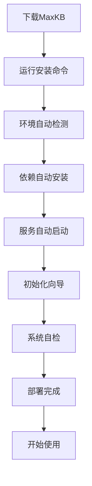
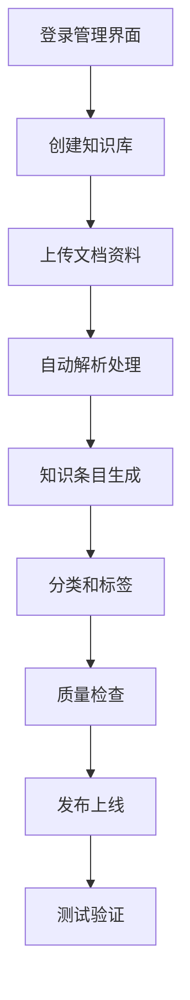

# 产品需求文档 (PRD) - MaxKB

## 1. 项目背景与愿景

### 1.1 项目概述
- **项目名称**: MaxKB
- **版本**: v1.0
- **创建日期**: 2025-11-03
- **最后更新**: 2025-11-03
- **项目地址**: https://github.com/1Panel-dev/MaxKB

### 1.2 问题背景
在当前的AI应用浪潮中，企业构建知识库和问答系统面临诸多挑战：
- **技术门槛高**: 需要深度学习、NLP、向量数据库等专业技能
- **部署复杂**: 涉及多个组件集成，配置和运维难度大
- **成本高昂**: GPU服务器、API调用、专业技术人力成本高
- **定制困难**: 难以根据特定业务场景进行深度定制和优化
- **维护负担**: 模型更新、数据管理、系统监控等持续投入大

### 1.3 产品愿景
MaxKB 致力于打造"开箱即用"的知识库解决方案，实现：
- 简化AI知识库的部署和使用
- 提供企业级的功能和性能
- 降低技术门槛和使用成本
- 支持灵活的定制和扩展
- 优秀的用户体验和稳定性

### 1.4 项目范围
- **包含内容**:
  - 一键部署的知识库系统
  - 内置多种大语言模型支持
  - 企业级安全和管理功能
  - 丰富的API和集成能力
  - 直观的Web管理界面
  - 完善的文档和社区支持

- **排除内容**:
  - 自定义模型训练功能
  - 分布式多节点部署
  - 实时流媒体处理

## 2. 目标用户画像与场景

### 2.1 主要用户画像

#### 用户画像 1: 中小企业IT管理员
- **基本信息**: 25-40岁，中小企业IT负责人、系统管理员
- **技术水平**: 中等偏上，熟悉系统运维，了解基础AI概念
- **目标和动机**:
  - 快速部署企业AI问答系统
  - 降低AI技术使用门槛
  - 提高客户服务效率
  - 控制IT投入成本
- **痛点描述**:
  - 缺乏专业的AI技术团队
  - 现有解决方案部署复杂
  - 预算有限，追求性价比
  - 需要快速见效的AI应用
- **使用场景**:
  - 企业客服知识库部署
  - 内部文档智能问答
  - 产品FAQ自动化
  - IT技术支持系统
- **技术能力**: 熟悉Linux系统管理，了解Docker基础操作

#### 用户画像 2: 开发者和创业者
- **基本信息**: 22-35岁，独立开发者、初创公司技术负责人
- **技术水平**: 高等，全栈开发能力，对AI技术有热情
- **目标和动机**:
  - 快速构建AI应用原型
  - 测试AI产品商业想法
  - 降低开发成本和时间
  - 专注业务逻辑而非技术细节
- **痛点描述**:
  - AI技术栈复杂，学习成本高
  - 资源有限，无法承担昂贵方案
  - 需要快速验证和迭代产品
  - 缺乏成熟的开发框架
- **使用场景**:
  - MVP产品快速开发
  - AI客服系统搭建
  - 内容生成应用开发
  - 个人助理工具构建
- **技术能力**: 熟练使用编程语言和开发工具，了解容器技术

#### 用户画像 3: 传统企业数字化转型负责人
- **基本信息**: 30-50岁，传统行业数字化负责人、业务部门主管
- **技术水平**: 中等，关注业务价值而非技术细节
- **目标和动机**:
  - 推动企业数字化转型
  - 提升客户服务体验
  - 降本增效改善运营
  - 获得竞争优势
- **痛点描述**:
  - AI技术概念抽象，难以理解
  - 担心技术风险和投资回报
  - 缺乏技术人才和实施经验
  - 希望看到实际效果
- **使用场景**:
  - 企业知识管理升级
  - 客户服务自动化
  - 员工培训和支持
  - 业务流程智能化
- **技术能力**: 更关注易用性和效果，对技术复杂度容忍度低

### 2.2 用户场景分析

#### 场景 1: 中小企业客服系统
- **触发条件**: 中小企业需要建立7x24小时智能客服
- **用户目标**: 低成本快速部署智能问答系统
- **操作步骤**:
  1. 下载MaxKB安装包
  2. 运行一键安装脚本
  3. 上传企业产品文档和FAQ
  4. 配置Web界面和API接口
  5. 集成到现有客服系统
- **期望结果**:
  - 部署时间<2小时
  - 系统稳定性>99%
  - 问答准确率>85%
  - 运维成本降低80%

#### 场景 2: 开发者原型验证
- **触发条件**: 开发者需要快速验证AI应用想法
- **用户目标**: 跳过复杂的技术细节，专注业务逻辑
- **操作步骤**:
  1. 使用Docker快速启动MaxKB
  2. 通过API或Web界面管理知识库
  3. 集成到应用原型中
  4. 收集用户反馈和数据
  5. 迭代优化产品功能
- **期望结果**:
  - 开发时间缩短70%
  - 技术复杂度降低80%
  - 快速获得产品验证
  - 降低试错成本

#### 场景 3: 企业内部知识库
- **触发条件**: 企业需要建立智能化的内部文档查询系统
- **用户目标**: 让员工快速找到所需信息和答案
- **操作步骤**:
  1. 收集整理企业内部文档
  2. 批量导入MaxKB系统
  3. 配置部门权限和访问控制
  4. 培训员工使用智能问答
  5. 监控使用情况并优化
- **期望结果**:
  - 信息查找效率提升90%
  - 员工满意度>4.5/5.0
  - 系统使用率>80%
  - 知识积累和传承效果显著

## 3. 产品目标与成功指标

### 3.1 业务目标
- **主要目标**: 成为最受欢迎的开源知识库解决方案
- **次要目标**:
  - 降低AI技术的使用门槛
  - 推动AI技术的普及应用
  - 建立活跃的开源社区

### 3.2 用户目标
- **核心价值**: 让AI知识库变得简单、易用、可靠
- **用户满意度**: 用户满意度>4.5/5.0，部署成功率>95%

### 3.3 成功指标 (KPIs)

#### 3.3.1 社区指标
- **GitHub星标**: 20K+ stars
- **下载量**: 500K+ monthly downloads
- **社区贡献者**: 500+ contributors
- **用户案例**: 1000+ deployment stories

#### 3.3.2 产品指标
- **部署成功率**: >95%
- **系统稳定性**: >99.5% uptime
- **问答准确率**: >90%
- **用户留存率**: >80%

#### 3.3.3 技术指标
- **安装时间**: <30 minutes
- **启动时间**: <2 minutes
- **响应时间**: <3 seconds
- **资源占用**: <4GB RAM

## 4. 功能列表与优先级

### 4.1 功能优先级定义
- **P0 - 必须有**: 核心知识库功能，产品价值基础
- **P1 - 应该有**: 重要增强功能，用户体验保证
- **P2 - 可以有**: 期望功能，丰富应用场景
- **P3 - 暂不考虑**: 未来版本考虑

### 4.2 核心功能 (P0)

#### 功能 1: 一键部署安装
- **功能描述**:
  - Docker容器化部署
  - 一键安装脚本
  - 自动环境检测和配置
  - 依赖包自动安装
  - 初始化向导和测试
- **用户价值**:
  - 极大降低部署难度
  - 节省安装和配置时间
  - 减少部署错误和问题
- **技术要求**:
  - Docker和Docker Compose支持
  - 跨平台安装脚本
  - 环境兼容性检测
  - 自动化配置生成
- **验收标准**:
  - 安装成功率>99%
  - 安装时间<30分钟
  - 支持主流操作系统

#### 功能 2: 多模型支持
- **功能描述**:
  - 内置多种大语言模型
  - 本地模型和云端模型支持
  - 模型切换和配置管理
  - 模型性能监控
  - 成本控制和优化
- **用户价值**:
  - 灵活的模型选择
  - 降低使用成本
  - 适应不同应用场景
- **技术要求**:
  - 模型API标准化接口
  - 本地模型推理引擎
  - 云端模型SDK集成
  - 性能监控指标
- **验收标准**:
  - 支持10+种主流模型
  - 模型切换无缝
  - 响应时间<5秒

#### 功能 3: 知识库管理
- **功能描述**:
  - 文档批量导入和解析
  - 支持多种文件格式
  - 知识条目增删改查
  - 分类和标签管理
  - 版本控制和历史记录
- **用户价值**:
  - 便捷的知识管理操作
  - 支持丰富的文档类型
  - 完整的版本追踪
- **技术要求**:
  - 文档解析引擎
  - 数据库设计优化
  - 文件存储管理
  - 操作审计日志
- **验收标准**:
  - 支持20+种文件格式
  - 批量处理速度>1000 files/min
  - 数据完整性100%

#### 功能 4: 智能问答系统
- **功能描述**:
  - 自然语言查询理解
  - 语义检索和匹配
  - 答案生成和优化
  - 相关性排序
  - 多轮对话支持
- **用户价值**:
  - 准确的问答体验
  - 自然的语言交互
  - 连续的对话能力
- **技术要求**:
  - 查询意图识别
  - 向量相似度计算
  - 大语言模型集成
  - 对话上下文管理
- **验收标准**:
  - 问答准确率>90%
  - 响应时间<3秒
  - 支持5轮以上对话

### 4.3 重要功能 (P1)

#### 功能 5: Web管理界面
- **功能描述**:
  - 直观的管理控制台
  - 知识库可视化展示
  - 系统状态监控
  - 用户和权限管理
  - 配置和设置面板
- **用户价值**:
  - 友好的用户体验
  - 直观的操作界面
  - 实时的系统监控
- **技术要求**:
  - 现代化Web前端框架
  - 响应式设计
  - 实时数据更新
  - 权限控制系统
- **验收标准**:
  - 界面响应时间<1秒
  - 移动端适配完整
  - 操作流程简化>80%

#### 功能 6: API和集成
- **功能描述**:
  - RESTful API接口
  - SDK和工具包
  - 第三方集成支持
  - Webhook回调
  - 数据导入导出
- **用户价值**:
  - 灵活的系统集成
  - 丰富的开发工具
  - 标准化的接口
- **技术要求**:
  - OpenAPI文档规范
  - 多语言SDK支持
  - 认证和授权机制
  - 数据格式标准化
- **验收标准**:
  - API响应时间<500ms
  - 接口稳定性>99.9%
  - 文档完整性100%

### 4.4 期望功能 (P2)

#### 功能 7: 高级检索
- **功能描述**:
  - 高级搜索语法
  - 多条件组合查询
  - 模糊搜索和容错
  - 搜索结果高亮
  - 搜索历史和建议
- **用户价值**:
  - 精确的信息检索
  - 灵活的查询条件
  - 智能的搜索建议
- **技术要求**:
  - 全文搜索引擎
  - 查询语法解析
  - 结果排序算法
  - 用户行为分析
- **验收标准**:
  - 搜索准确率>95%
  - 复杂查询响应<2秒
  - 支持20+种搜索语法

#### 功能 8: 多语言支持
- **功能描述**:
  - 国际化界面支持
  - 多语言知识处理
  - 跨语言检索
  - 本地化配置
  - 语言自动检测
- **用户价值**:
  - 支持全球化应用
  - 母语用户体验
  - 跨语言知识访问
- **技术要求**:
  - i18n框架集成
  - 多语言NLP模型
  - 语言检测算法
  - 本地化资源管理
- **验收标准**:
  - 支持10+种语言
  - 翻译准确率>90%
  - 界面本地化>95%

## 5. 用户流程与线框图

### 5.1 核心用户流程

#### 流程 1: 快速部署流程


**流程说明**:
1. **下载MaxKB**: 从GitHub或官方渠道获取安装包
2. **运行安装命令**: 执行一键安装脚本或Docker命令
3. **环境自动检测**: 检查系统环境和依赖
4. **依赖自动安装**: 自动安装所需的软件包和依赖
5. **服务自动启动**: 启动MaxKB和相关服务
6. **初始化向导**: 引导用户完成初始配置
7. **系统自检**: 验证系统功能正常
8. **部署完成**: 系统准备就绪可以使用
9. **开始使用**: 用户可以开始创建知识库和使用问答

#### 流程 2: 知识库管理流程


**流程说明**:
1. **登录管理界面**: 通过Web界面登录系统
2. **创建知识库**: 创建新的知识库实例
3. **上传文档资料**: 批量上传各种格式的文档
4. **自动解析处理**: 系统自动解析和处理文档内容
5. **知识条目生成**: 生成结构化的知识条目
6. **分类和标签**: 自动或手动设置分类和标签
7. **质量检查**: 检查知识质量并进行优化
8. **发布上线**: 将知识库发布供用户使用
9. **测试验证**: 测试问答功能验证效果

### 5.2 页面线框图

#### 页面 1: 管理控制台

**布局结构**:
```
┌─────────────────────────────────────────────────────────┐
│  🚀 MaxKB    [知识库▼] [模型▼] [监控▼]  用户 [👤]         │
├─────────────────────────────────────────────────────────┤
│  侧边导航栏              │        主工作区               │
│                        │                                 │
│ 📚 知识库管理           │  ┌─────────────────────────┐    │
│   - 知识库列表          │  │   🚀 欢迎使用MaxKB       │    │
│   - 文档管理            │  │                         │    │
│   - 知识条目            │  │ 🎯 快速开始             │    │
│                        │  │ [创建知识库] [上传文档]  │    │
│ 🤖 模型管理            │  │ [测试问答] [查看帮助]   │    │
│   - 模型列表            │  │                         │    │
│   - 模型配置            │  │ 📊 系统概览             │    │
│   - 性能监控            │  │ 知识库: 12  文档: 1,234 │    │
│                        │  │ 今日问答: 856 成功率:94%│    │
│ 🔧 系统设置            │  │                         │    │
│   - 基础配置            │  │ ⚡ 快速操作             │    │
│   - 用户权限            │  │ [系统状态] [日志查看]   │    │
│   - 备份恢复            │  │ [性能监控] [更新检查]   │    │
│                        │  └─────────────────────────┘    │
├─────────────────────────────────────────────────────────┤
│              🚀 MaxKB - 开箱即用的AI知识库              │
└─────────────────────────────────────────────────────────┘
```

**主要元素**:
- **导航栏**:
  - MaxKB品牌标识
  - 核心功能快速访问
  - 用户信息和设置
- **侧边导航**:
  - 知识库管理功能
  - AI模型配置
  - 系统设置选项
- **主工作区**:
  - 欢迎信息和快速开始
  - 系统概览和统计
  - 快速操作入口
- **品牌标语**:
  - 突出产品核心价值

#### 页面 2: 问答测试界面

**布局结构**:
```
┌─────────────────────────────────────────────────────────┐
│  ← 返回    🤖 智能问答    [清空] [导出] [设置]           │
├─────────────────────────────────────────────────────────┤
│  对话区域                │        信息面板               │
│                         │                            │
│ ┌─────────────────────┐ │ ┌────────────────────────┐ │
│ │ 👤 您好！             │ │ │ 📚 当前知识库           │ │
│ │                     │ │ │                        │ │
│ └─────────────────────┘ │ • 产品文档: 456篇       │ │
│                         │ • 技术文档: 234篇       │ │
│ ┌─────────────────────┐ │ • FAQ文档: 123篇       │ │
│ │ 🤖 您好！我是MaxKB   │ │                        │ │
│ │ 智能助手，请问有什   │ │ 🎯 使用的模型            │ │
│ │ 么可以帮助您的吗？   │ │ GPT-3.5-turbo (本地)    │ │
│ └─────────────────────┘ │ 响应速度: 1.2秒          │ │
│                         │                        │ │
│ ┌─────────────────────┐ │ 💡 提示                 │ │
│ │ 👤 如何配置系统？     │ │ 您可以上传文档来建立     │ │
│ │                     │ │ 自己的知识库，系统会     │ │
│ └─────────────────────┘ │ 自动学习并回答相关问题。 │ │
│                         │ └────────────────────────┘ │
│ 🤖 正在思考... [●●●○○] │                            │
│                         │ 📊 问答统计              │ │
│ ┌─────────────────────┐ │ 总问答: 1,234  今日: 89  │ │
│ │ 🤖 配置系统需要以   │ │ 平均响应: 1.5秒          │ │
│ │ 下步骤：             │ │ 用户满意度: 4.6/5.0     │ │
│ │ 1. 下载安装包...    │ │                            │ │
│ │ 2. 运行安装命令...  │ ⭐ 评价这个答案           │ │
│ │ 3. 配置环境变量...  │ [👍] [👎] [💬]             │ │
│ │                     │                            │ │
│ │ 📚 详细文档链接...   │ 🔧 相关操作              │ │
│ └─────────────────────┘ [🔄] [📋] [📤]             │ │
├─────────────────────────────────────────────────────────┤
│               🚀 基于您的文档提供智能问答服务            │
└─────────────────────────────────────────────────────────┘
```

**主要元素**:
- **对话区域**:
  - 模拟对话界面
  - 实时思考状态
  - 结构化答案展示
  - 相关文档链接
- **信息面板**:
  - 当前知识库统计
  - 使用的模型信息
  - 使用提示和建议
  - 问答统计数据
  - 用户评价和操作

### 5.3 交互设计要点

#### 交互模式 1: 一键式部署体验
- **触发条件**: 新用户首次部署系统
- **操作步骤**:
  1. 下载MaxKB安装包
  2. 执行单个安装命令
  3. 等待自动安装完成
  4. 访问Web界面
  5. 完成初始化配置
- **系统响应**:
  - 清晰的安装进度显示
  - 自动环境检测和依赖安装
  - 安装成功通知和指导
  - 详细的错误提示和解决方案
- **用户反馈**:
  - 安装体验满意度
  - 部署成功率统计
  - 改进建议收集

#### 交互模式 2: 直观的知识管理
- **触发条件**: 用户需要管理和维护知识库
- **操作步骤**:
  1. 进入知识库管理页面
  2. 上传或创建知识内容
  3. 设置分类和标签
  4. 预览和测试问答效果
  5. 发布和更新知识库
- **系统响应**:
  - 拖拽式文件上传
  - 实时内容预览
  - 自动分类建议
  - 智能质量检查
- **用户反馈**:
  - 操作便捷性评价
  - 功能完整性反馈
  - 性能体验统计

## 6. 技术要求与约束

### 6.1 技术栈

#### 后端技术
- **框架**: Go / Python / Node.js
- **数据库**: PostgreSQL / SQLite / Redis
- **搜索引擎**: Elasticsearch / Meilisearch
- **消息队列**: RabbitMQ / NATS
- **Web服务**: Gin / FastAPI / Express

#### AI和ML
- **大语言模型**:
  - 本地: Llama2, ChatGLM, Qwen
  - 云端: OpenAI, Anthropic, Google
- **向量数据库**: Chroma, FAISS, Milvus
- **NLP库**: transformers, sentence-transformers
- **文本处理**: jieba, spaCy, NLTK

#### 前端技术
- **框架**: React 18+ / Vue 3+
- **UI组件**: Ant Design / Element Plus
- **状态管理**: Redux / Pinia
- **构建工具**: Vite / Webpack
- **编辑器**: Monaco / Quill

#### 部署和运维
- **容器化**: Docker, Docker Compose
- **进程管理**: systemd, supervisor
- **监控**: Prometheus, Grafana
- **日志**: ELK Stack, Loki

### 6.2 性能要求
- **资源消耗**:
  - 内存使用: 2-4GB (典型负载)
  - CPU使用: 2-4 cores
  - 磁盘空间: 10GB+ (包含模型)
  - 网络带宽: 10Mbps+
- **响应性能**:
  - Web界面响应: <1秒
  - API接口响应: <500ms
  - 问答生成时间: <3秒
  - 文档处理速度: >10 pages/second
- **并发能力**:
  - 同时在线用户: 100+
  - 并发问答请求: 50 QPS
  - 文档上传: 10+ concurrent

### 6.3 兼容性要求
- **操作系统**:
  - Linux: Ubuntu 20.04+, CentOS 8+, Debian 11+
  - Windows: Windows 10+, Windows Server 2019+
  - macOS: macOS 11+
- **浏览器**:
  - Chrome 90+, Firefox 88+, Safari 14+, Edge 90+
- **硬件要求**:
  - 最小: 4GB RAM, 2 CPU cores
  - 推荐: 8GB RAM, 4 CPU cores
  - 本地模型需要: 16GB RAM, GPU optional

## 7. 风险与约束

### 7.1 技术风险

#### 风险 1: 模型质量和稳定性
- **风险描述**: 不同模型的性能和质量差异较大，可能影响用户体验
- **影响程度**: 高
- **缓解措施**:
  - 多模型支持和自动选择
  - 模型性能监控和评估
  - 降级和容错机制
  - 用户反馈驱动的模型优化

#### 风险 2: 部署环境复杂性
- **风险描述**: 用户环境多样，部署可能出现兼容性问题
- **影响程度**: 中
- **缓解措施**:
  - 容器化部署方案
  - 全面的环境检测
  - 详细的安装文档
  - 社区支持和问题解答

#### 风险 3: 数据安全和隐私
- **风险描述**: 企业数据安全要求高，可能涉及敏感信息
- **影响程度**: 高
- **缓解措施**:
  - 本地部署优先
  - 数据加密和访问控制
  - 安全审计和日志
  - 合规性检查和认证

### 7.2 业务风险

#### 风险 1: 开源商业模式挑战
- **风险描述**: 开源产品的商业化和可持续性挑战
- **影响程度**: 中
- **缓解措施**:
  - 企业版增值服务
  - 技术支持和咨询服务
  - 社区建设和生态发展
  - 多元化收入模式

#### 风险 2: 竞争激烈
- **风险描述**: AI知识库领域竞争激烈，同质化严重
- **影响程度**: 中
- **缓解措施**:
  - 聚焦易用性和部署体验
  - 持续的功能创新
  - 强大的社区运营
  - 差异化的技术优势

### 7.3 时间约束
- **发布计划**:
  - Alpha版本: 2个月内
  - Beta版本: 4个月内
  - 正式版本: 6个月内
- **重要里程碑**:
  - Month 1: 核心问答功能
  - Month 2: 一键部署方案
  - Month 3: Web管理界面
  - Month 4: API和集成
  - Month 5: 企业级功能
  - Month 6: 正式发布和推广

## 8. 附录

### 8.1 术语表
- **知识库**: 结构化的信息存储和检索系统
- **大语言模型**: 基于深度学习的文本生成模型
- **向量数据库**: 专门用于存储和检索高维向量数据的数据库
- **RAG**: 检索增强生成，结合信息检索和文本生成的AI架构

### 8.2 参考文档
- [MaxKB GitHub Repository](https://github.com/1Panel-dev/MaxKB)
- [LangChain Documentation](https://python.langchain.com/)
- [Docker Deployment Guide](https://docs.docker.com/)
- [LLM Deployment Best Practices](https://huggingface.co/docs/accelerate)

### 8.3 变更记录
| 版本 | 日期 | 变更内容 | 变更人 |
|------|------|----------|--------|
| v1.0 | 2025-11-03 | 初始版本，基于MaxKB项目分析的完整PRD | Claude AI Assistant |

---

*本文档为MaxKB项目的详细产品需求文档，专注于开箱即用的AI知识库解决方案。MaxKB通过简化部署流程、优化用户体验、提供企业级功能，让每个企业和开发者都能轻松构建自己的智能问答系统。*