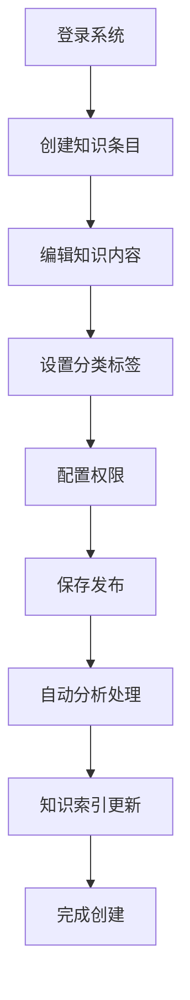
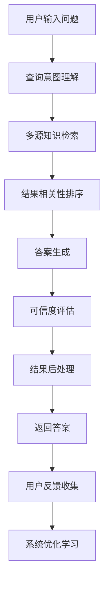

# 产品需求文档 (PRD) - PandaWiki

## 1. 项目背景与愿景

### 1.1 项目概述
- **项目名称**: PandaWiki
- **版本**: v1.0
- **创建日期**: 2025-11-03
- **最后更新**: 2025-11-03
- **项目地址**: https://github.com/chaitin/PandaWiki

### 1.2 问题背景
在传统的知识管理系统中，企业面临着以下核心挑战：
- **知识孤岛严重**: 企业知识分散在各个系统和文档中，缺乏统一的管理平台
- **检索效率低下**: 传统基于关键词的搜索无法理解语义和上下文
- **更新维护困难**: 知识更新不及时，版本管理混乱
- **协作效率低**: 团队成员间知识共享和协作流程繁琐
- **安全风险**: 敏感知识缺乏有效保护，存在泄露风险

### 1.3 产品愿景
PandaWiki 致力于打造下一代企业级智能知识管理平台，实现：
- 统一的企业知识库和智能检索
- AI驱动的知识管理和自动分类
- 高效的团队协作和知识共享
- 企业级的安全保障和权限控制
- 简化部署和使用体验

### 1.4 项目范围
- **包含内容**:
  - 企业级知识管理系统
  - AI智能检索和问答功能
  - 多模态内容支持（文本、图片、附件）
  - 细粒度权限和安全管理
  - 丰富的编辑器和协作工具
  - 开放的API和集成能力

- **排除内容**:
  - 复杂的项目管理功能
  - 实时音视频会议功能
  - 社交媒体集成功能

## 2. 目标用户画像与场景

### 2.1 主要用户画像

#### 用户画像 1: 企业知识管理者
- **基本信息**: 28-45岁，企业知识管理专员、信息架构师、培训经理
- **技术水平**: 中等偏上，熟悉KM系统，了解企业流程
- **目标和动机**:
  - 构建统一的企业知识体系
  - 提高知识的可发现性和可重用性
  - 促进团队间的知识共享
  - 降低知识管理成本
- **痛点描述**:
  - 知识分散在各个部门，难以统一管理
  - 员工重复提问同样的问题
  - 知识更新和版本管理复杂
  - 缺乏有效的知识分类和标签体系
- **使用场景**:
  - 企业知识库建设和维护
  - 新员工培训和知识传承
  - 政策文档管理和发布
  - 最佳实践收集和推广
- **技术能力**: 熟悉各类KM系统，具备一定的技术理解能力

#### 用户画像 2: 技术开发人员
- **基本信息**: 25-40岁，软件工程师、系统架构师、DevOps工程师
- **技术水平**: 高等，深度使用各种开发工具和技术栈
- **目标和动机**:
  - 快速查找技术文档和解决方案
  - 记录和分享开发经验
  - 建立团队技术知识库
  - 提高开发效率和代码质量
- **痛点描述**:
  - 技术文档分散且版本混乱
  - 难以找到特定问题的解决方案
  - 重复造轮子，缺乏经验共享
  - 新员工上手周期长
- **使用场景**:
  - 技术文档管理和检索
  - 开发指南和最佳实践
  - 问题解决方案库
  - 代码和架构知识管理
- **技术能力**: 熟练使用开发工具，了解API和系统集成

#### 用户画像 3: 企业管理者
- **基本信息**: 35-55岁，部门经理、项目总监、CTO
- **技术水平**: 中等，关注业务价值和管理效率
- **目标和动机**:
  - 提升组织整体效率
  - 降低沟通和培训成本
  - 改善决策质量
  - 建立学习型组织
- **痛点描述**:
  - 信息不对称导致决策失误
  - 知识流失严重，人才依赖性强
  - 跨部门协作效率低
  - 缺乏有效的知识管理工具
- **使用场景**:
  - 战略决策支持
  - 管理规范和流程制定
  - 团队绩效考核
  - 组织知识沉淀
- **技术能力**: 重视结果导向，对技术复杂度容忍度低

### 2.2 用户场景分析

#### 场景 1: 企业智能问答系统
- **触发条件**: 员工需要快速获取企业相关信息
- **用户目标**: 通过自然语言查询获得准确的企业知识答案
- **操作步骤**:
  1. 在智能问答界面输入问题
  2. 系统理解查询意图并检索相关知识
  3. 结合多个知识源生成综合答案
  4. 提供相关文档和参考链接
  5. 记录查询日志用于知识优化
- **期望结果**:
  - 查询响应时间<3秒
  - 答案准确率>90%
  - 支持复杂的业务问题
  - 提供答案来源和可信度

#### 场景 2: 项目知识沉淀
- **触发条件**: 项目结束后需要总结和沉淀经验
- **用户目标**: 系统化整理项目经验和最佳实践
- **操作步骤**:
  1. 创建项目知识空间
  2. 上传项目相关文档和资料
  3. 系统自动分析和分类内容
  4. 生成知识标签和关联关系
  5. 组织团队进行知识整理和验证
- **期望结果**:
  - 知识分类准确率>85%
  - 支持多种文档格式
  - 自动化程度>80%
  - 知识检索便捷高效

#### 场景 3: 新员工快速上手
- **触发条件**: 新员工入职需要快速了解企业知识和流程
- **用户目标**: 通过系统化的学习路径快速掌握必要知识
- **操作步骤**:
  1. 系统推荐个性化学习计划
  2. 按顺序学习相关知识模块
  3. 通过智能问答解决具体问题
  4. 参与知识讨论和反馈
  5. 完成学习评估和认证
- **期望结果**:
  - 上手时间缩短50%
  - 学习完成率>90%
  - 知识掌握度>85%
  - 学习体验满意度>4.5/5.0

## 3. 产品目标与成功指标

### 3.1 业务目标
- **主要目标**: 成为企业知识管理领域的领先解决方案
- **次要目标**:
  - 推动企业数字化转型和知识化升级
  - 建立完善的知识管理生态体系
  - 为企业创造实实在在的业务价值

### 3.2 用户目标
- **核心价值**: 让知识管理变得更加智能、高效、安全
- **用户满意度**: 企业客户满意度>4.6/5.0，员工使用率>80%

### 3.3 成功指标 (KPIs)

#### 3.3.1 业务指标
- **企业客户数**: 1000+ enterprise customers
- **行业覆盖**: 20+ major industries
- **付费用户数**: 50K+ paid users
- **年收入目标**: $10M+ ARR

#### 3.3.2 产品指标
- **知识库规模**: 平均每个客户100K+ knowledge items
- **查询成功率**: >95%
- **知识更新频率**: 每周新增>10%
- **用户活跃度**: 日活跃率>60%

#### 3.3.3 用户体验指标
- **查询响应时间**: <3 seconds
- **知识检索准确率**: >90%
- **用户培训时间**: <1 day
- **客户留存率**: >90%

## 4. 功能列表与优先级

### 4.1 功能优先级定义
- **P0 - 必须有**: 核心知识管理功能，产品价值基础
- **P1 - 应该有**: 重要增强功能，竞争力保证
- **P2 - 可以有**: 期望功能，丰富应用场景
- **P3 - 暂不考虑**: 未来版本考虑

### 4.2 核心功能 (P0)

#### 功能 1: 智能知识编辑器
- **功能描述**:
  - 所见即所得的富文本编辑
  - Markdown支持
  - 多媒体内容嵌入（图片、视频、附件）
  - 版本历史和协同编辑
  - 自动保存和恢复
- **用户价值**:
  - 便捷的知识创建和编辑体验
  - 支持丰富的内容格式
  - 保障知识内容安全可靠
- **技术要求**:
  - 现代化的富文本编辑器框架
  - 实时协同编辑技术
  - 版本控制和差异对比
  - 自动保存和冲突解决
- **验收标准**:
  - 支持常见富文本格式
  - 协同编辑延迟<100ms
  - 版本历史完整可追溯

#### 功能 2: AI智能检索
- **功能描述**:
  - 自然语言查询理解
  - 语义相似度匹配
  - 多源知识融合检索
  - 个性化结果排序
  - 查询建议和优化
- **用户价值**:
  - 像与人对话一样搜索知识
  - 获得准确相关的搜索结果
  - 快速找到所需信息
- **技术要求**:
  - 大语言模型集成
  - 向量搜索技术
  - 查询优化算法
  - 个性化推荐引擎
- **验收标准**:
  - 查询响应时间<3秒
  - 搜索准确率>90%
  - 支持复杂查询语法

#### 功能 3: 知识组织和分类
- **功能描述**:
  - 智能标签和分类
  - 知识图谱构建
  - 层级目录管理
  - 自定义分类体系
  - 知识关联和推荐
- **用户价值**:
  - 系统化的知识组织结构
  - 智能化的分类和标签
  - 发现知识间的关联关系
- **技术要求**:
  - 自然语言处理技术
  - 知识图谱构建算法
  - 聚类和分类算法
  - 关联规则挖掘
- **验收标准**:
  - 自动分类准确率>85%
  - 标签推荐相关性>80%
  - 支持自定义分类规则

#### 功能 4: 权限和安全控制
- **功能描述**:
  - 细粒度权限管理
  - 基于角色的访问控制
  - 数据加密和脱敏
  - 操作审计和日志
  - 单点登录集成
- **用户价值**:
  - 企业级的安全保障
  - 灵活的权限控制
  - 完整的操作可追溯性
- **技术要求**:
  - RBAC权限模型
  - 数据加密技术
  - 审计日志系统
  - SSO协议支持
- **验收标准**:
  - 权限控制100%准确
  - 数据安全性满足企业级要求
  - 审计日志完整性100%

### 4.3 重要功能 (P1)

#### 功能 5: 智能问答机器人
- **功能描述**:
  - 基于企业知识的问答
  - 多轮对话支持
  - 上下文理解和记忆
  - 答案溯源和可信度
  - 持续学习优化
- **用户价值**:
  - 24/7智能客服支持
  - 快速解答常见问题
  - 减轻人工客服压力
- **技术要求**:
  - 对话管理系统
  - 上下文建模
  - 置信度评估
  - 强化学习优化
- **验收标准**:
  - 问答准确率>90%
  - 支持多轮复杂对话
  - 答案溯源准确性100%

#### 功能 6: 知识分析和洞察
- **功能描述**:
  - 知识使用情况分析
  - 知识质量评估
  - 知识缺口识别
  - 趋势和模式发现
  - 决策支持报告
- **用户价值**:
  - 了解知识管理效果
  - 发现知识盲点和优化机会
  - 支持管理决策
- **技术要求**:
  - 数据分析和可视化
  - 文本挖掘技术
  - 预测分析算法
  - 报表生成引擎
- **验收标准**:
  - 分析维度>20种
  - 报告生成时间<5分钟
  - 洞察准确性>80%

### 4.4 期望功能 (P2)

#### 功能 7: 多语言支持
- **功能描述**:
  - 跨语言知识检索
  - 自动翻译功能
  - 本地化界面支持
  - 多语言知识库
  - 文化适配优化
- **用户价值**:
  - 支持跨国企业的多语言需求
  - 消除语言障碍
  - 全球化知识共享
- **技术要求**:
  - 机器翻译API
  - 多语言NLP模型
  - 国际化框架
  - 本地化测试
- **验收标准**:
  - 支持10+种主要语言
  - 翻译准确率>90%
  - 本地化完整性>95%

#### 功能 8: 移动端应用
- **功能描述**:
  - 移动端适配界面
  - 离线阅读支持
  - 推送通知功能
  - 移动端特色功能
  - 跨平台同步
- **用户价值**:
  - 随时随地访问知识
  - 移动办公便利性
  - 实时信息推送
- **技术要求**:
  - 响应式设计
  - 移动端应用开发
  - 推送服务集成
  - 离线数据同步
- **验收标准**:
  - 移动端体验评分>4.5/5.0
  - 离线功能支持>80%
  - 推送到达率>95%

## 5. 用户流程与线框图

### 5.1 核心用户流程

#### 流程 1: 知识创建和管理流程


**流程说明**:
1. **登录系统**: 用户通过统一认证登录知识管理平台
2. **创建知识条目**: 选择知识类型和模板，创建新的知识条目
3. **编辑知识内容**: 使用富文本编辑器编写和格式化知识内容
4. **设置分类标签**: 手动或自动设置知识分类和标签
5. **配置权限**: 设置知识的访问权限和编辑权限
6. **保存发布**: 保存知识并发布到知识库
7. **自动分析处理**: 系统自动分析内容并提取关键信息
8. **知识索引更新**: 更新搜索索引和知识图谱
9. **完成创建**: 知识创建完成，可供其他用户检索和使用

#### 流程 2: 智能问答流程


**流程说明**:
1. **用户输入问题**: 用户用自然语言描述问题或需求
2. **查询意图理解**: 分析用户查询的意图和关键信息
3. **多源知识检索**: 在企业知识库中检索相关信息
4. **结果相关性排序**: 根据相关性对检索结果进行排序
5. **答案生成**: 基于检索结果生成准确答案
6. **可信度评估**: 评估答案的准确性和可信度
7. **结果后处理**: 对答案进行格式化和优化
8. **返回答案**: 向用户返回最终答案和相关参考
9. **用户反馈收集**: 收集用户对答案的反馈
10. **系统优化学习**: 基于反馈优化问答系统

### 5.2 页面线框图

#### 页面 1: 知识管理主界面

**布局结构**:
```
┌─────────────────────────────────────────────────────────┐
│  🐼 PandaWiki    [搜索框]        [用户▼]  [设置▼]        │
├─────────────────────────────────────────────────────────┤
│  侧边导航栏              │        主工作区               │
│                        │                                 │
│ 📚 知识库               │  ┌─────────────────────────┐    │
│   - 分类目录            │  │   🐼 欢迎使用PandaWiki   │    │
│   - 最新知识            │  │                         │    │
│   - 热门知识            │  │ 🚀 快速操作             │    │
│   - 我的收藏            │  │ [新建知识] [智能问答]   │    │
│                        │  │ [上传文档] [知识图谱]   │    │
│ 🔍 智能检索             │  │                         │    │
│   - 全文搜索            │  │ 📊 知识统计             │    │
│   - 智能问答            │  │ 总知识: 12,456  今日: 23 │    │
│   - 高级搜索            │  │ 访问量: 5,678  搜索: 892 │    │
│                        │  │                         │    │
│ 👥 协作空间             │  │ 📈 最新动态             │    │
│   - 团队知识            │  │ • 新增《API开发指南》   │    │
│   - 项目知识            │  │ • 更新《安全规范》v2.0  │    │
│   - 讨论区              │  │ • 热门问题《如何部署》  │    │
│                        │  └─────────────────────────┘    │
├─────────────────────────────────────────────────────────┤
│               🐼 知识管理，让智慧传承有序                 │
└─────────────────────────────────────────────────────────┘
```

**主要元素**:
- **导航栏**:
  - PandaWiki品牌标识
  - 全局搜索框
  - 用户和设置快速访问
- **侧边导航**:
  - 知识库管理功能
  - 智能检索工具
  - 协作和社交功能
- **主工作区**:
  - 欢迎信息和快速操作
  - 知识统计和概览
  - 最新动态和推荐内容
- **品牌标语**:
  - 突出产品价值主张

#### 页面 2: 智能问答界面

**布局结构**:
```
┌─────────────────────────────────────────────────────────┐
│  ← 返回    🤖 智能问答    [历史记录] [建议] [反馈]       │
├─────────────────────────────────────────────────────────┤
│  对话区域                │        相关信息               │
│                         │                            │
│ ┌─────────────────────┐ │ ┌────────────────────────┐ │
│ │ 🤖 您好！我是小熊猫  │ │ │ 📚 相关知识推荐         │ │
│ │ 助手，有什么可以帮  │ │ │                        │ │
│ │ 您的吗？             │ │ • 《系统部署指南》       │ │
│ └─────────────────────┘ │ • 《故障排查手册》       │ │
│                         │ • 《常见问题解答》       │ │
│ ┌─────────────────────┐ │                        │ │
│ │ 👤 如何部署系统？     │ │ 🔍 快速问题            │ │
│ │                     │ │ • 如何创建知识？        │ │
│ └─────────────────────┘ │ • 如何设置权限？        │ │
│                         │ • 如何导出数据？        │ │
│ 🤖 正在思考... [●●●○○] │                        │ │
│                         │ 📊 对话统计            │ │
│ ┌─────────────────────┐ │ 今日对话: 156  满意: 148 │ │
│ │ 🤖 部署系统需要以   │ │ 成功率: 94.9%           │ │
│ │ 下步骤：             │ │                        │ │
│ │ 1. 环境准备...      │ └────────────────────────┘ │
│ │ 2. 配置文件...      │                            │
│ │ 3. 启动服务...      │ 💬 操作建议            │ │
│ │                     │ [👍有帮助] [👎没帮助]    │ │
│ │ 📚 详细文档链接...   │ [🔄换一个问题]          │ │
│ └─────────────────────┘ [💡分享]                 │ │
├─────────────────────────────────────────────────────────┤
│                🐼 基于企业知识库的智能问答服务            │
└─────────────────────────────────────────────────────────┘
```

**主要元素**:
- **对话区域**:
  - 模拟聊天对话界面
  - 实时思考状态显示
  - 结构化答案展示
  - 相关文档链接
- **相关信息区**:
  - 知识推荐和快速问题
  - 对话统计和成功率
  - 用户反馈操作
  - 分享和建议功能

### 5.3 交互设计要点

#### 交互模式 1: 智能知识搜索
- **触发条件**: 用户需要查找特定知识信息
- **操作步骤**:
  1. 在搜索框输入关键词或自然语言问题
  2. 系统实时显示搜索建议和历史记录
  3. 执行搜索并显示结果列表
  4. 用户可使用筛选和排序功能
  5. 点击查看详细知识内容
- **系统响应**:
  - 实时搜索建议和自动补全
  - 智能结果排序和推荐
  - 快速的搜索响应
  - 相关知识的关联推荐
- **用户反馈**:
  - 搜索结果满意度评价
  - 搜索体验改进建议
  - 知识质量反馈

#### 交互模式 2: 协同知识编辑
- **触发条件**: 多人需要共同编辑知识内容
- **操作步骤**:
  1. 用户进入知识编辑页面
  2. 系统显示其他在线协作者
  3. 多人可同时编辑不同部分
  4. 实时显示编辑冲突和建议
  5. 保存时自动合并更改
- **系统响应**:
  - 实时协作者状态显示
  - 平滑的协同编辑体验
  - 智能的冲突解决机制
  - 完整的版本历史记录
- **用户反馈**:
  - 协作体验评价
  - 编辑效率提升评估
  - 功能使用统计分析

## 6. 技术要求与约束

### 6.1 技术栈

#### 前端技术
- **框架**: React 18+ / Vue 3+
- **UI组件**: Ant Design / Element Plus
- **编辑器**: Quill.js / TinyMCE / Monaco Editor
- **状态管理**: Redux / Vuex / Pinia
- **构建工具**: Vite / Webpack

#### 后端技术
- **框架**: Spring Boot / Django / FastAPI
- **数据库**: PostgreSQL / MySQL / MongoDB
- **搜索引擎**: Elasticsearch / OpenSearch
- **缓存**: Redis / Memcached
- **消息队列**: RabbitMQ / Apache Kafka

#### AI和搜索
- **大语言模型**: GPT-4 / Claude / Llama2
- **向量搜索**: FAISS / Milvus / Pinecone
- **自然语言处理**: spaCy / NLTK / HanLP
- **机器学习**: scikit-learn / PyTorch / TensorFlow

#### 部署和运维
- **容器化**: Docker / Kubernetes
- **监控**: Prometheus / Grafana / ELK
- **CI/CD**: Jenkins / GitLab CI / GitHub Actions
- **安全**: OAuth2.0 / JWT / SSL/TLS

### 6.2 性能要求
- **响应时间**:
  - 页面加载: <3 seconds
  - 搜索响应: <2 seconds
  - 知识编辑: <1 second
  - 文件上传: <10 seconds (100MB)
- **并发能力**:
  - 同时在线用户: 10,000+
  - 并发搜索请求: 1,000 QPS
  - 并发编辑用户: 100+
  - 文件处理: 100+ concurrent

### 6.3 兼容性要求
- **浏览器支持**:
  - Chrome 90+, Firefox 88+, Safari 14+, Edge 90+
- **移动设备**:
  - iOS 13+, Android 8+
  - 响应式设计适配
- **服务器环境**:
  - Linux (Ubuntu 20.04+, CentOS 8+)
  - CPU: 8+ cores, Memory: 16GB+ RAM
  - 存储: SSD 100GB+

## 7. 风险与约束

### 7.1 技术风险

#### 风险 1: AI模型准确性和可靠性
- **风险描述**: AI智能检索和问答的准确性可能不稳定
- **影响程度**: 高
- **缓解措施**:
  - 多模型集成和验证
  - 持续的模型训练和优化
  - 人工审核和反馈机制
  - 置信度评估和降级策略

#### 风险 2: 大规模数据性能
- **风险描述**: 企业级知识库规模大，可能面临性能瓶颈
- **影响程度**: 中
- **缓解措施**:
  - 分布式架构设计
  - 智能缓存策略
  - 数据分片和索引优化
  - 性能监控和自动扩容

#### 风险 3: 数据安全和隐私
- **风险描述**: 企业敏感知识的安全保护挑战
- **影响程度**: 高
- **缓解措施**:
  - 端到端加密保护
  - 细粒度权限控制
  - 安全审计和合规检查
  - 数据备份和灾难恢复

### 7.2 业务风险

#### 风险 1: 市场竞争激烈
- **风险描述**: 知识管理市场竞争激烈，同质化严重
- **影响程度**: 中
- **缓解措施**:
  - 聚焦AI驱动的差异化优势
  - 深度行业解决方案定制
  - 建立客户成功体系
  - 构建生态合作伙伴网络

#### 风险 2: 用户采用阻力
- **风险描述**: 企业用户习惯传统工具，新系统推广困难
- **影响程度**: 中
- **缓解措施**:
  - 简化用户体验和学习成本
  - 提供完善的培训和支持
  - 数据迁移工具和方案
  - 分阶段推广和试点项目

### 7.3 时间约束
- **发布计划**:
  - MVP版本: 3个月内
  - 企业版: 6个月内
  - 国际化版: 12个月内
- **重要里程碑**:
  - Month 1: 核心知识管理功能
  - Month 2: AI智能检索功能
  - Month 3: 权限和安全功能
  - Month 4: 企业级部署工具
  - Month 5: 移动端应用
  - Month 6: 完整企业解决方案

## 8. 附录

### 8.1 术语表
- **知识管理**: 组织内知识的创建、存储、共享和应用过程
- **智能检索**: 基于AI技术的语义搜索和知识发现
- **协同编辑**: 多用户同时编辑同一文档的能力
- **知识图谱**: 用图结构表示知识和实体关系的网络

### 8.2 参考文档
- [PandaWiki GitHub Repository](https://github.com/chaitin/PandaWiki)
- [企业知识管理最佳实践](https://www.kmworld.com/)
- [AI在知识管理中的应用](https://arxiv.org/abs/2305.10925)
- [现代知识管理系统架构](https://aws.amazon.com/solutions/knowledge-management/)

### 8.3 变更记录
| 版本 | 日期 | 变更内容 | 变更人 |
|------|------|----------|--------|
| v1.0 | 2025-11-03 | 初始版本，基于PandaWiki项目分析的完整PRD | Claude AI Assistant |

---

*本文档为PandaWiki项目的详细产品需求文档，专注于企业级智能知识管理解决方案。PandaWiki结合现代AI技术，为企业提供安全、高效、智能的知识管理平台，助力企业数字化转型和知识化升级。*