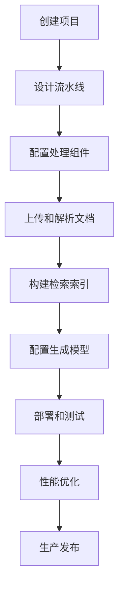
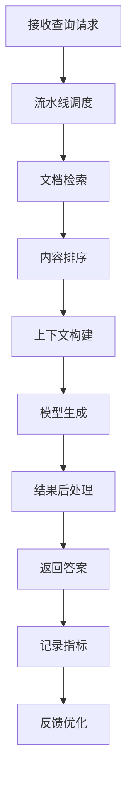

# 产品需求文档 (PRD) - RAGFlow

## 1. 项目背景与愿景

### 1.1 项目概述
- **项目名称**: RAGFlow
- **版本**: v1.0
- **创建日期**: 2025-11-03
- **最后更新**: 2025-11-03
- **项目地址**: https://github.com/infiniflow/ragflow

### 1.2 问题背景
在RAG（检索增强生成）技术的实际应用中，企业和开发者面临着一系列复杂挑战：
- **流程复杂性**: 从数据处理到问答服务的完整链路涉及多个技术组件
- **技术集成困难**: 需要集成文档解析、向量化、检索、生成等多个技术栈
- **性能优化挑战**: 不同场景下的性能调优需要深度专业知识
- **可扩展性限制**: 随着数据量和用户量增长，系统架构需要重新设计
- **监控和维护**: 生产环境的监控、故障排查和持续优化负担重

### 1.3 产品愿景
RAGFlow 致力于打造端到端的RAG解决方案，实现：
- 简化RAG应用的开发和部署流程
- 提供高性能和高可扩展性的RAG引擎
- 支持灵活的定制和优化能力
- 优秀的开发体验和运维便利性
- 企业级的稳定性和可靠性

### 1.4 项目范围
- **包含内容**:
  - 完整的RAG处理流程引擎
  - 高性能的向量检索和相似度计算
  - 灵活的流水线编排和定制
  - 企业级的部署和运维工具
  - 丰富的预训练模型和组件
  - 完善的监控和调试能力

- **排除内容**:
  - 自定义模型训练功能
  - 实时流式数据处理
  - 多模态内容处理（初期）

## 2. 目标用户画像与场景

### 2.1 主要用户画像

#### 用户画像 1: AI应用开发团队
- **基本信息**: 25-45岁，AI工程师、全栈开发者、技术负责人
- **技术水平**: 高等，深度理解AI和机器学习技术
- **目标和动机**:
  - 快速构建和部署RAG应用
  - 优化检索和生成性能
  - 简化开发和运维流程
  - 聚焦业务逻辑而非技术细节
- **痛点描述**:
  - RAG技术栈复杂，集成难度高
  - 性能调优需要大量实验
  - 生产环境部署和维护困难
  - 缺乏统一的开发框架
- **使用场景**:
  - 企业知识问答系统
  - 智能客服和助手
  - 文档智能分析
  - 内容推荐和生成
- **技术能力**: 熟练使用Python、机器学习框架、云服务

#### 用户画像 2: AI产品和解决方案架构师
- **基本信息**: 30-50岁，AI产品经理、解决方案架构师、技术总监
- **技术水平**: 中等到高等，理解AI技术能力和业务价值
- **目标和动机**:
  - 设计可扩展的AI解决方案
  - 评估和选择合适的技术方案
  - 降低技术实施风险
  - 加速产品上线时间
- **痛点描述**:
  - 技术选型复杂，评估成本高
  - 缺乏成熟的企业级RAG方案
  - 担心系统可扩展性和稳定性
  - 需要快速验证概念验证(POC)
- **使用场景**:
  - 企业AI架构设计
  - 技术方案评估和选型
  - 概念验证和原型开发
  - 生产系统规划和部署
- **技术能力**: 理解系统架构，关注技术趋势和业务价值

#### 用户画像 3: 大型企业AI团队负责人
- **基本信息**: 35-55岁，企业AI实验室负责人、创新部门主管
- **技术水平**: 高等，领导过多个AI项目
- **目标和动机**:
  - 构建企业级AI平台能力
  - 推动AI技术在业务中的应用
  - 建立AI开发标准和规范
  - 提升团队开发效率
- **痛点描述**:
  - 团队技术栈不统一
  - 项目重复开发资源浪费
  - 缺乏可复用的AI组件
  - 技术债务和维护成本高
- **使用场景**:
  - 企业AI平台建设
  - AI项目技术标准制定
  - 团队技术能力建设
  - AI创新应用孵化
- **技术能力**: 深度理解AI技术发展，具备技术管理经验

### 2.2 用户场景分析

#### 场景 1: 企业级智能客服系统
- **触发条件**: 大型企业需要构建高性能的智能客服系统
- **用户目标**: 快速部署可扩展的智能问答平台
- **操作步骤**:
  1. 使用RAGFlow创建客服知识库
  2. 配置多级检索和生成策略
  3. 集成企业现有CRM和工单系统
  4. 部署高可用的服务集群
  5. 监控系统性能和用户满意度
- **期望结果**:
  - 系统响应时间<2秒
  - 问答准确率>95%
  - 支持10万+日活用户
  - 系统可用性>99.9%

#### 场景 2: 金融风控知识图谱
- **触发条件**: 金融机构需要基于海量文档进行风险分析
- **用户目标**: 构建智能化的风险知识检索和推理系统
- **操作步骤**:
  1. 处理和分析金融法规和案例文档
  2. 构建领域特定的知识表示和索引
  3. 设计复杂的多跳查询策略
  4. 集成风险评估和决策支持系统
  5. 持续优化检索和推理性能
- **期望结果**:
  - 复杂查询响应时间<5秒
  - 风险识别准确率>90%
  - 支持亿级文档处理
  - 推理过程可解释

#### 场景 3: 科研文献智能分析
- **触发条件**: 研究机构需要分析大量学术文献
- **用户目标**: 构建智能化的科研文献检索和分析平台
- **操作步骤**:
  1. 批量处理学术论文和期刊文献
  2. 提取实体、关系和语义信息
  3. 构建学科知识图谱和索引
  4. 支持复杂的学术查询和分析
  5. 生成研究洞察和趋势分析
- **期望结果**:
  - 文献处理速度>1000篇/小时
  - 语义检索准确率>90%
  - 支持跨学科知识发现
  - 生成高质量分析报告

## 3. 产品目标与成功指标

### 3.1 业务目标
- **主要目标**: 成为企业级RAG解决方案的首选平台
- **次要目标**:
  - 推动RAG技术在企业中的标准化应用
  - 构建开放的RAG技术生态
  - 降低企业AI应用开发门槛

### 3.2 用户目标
- **核心价值**: 让RAG应用开发变得简单、高效、可靠
- **用户满意度**: 企业客户满意度>4.7/5.0，开发效率提升>80%

### 3.3 成功指标 (KPIs)

#### 3.3.1 技术指标
- **处理性能**: 支持1000+ QPS检索请求
- **扩展能力**: 支持PB级数据处理
- **响应时间**: P99响应时间<3秒
- **系统稳定性**: 99.95%可用性

#### 3.3.2 业务指标
- **企业客户**: 500+ enterprise customers
- **部署实例**: 10,000+ production deployments
- **开发者社区**: 50,000+ active developers
- **生态合作伙伴**: 100+ technology partners

#### 3.3.3 用户体验指标
- **开发效率**: RAG应用开发时间缩短70%
- **学习成本**: 新手上手时间<3天
- **文档完整性**: >95%覆盖率
- **社区活跃度**: 月活贡献者>1000人

## 4. 功能列表与优先级

### 4.1 功能优先级定义
- **P0 - 必须有**: 核心RAG引擎功能，产品价值基础
- **P1 - 应该有**: 企业级增强功能，竞争力保证
- **P2 - 可以有**: 专业化功能，场景扩展
- **P3 - 暂不考虑**: 未来版本考虑

### 4.2 核心功能 (P0)

#### 功能 1: 流水线编排引擎
- **功能描述**:
  - 可视化的流水线设计器
  - 丰富的预置处理组件
  - 自定义组件开发支持
  - 流水线版本管理和回滚
  - 性能监控和优化建议
- **用户价值**:
  - 灵活定制RAG处理流程
  - 快速构建复杂的应用逻辑
  - 便捷的流程管理和优化
- **技术要求**:
  - 有向无环图(DAG)引擎
  - 组件标准化接口
  - 分布式任务调度
  - 实时性能监控
- **验收标准**:
  - 支持50+预置组件
  - 流水线执行成功率>99.5%
  - 组件开发周期<3天

#### 功能 2: 高性能检索引擎
- **功能描述**:
  - 多种索引类型和算法
  - 智能查询路由和优化
  - 实时索引更新和维护
  - 分布式检索和负载均衡
  - 检索结果融合和重排
- **用户价值**:
  - 亚秒级检索响应速度
  - 高准确度的相关性匹配
  - 强大的扩展能力
- **技术要求**:
  - 向量数据库集成
  - 倒排索引引擎
  - 查询优化器
  - 分布式计算框架
- **验收标准**:
  - 检索延迟<100ms (P95)
  - 索引构建速度>10K docs/sec
  - 支持10亿级向量检索

#### 功能 3: 智能文档解析
- **功能描述**:
  - 多格式文档解析支持
  - 智能内容提取和结构化
  - 多模态信息融合
  - 增量更新和变更检测
  - 质量评估和数据清洗
- **用户价值**:
  - 自动化的文档处理
  - 高质量的内容提取
  - 支持丰富的文档类型
- **技术要求**:
  - 文档解析引擎集成
  - OCR和多模态处理
  - 自然语言处理技术
  - 数据质量管理
- **验收标准**:
  - 支持100+文档格式
  - 解析准确率>95%
  - 处理速度>100 pages/second

#### 功能 4: 生成模型集成
- **功能描述**:
  - 多种大语言模型支持
  - 模型路由和负载均衡
  - 上下文管理和优化
  - 生成质量监控
  - 成本控制和优化
- **用户价值**:
  - 灵活的模型选择
  - 高质量的文本生成
  - 成本效益优化
- **技术要求**:
  - LLM API标准化
  - 模型性能监控
  - 上下文窗口管理
  - 成本分析引擎
- **验收标准**:
  - 支持20+主流模型
  - 生成响应时间<5秒
  - 成本控制精度>90%

### 4.3 重要功能 (P1)

#### 功能 5: 企业级部署工具
- **功能描述**:
  - Kubernetes原生部署
  - 自动扩缩容和负载均衡
  - 多环境配置管理
  - 蓝绿部署和灰度发布
  - 灾备和高可用方案
- **用户价值**:
  - 生产级部署能力
  - 弹性扩展能力
  - 零停机更新
- **技术要求**:
  - 容器编排技术
  - 服务网格集成
  - 配置管理中心
  - 监控告警系统
- **验收标准**:
  - 部署自动化率>95%
  - 故障恢复时间<5分钟
  - 支持1000+节点集群

#### 功能 6: 监控和调试系统
- **功能描述**:
  - 全链路性能监控
  - 实时告警和通知
  - 详细的调试信息
  - 性能分析和优化
  - A/B测试和实验管理
- **用户价值**:
  - 全面的系统可观测性
  - 快速问题定位和解决
  - 持续性能优化
- **技术要求**:
  - 分布式追踪系统
  - 时序数据库
  - 日志聚合分析
  - 实验管理平台
- **验收标准**:
  - 监控覆盖率100%
  - 告警准确率>95%
  - 问题定位时间<10分钟

### 4.4 期望功能 (P2)

#### 功能 7: 领域知识增强
- **功能描述**:
  - 领域本体和知识图谱
  - 专业术语和实体识别
  - 领域特定的检索策略
  - 专家规则和知识注入
  - 持续学习和优化
- **用户价值**:
  - 领域专业化能力
  - 更高的检索准确性
  - 行业最佳实践
- **技术要求**:
  - 知识图谱引擎
  - 领域NLP模型
  - 规则引擎
  - 增量学习算法
- **验收标准**:
  - 支持10+主流行业
  - 领域检索准确率>95%
  - 知识更新延迟<24小时

#### 功能 8: 多租户和隔离
- **功能描述**:
  - 多租户架构支持
  - 资源配额和限制
  - 数据隔离和安全
  - 租户级别的定制化
  - 计费和使用统计
- **用户价值**:
  - SaaS服务能力
  - 资源成本控制
  - 数据安全保障
- **技术要求**:
  - 多租户架构设计
  - 资源调度系统
  - 数据加密和隔离
  - 计费计量系统
- **验收标准**:
  - 支持1000+租户
  - 资源隔离有效性100%
  - 计费准确率>99.9%

## 5. 用户流程与线框图

### 5.1 核心用户流程

#### 流程 1: RAG应用开发流程


**流程说明**:
1. **创建项目**: 在RAGFlow中创建新的RAG应用项目
2. **设计流水线**: 使用可视化编辑器设计处理流水线
3. **配置处理组件**: 选择和配置文档处理、检索、生成等组件
4. **上传和解析文档**: 上传业务文档并进行智能解析
5. **构建检索索引**: 为解析后的内容构建检索索引
6. **配置生成模型**: 选择和配置大语言模型
7. **部署和测试**: 部署应用并进行功能测试
8. **性能优化**: 监控性能并进行参数调优
9. **生产发布**: 将优化后的应用发布到生产环境

#### 流程 2: 流水线执行流程


**流程说明**:
1. **接收查询请求**: 获取用户的查询请求
2. **流水线调度**: 调度配置好的处理流水线
3. **文档检索**: 在索引中检索相关文档
4. **内容排序**: 对检索结果进行相关性排序
5. **上下文构建**: 为模型生成构建上下文
6. **模型生成**: 调用大语言模型生成答案
7. **结果后处理**: 对生成结果进行格式化和优化
8. **返回答案**: 向用户返回最终答案
9. **记录指标**: 记录性能和质量指标
10. **反馈优化**: 基于反馈数据优化系统参数

### 5.2 页面线框图

#### 页面 1: 流水线设计器

**布局结构**:
```
┌─────────────────────────────────────────────────────────┐
│  🌊 RAGFlow   [流水线▼] [组件▼] [监控▼]  部署 [🚀]        │
├─────────────────────────────────────────────────────────┤
│  组件面板                │        画布区域               │
│                        │                                 │
│ 📥 输入组件             │  ┌─────────────────────────┐    │
│   • 文档上传器          │  │    流水线设计画布        │    │
│   • API输入             │  │                         │    │
│   • 文件监控器          │  │ [文档输入] → [文本解析] │    │
│                        │  │     ↓         ↓        │    │
│ 🔧 处理组件             │  │   [向量化]   [索引构建] │    │
│   • 文本解析器          │  │     ↓         ↓        │    │
│   • 向量化引擎          │  │   [检索器] → [排序器]   │    │
│   • OCR处理器          │  │     ↓         ↓        │    │
│                        │  │  [上下文] → [LLM生成]   │    │
│ 🔍 检索组件             │  │     ↓                  │    │
│   • 向量检索器          │  │  [后处理] → [输出]      │    │
│   • 混合检索器          │  │                         │    │
│   • 图谱检索器          │  └─────────────────────────┘    │
│                        │                                 │
│ 🤖 生成组件             │ 🔧 工具栏                  │    │
│   • LLM生成器           │ [运行] [调试] [保存] [部署] │    │
│   • 模板渲染器          │                            │    │
│                        │ 📊 性能监控                │    │
├─────────────────────────────────────────────────────────┤
│                🌊 RAGFlow - 端到端RAG解决方案              │
└─────────────────────────────────────────────────────────┘
```

**主要元素**:
- **组件面板**:
  - 分类的组件库（输入、处理、检索、生成）
  - 拖拽式的组件添加
  - 组件配置和属性面板
- **画布区域**:
  - 可视化的流水线设计
  - 连接线和数据流向
  - 组件状态和参数显示
- **工具栏**:
  - 流水线运行和调试
  - 保存和部署操作
  - 性能监控和状态

#### 页面 2: 监控和分析界面

**布局结构**:
```
┌─────────────────────────────────────────────────────────┐
│  ← 返回    📊 系统监控    [实时▼] [历史▼] [告警▼]         │
├─────────────────────────────────────────────────────────┤
│  指标选择                │        可视化区域             │
│                        │                            │
│ 🎯 核心指标             │ ┌────────────────────────┐  │
│   [✓] QPS              │ │     系统性能概览        │  │
│   [✓] 延迟             │ │                        │  │
│   [✓] 准确率           │ │ 📈 请求量趋势           │  │
│   [✓] 可用性           │ │ 1.2K ████████ 1.5K     │  │
│                        │ │                        │  │
│ 🔍 详细指标             │ │ ⚡ 响应时间分布         │  │
│   • 组件性能           │ │ P50: 120ms P95: 350ms   │  │
│   • 错误率             │ │                        │  │
│   • 资源使用           │ │ 🎯 检索准确率           │  │
│   • 成本统计           │ │ 94.5% ███████████ 96.2% │  │
│                        │ └────────────────────────┘  │
│ ⏰ 时间范围             │                            │
│ [最近1小时] [最近24小时] │ 🚨 实时告警              │  │
│ [最近7天] [自定义]      │ • 检索延迟异常          │  │
│                        │ • 生成错误率升高        │  │
│ 📊 自定义面板           │ • 磁盘空间不足          │  │
│ [创建面板] [编辑面板]   │                            │  │
├─────────────────────────────────────────────────────────┤
│               🌊 RAGFlow - 让RAG应用开发变得简单            │
└─────────────────────────────────────────────────────────┘
```

**主要元素**:
- **指标选择**:
  - 核心性能指标（QPS、延迟、准确率）
  - 详细的组件和系统指标
  - 时间范围选择器
  - 自定义监控面板
- **可视化区域**:
  - 实时性能图表
  - 历史趋势分析
  - 告警信息展示
  - 综合性能概览

### 5.3 交互设计要点

#### 交互模式 1: 可视化流水线设计
- **触发条件**: 开发者需要设计和配置RAG处理流程
- **操作步骤**:
  1. 从组件面板拖拽组件到画布
  2. 连接组件形成处理流程
  3. 配置组件参数和属性
  4. 测试和调试流水线
  5. 保存和部署流水线
- **系统响应**:
  - 实时的拖拽反馈
  - 智能的连接建议
  - 参数验证和错误提示
  - 性能预览和优化建议
- **用户反馈**:
  - 设计易用性评价
  - 组件丰富度反馈
  - 性能优化效果评估

#### 交互模式 2: 实时性能监控
- **触发条件**: 运维人员需要监控系统性能和健康状态
- **操作步骤**:
  1. 选择监控指标和时间范围
  2. 查看实时性能图表
  3. 分析异常和性能瓶颈
  4. 设置告警阈值和通知
  5. 导出监控报告
- **系统响应**:
  - 实时数据更新
  - 智能异常检测
  - 根因分析和建议
  - 自动化告警推送
- **用户反馈**:
  - 监控准确性评价
  - 告警及时性评估
  - 用户体验改进建议

## 6. 技术要求与约束

### 6.1 技术栈

#### 核心框架
- **微服务框架**: Spring Boot / FastAPI / gRPC
- **工作流引擎**: Apache Airflow / Prefect / Temporal
- **消息队列**: Apache Kafka / RabbitMQ / NATS
- **服务网格**: Istio / Linkerd

#### AI和ML
- **深度学习**: PyTorch / TensorFlow / JAX
- **向量数据库**: Milvus / Pinecone / Weaviate
- **搜索引擎**: Elasticsearch / OpenSearch / Solr
- **大语言模型**: OpenAI / Anthropic / Hugging Face

#### 数据处理
- **流处理**: Apache Flink / Spark Streaming
- **批处理**: Apache Spark / Dask
- **图计算**: Apache GraphX / DGL
- **文档处理**: Apache Tika / Unstructured

#### 部署和运维
- **容器编排**: Kubernetes / Docker Swarm
- **服务发现**: Consul / etcd / ZooKeeper
- **监控**: Prometheus / Grafana / Jaeger
- **CI/CD**: GitLab CI / GitHub Actions / ArgoCD

### 6.2 性能要求
- **处理性能**:
  - 文档处理: 1000+ pages/second
  - 向量检索: 10000+ QPS
  - 流水线执行: 100+ concurrent pipelines
  - 端到端延迟: <3 seconds (P95)
- **扩展能力**:
  - 水平扩展: 支持1000+节点集群
  - 数据规模: 支持PB级数据处理
  - 并发用户: 10000+ concurrent users
  - 多租户: 1000+ tenants

### 6.3 兼容性要求
- **云平台支持**:
  - AWS: EKS, EC2, S3, RDS
  - Azure: AKS, VM, Blob, SQL
  - GCP: GKE, Compute, Cloud Storage
  - 私有云: OpenStack, VMware
- **硬件要求**:
  - CPU: x86_64, ARM64
  - 内存: 16GB+ per node
  - 存储: SSD, NVMe preferred
  - 网络: 10Gbps+ bandwidth

## 7. 风险与约束

### 7.1 技术风险

#### 风险 1: 系统复杂度高
- **风险描述**: 端到端RAG系统复杂，开发和维护成本高
- **影响程度**: 高
- **缓解措施**:
  - 模块化和微服务架构
  - 自动化测试和部署
  - 完善的文档和工具
  - 社区支持和培训

#### 风险 2: 性能优化挑战
- **风险描述**: 不同场景下性能差异大，优化难度高
- **影响程度**: 中
- **缓解措施**:
  - 智能性能调优算法
  - A/B测试和实验框架
  - 预设的性能配置模板
  - 持续的基准测试和优化

#### 风险 3: 技术快速演进
- **风险描述**: AI技术发展迅速，存在技术过时风险
- **影响程度**: 中
- **缓解措施**:
  - 模块化和可插拔架构
  - 持续的技术研究和创新
  - 灵活的适配和集成能力
  - 与学术界和产业界合作

### 7.2 业务风险

#### 风险 1: 市场竞争激烈
- **风险描述**: RAG和AI平台市场竞争激烈
- **影响程度**: 高
- **缓解措施**:
  - 聚焦端到端解决方案
  - 构建技术和生态护城河
  - 建立强大的开发者社区
  - 提供独特的技术价值

#### 风险 2: 企业销售周期长
- **风险描述**: 企业客户决策和采购周期长
- **影响程度**: 中
- **缓解措施**:
  - 开源版降低试用门槛
  - 完善的概念验证支持
  - 专业的销售和技术支持
  - 成功案例和客户推荐

### 7.3 时间约束
- **发布计划**:
  - Alpha版本: 6个月内
  - Beta版本: 12个月内
  - 正式版本: 18个月内
- **重要里程碑**:
  - Month 3: 核心流水线引擎
  - Month 6: 检索和生成组件
  - Month 9: 企业级部署工具
  - Month 12: 监控和调试系统
  - Month 15: 生态和集成扩展
  - Month 18: 正式企业版发布

## 8. 附录

### 8.1 术语表
- **RAG**: 检索增强生成，结合信息检索和文本生成的AI架构
- **流水线**: 数据处理的连续步骤和组件组合
- **向量化**: 将文本转换为数值向量的过程
- **嵌入**: 文本或数据在向量空间中的表示

### 8.2 参考文档
- [RAGFlow GitHub Repository](https://github.com/infiniflow/ragflow)
- [RAG Architecture Patterns](https://arxiv.org/abs/2312.10997)
- [Enterprise AI Platform Design](https://aws.amazon.com/solutions/ai-platform/)
- [Microservices for AI Systems](https://microservices.io/patterns)

### 8.3 变更记录
| 版本 | 日期 | 变更内容 | 变更人 |
|------|------|----------|--------|
| v1.0 | 2025-11-03 | 初始版本，基于RAGFlow项目分析的完整PRD | Claude AI Assistant |

---

*本文档为RAGFlow项目的详细产品需求文档，专注于端到端的RAG解决方案。RAGFlow通过流水线编排、高性能检索、企业级部署等核心能力，为AI应用开发者提供完整的RAG技术栈，加速企业AI应用的落地和创新。*