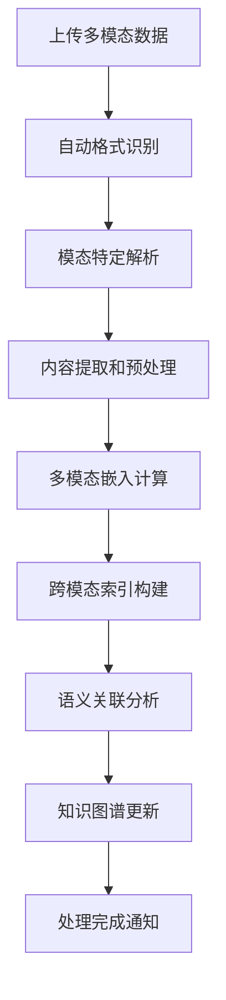
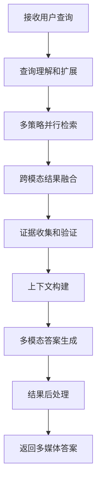

# 产品需求文档 (PRD) - RAG-Anything

## 1. 项目背景与愿景

### 1.1 项目概述
- **项目名称**: RAG-Anything
- **版本**: v1.0
- **创建日期**: 2025-11-03
- **最后更新**: 2025-11-03
- **项目地址**: https://github.com/HKUDS/RAG-Anything

### 1.2 问题背景
在当前的信息时代，数据以多样化的形式存在，包括文本、图像、音频、视频、表格等。传统的RAG系统主要针对文本数据进行优化，在处理多模态数据时面临以下挑战：
- **数据格式限制**: 大多数RAG系统只能处理文本，无法有效处理图像、音频、视频等
- **模态割裂**: 不同模态数据无法统一检索和理解
- **上下文缺失**: 无法理解跨模态的内容关联和语义关系
- **处理效率低**: 多模态数据处理复杂，计算开销大
- **应用场景受限**: 无法满足现实世界中对多媒体内容的智能问答需求

### 1.3 产品愿景
RAG-Anything 致力于打造首个真正的多模态RAG平台，实现：
- 支持任意格式的数据输入和处理
- 跨模态的语义理解和检索能力
- 统一的多模态知识表示和索引
- 高效的多媒体内容分析和问答
- 开放的模态扩展和定制能力

### 1.4 项目范围
- **包含内容**:
  - 多模态数据解析和处理引擎
  - 统一的多模态嵌入和表示
  - 跨模态检索和相似性计算
  - 多模态融合和问答系统
  - 可扩展的模态插件架构
  - 丰富的预训练模型和工具

- **排除内容**:
  - 实时流媒体处理
  - 3D/VR内容处理
  - 专业医疗影像分析

## 2. 目标用户画像与场景

### 2.1 主要用户画像

#### 用户画像 1: 多媒体内容创作者
- **基本信息**: 22-40岁，视频制作人、播客主、摄影师、设计师
- **技术水平**: 中等，熟悉各种创作工具，对AI技术有基本了解
- **目标和动机**:
  - 快速检索和管理大量多媒体素材
  - 基于内容进行智能创作和编辑
  - 自动化内容标注和分类
  - 提升创作效率和质量
- **痛点描述**:
  - 素材管理混乱，查找困难
  - 缺乏基于内容的智能检索
  - 手动标注耗时耗力
  - 跨模态内容关联难以发现
- **使用场景**:
  - 视频素材库管理和检索
  - 播客内容智能分析和标注
  - 图像集合的主题分类
  - 跨媒体内容的创作灵感获取
- **技术能力**: 熟练使用创作软件，对AI工具接受度高

#### 用户画像 2: 企业知识管理专员
- **基本信息**: 28-45岁，企业培训师、知识管理专员、信息架构师
- **技术水平**: 中等偏上，了解企业级知识管理系统
- **目标和动机**:
  - 构建企业多媒体知识库
  - 提升培训材料和文档的可用性
  - 支持多样化的知识检索需求
  - 促进跨部门知识共享
- **痛点描述**:
  - 企业知识分散在多种格式中
  - 传统搜索无法理解多媒体内容
  - 培训材料利用率低
  - 知识发现和传承困难
- **使用场景**:
  - 企业培训视频智能检索
  - 产品演示文档问答
  - 会议录音和纪要分析
  - 跨格式知识图谱构建
- **技术能力**: 熟悉KM系统，理解企业知识管理流程

#### 用户画像 3: 研究人员和学者
- **基本信息**: 25-50岁，各学科研究人员、教授、研究生
- **技术水平**: 高等，深度使用各种学术工具和数据库
- **目标和动机**:
  - 整合和分析多模态研究数据
  - 快速找到相关研究文献和资料
  - 支持跨学科的知识发现
  - 提升研究效率和创新能力
- **痛点描述**:
  - 研究资料格式多样，难以统一管理
  - 缺乏跨模态的内容理解能力
  - 文献综述和引用分析困难
  - 实验数据的智能分析不足
- **使用场景**:
  - 学术文献的多模态检索
  - 研究数据的智能分析
  - 跨学科知识关联发现
  - 实验结果的可视化和解释
- **技术能力**: 深度理解研究方法论，熟练使用数据分析工具

### 2.2 用户场景分析

#### 场景 1: 视频内容智能问答
- **触发条件**: 用户需要从大量视频中快速获取特定信息
- **用户目标**: 通过自然语言查询视频内容，获得精准答案和片段
- **操作步骤**:
  1. 上传或导入视频文件
  2. 系统自动进行语音识别和场景分析
  3. 构建视频内容的时序索引
  4. 用户输入自然语言查询
  5. 系统返回相关视频片段和文字答案
- **期望结果**:
  - 视频处理速度>实时播放速度
  - 语音识别准确率>95%
  - 查询响应时间<2秒
  - 支持时间戳精确定位

#### 场景 2: 多模态知识检索
- **触发条件**: 企业员工需要查询各种格式的企业知识
- **用户目标**: 通过单一查询同时搜索文档、图片、视频等多种内容
- **操作步骤**:
  1. 连接企业知识库和数据源
  2. 系统建立多模态统一索引
  3. 用户输入复合查询（如"产品演示视频+技术文档"）
  4. 系统进行跨模态语义理解
  5. 返回相关的多媒体内容和综合答案
- **期望结果**:
  - 支持10+种数据模态
  - 跨模态检索准确率>85%
  - 相关性评分准确度>90%

#### 场景 3: 图像内容理解和问答
- **触发条件**: 用户需要理解图像内容并获取相关信息
- **用户目标**: 基于图像内容进行智能问答和分析
- **操作步骤**:
  1. 上传图像或图像集合
  2. 系统进行对象检测、场景理解、OCR处理
  3. 构建图像内容的语义描述
  4. 用户针对图像内容进行查询
  5. 系统返回基于图像理解的详细答案
- **期望结果**:
  - 对象检测准确率>90%
  - 场景理解准确率>85%
  - OCR识别准确率>98%
  - 支持复杂图像推理

## 3. 产品目标与成功指标

### 3.1 业务目标
- **主要目标**: 成为多模态RAG领域的领导者和标准制定者
- **次要目标**:
  - 推动多模态AI技术的普及和应用
  - 建立开放的多模态处理生态
  - 孵化创新的多媒体应用和工具

### 3.2 用户目标
- **核心价值**: 让任意格式的数据都能被智能理解和检索
- **用户满意度**: 用户满意度>4.4/5.0，跨模态检索准确率>90%

### 3.3 成功指标 (KPIs)

#### 3.3.1 技术指标
- **模态支持**: 10+种数据模态
- **跨模态检索准确率**: >90%
- **多模态处理速度**: >1000 items/hour
- **系统可用性**: >99.5%

#### 3.3.2 用户指标
- **GitHub星标**: 15K+ stars
- **下载量**: 200K+ monthly downloads
- **社区贡献者**: 300+ contributors
- **用户案例**: 500+ production deployments

#### 3.3.3 性能指标
- **查询响应时间**: <2 seconds (average)
- **并发处理**: 100+ concurrent queries
- **存储效率**: 压缩率>60%
- **GPU利用率**: >80%

## 4. 功能列表与优先级

### 4.1 功能优先级定义
- **P0 - 必须有**: 核心多模态功能，产品差异化基础
- **P1 - 应该有**: 重要增强功能，提升实用性
- **P2 - 可以有**: 期望功能，丰富应用场景
- **P3 - 暂不考虑**: 未来版本考虑

### 4.2 核心功能 (P0)

#### 功能 1: 多模态数据解析器
- **功能描述**:
  - 统一的多模态数据接口
  - 智能格式识别和转换
  - 原始内容提取和预处理
  - 元数据标准化和丰富
- **用户价值**:
  - 支持任意格式的数据输入
  - 自动化的数据处理流程
  - 保证数据质量和一致性
- **技术要求**:
  - 可扩展的解析器架构
  - 专用模态处理库
  - 异步处理管道
  - 数据验证和清洗
- **验收标准**:
  - 支持20+种数据格式
  - 解析成功率>99%
  - 处理速度>100 files/minute

#### 功能 2: 多模态嵌入引擎
- **功能描述**:
  - 统一的多模态向量表示
  - 跨模态语义对齐
  - 高效的嵌入计算和缓存
  - 可配置的嵌入策略
- **用户价值**:
  - 跨模态的语义理解能力
  - 高效的相似性计算
  - 灵活的模型选择
- **技术要求**:
  - 多模态预训练模型
  - 对比学习技术
  - 向量数据库集成
  - 模型压缩和优化
- **验收标准**:
  - 支持10+种模态嵌入
  - 跨模态相似度计算<100ms
  - 嵌入质量评估>4.0/5.0

#### 功能 3: 跨模态检索系统
- **功能描述**:
  - 多策略融合检索算法
  - 跨模态相关性计算
  - 智能结果排序和过滤
  - 个性化推荐和优化
- **用户价值**:
  - 准确的跨模态内容发现
  - 智能的结果排序
  - 个性化的检索体验
- **技术要求**:
  - 混合检索算法
  - 相关性排序模型
  - 用户行为分析
  - 实时性能优化
- **验收标准**:
  - 检索准确率>90%
  - 响应时间<2 seconds
  - 支持复杂查询语法

#### 功能 4: 多模态问答引擎
- **功能描述**:
  - 跨模态上下文理解
  - 多模态证据收集
  - 智能答案生成和解释
  - 可解释性和溯源支持
- **用户价值**:
  - 基于多媒体内容的智能问答
  - 准确可靠的答案生成
  - 透明的推理过程
- **技术要求**:
  - 大型多模态模型集成
  - 证据检索和验证
  - 推理链构建
  - 溯踪和可视化
- **验收标准**:
  - 答案准确率>85%
  - 证据相关性>90%
  - 响应时间<5 seconds

### 4.3 重要功能 (P1)

#### 功能 5: 时序内容处理
- **功能描述**:
  - 视频、音频时序分析
  - 场景分割和关键帧提取
  - 语音识别和说话人分离
  - 时间轴导航和检索
- **用户价值**:
  - 精确的时序内容定位
  - 智能的章节分割
  - 说话人识别和跟踪
- **技术要求**:
  - 时序数据处理算法
  - 语音识别引擎
  - 视频分析技术
  - 时间索引结构
- **验收标准**:
  - 时序精度<1 second
  - 语音识别准确率>95%
  - 场景分割准确率>85%

#### 功能 6: 空间内容理解
- **功能描述**:
  - 图像和3D内容理解
  - 对象检测和分割
  - 场景图构建
  - 空间关系推理
- **用户价值**:
  - 深度理解图像内容
  - 精确的对象定位
  - 空间关系分析
- **技术要求**:
  - 计算机视觉算法
  - 深度学习模型
  - 图神经网络
  - 几何推理引擎
- **验收标准**:
  - 对象检测mAP>0.8
  - 分割IoU>0.85
  - 空间推理准确率>80%

### 4.4 期望功能 (P2)

#### 功能 7: 多模态内容生成
- **功能描述**:
  - 基于检索结果的创意生成
  - 跨模态内容转换
  - 个性化内容推荐
  - 协作创作支持
- **用户价值**:
  - 激发创作灵感
  - 多格式内容转换
  - 智能内容推荐
- **技术要求**:
  - 生成式AI模型
  - 风格迁移技术
  - 推荐系统算法
  - 实时协作工具
- **验收标准**:
  - 生成内容质量>4.0/5.0
  - 转换准确性>90%
  - 推荐相关性>85%

#### 功能 8: 企业级集成
- **功能描述**:
  - 企业系统集成接口
  - 权限和安全控制
  - 大规模数据处理
  - 定制化和扩展支持
- **用户价值**:
  - 无缝集成现有系统
  - 企业级安全保障
  - 处理海量数据
  - 满足特殊需求
- **技术要求**:
  - 企业API接口
  - 安全认证体系
  - 分布式计算框架
  - 插件开发工具
- **验收标准**:
  - 支持10+种企业系统集成
  - 安全合规性100%
  - 数据处理能力>TB级

## 5. 用户流程与线框图

### 5.1 核心用户流程

#### 流程 1: 多模态数据处理流程


**流程说明**:
1. **上传多模态数据**: 用户上传各种格式的文件
2. **自动格式识别**: 系统自动识别文件类型和格式
3. **模态特定解析**: 使用专门的解析器处理不同模态数据
4. **内容提取和预处理**: 提取原始内容并进行标准化处理
5. **多模态嵌入计算**: 计算统一的向量表示
6. **跨模态索引构建**: 构建支持跨模态检索的索引结构
7. **语义关联分析**: 分析不同模态内容间的语义关联
8. **知识图谱更新**: 更新多模态知识图谱
9. **处理完成通知**: 通知用户数据处理完成

#### 流程 2: 跨模态问答流程


**流程说明**:
1. **接收用户查询**: 获取用户的自然语言查询
2. **查询理解和扩展**: 理解查询意图并扩展相关概念
3. **多策略并行检索**: 使用多种策略并行检索相关内容
4. **跨模态结果融合**: 融合不同模态的检索结果
5. **证据收集和验证**: 收集支持答案的证据并验证
6. **上下文构建**: 为生成模型构建多模态上下文
7. **多模态答案生成**: 生成包含多媒体内容的答案
8. **结果后处理**: 对答案进行格式化和优化
9. **返回多媒体答案**: 向用户返回丰富的多模态答案

### 5.2 页面线框图

#### 页面 1: 多模态控制台

**布局结构**:
```
┌─────────────────────────────────────────────────────────┐
│  🎭 RAG-Anything   [数据▼] [分析▼] [检索▼]  仪表盘 [📊]  │
├─────────────────────────────────────────────────────────┤
│  侧边导航栏              │        主工作区               │
│                        │                                 │
│ 🎨 数据中心             │  ┌─────────────────────────┐    │
│   - 文档库 📄           │  │   🎭 多模态数据概览      │    │
│   - 图像库 🖼️          │  │                         │    │
│   - 视频库 🎥           │  │ 📊 模态分布             │    │
│   - 音频库 🎵           │  │ 文档: 45%  图像: 25%     │    │
│                        │  │ 视频: 20%  音频: 10%     │    │
│ 🔍 智能检索             │  │                         │    │
│   - 跨模态搜索          │  │ 🚀 快速操作             │    │
│   - 语义搜索            │  │ [上传文件] [批量导入]   │    │
│   - 相似内容发现        │  │ [智能分类] [开始分析]   │    │
│                        │  │                         │    │
│ 🧠 分析工具             │  │ 📈 处理状态             │    │
│   - 内容分析            │  │ 待处理: 23  处理中: 5   │    │
│   - 关联分析            │  │ 已完成: 1,234           │    │
│                        │  └─────────────────────────┘    │
├─────────────────────────────────────────────────────────┤
│            💡 当前支持: 15种数据模态  处理能力: 优秀      │
└─────────────────────────────────────────────────────────┘
```

**主要元素**:
- **导航栏**:
  - 多模态品牌标识
  - 核心功能快速访问
  - 状态指示器
- **侧边导航**:
  - 按模态组织的数据中心
  - 智能检索工具组
  - 分析和洞察工具
- **主工作区**:
  - 多模态数据统计概览
  - 快速操作按钮组
  - 实时处理状态显示
- **状态栏**:
  - 支持的模态数量
  - 系统处理能力评估

#### 页面 2: 跨模态检索界面

**布局结构**:
```
┌─────────────────────────────────────────────────────────┐
│  ← 返回    跨模态检索    [高级搜索] [筛选▼] [导出结果]     │
├─────────────────────────────────────────────────────────┤
│  查询输入区                │        结果显示区           │
│                         │                            │
│ ┌─────────────────────┐ │ ┌────────────────────────┐ │
│ │ 输入您的查询...      │ │ │ 🎭 多模态检索结果      │ │
│ │                     │ │ │                        │ │
│ │ 🎯 支持跨模态查询    │ │ │ 💬 智能答案           │ │
│ │ 📎 可上传图片参考    │ │ │ 基于多模态分析的结果...│ │
│ └─────────────────────┘ │ │                        │ │
│                         │ │ 🖼️ 相关图像 (3张)      │ │
│ 🎨 模态筛选             │ │ [📷] [📷] [📷]         │ │
│ [✓] 文档 [✓] 图像       │ │                        │ │
│ [✓] 视频 [✓] 音频       │ │ 🎥 相关视频片段 (2段)   │ │
│                         │ │ ▶️ [00:01:23] [00:05:67]│ │
│ 🔧 检索选项             │ │                        │ │
│ 相似度: 高 [───────●────] │ │ 📄 相关文档 (5篇)       │ │
│ 模式: 语义 [语义▼]      │ │ • 技术文档.pdf          │ │
│                         │ │ • 研究报告.docx         │ │
│ 📋 智能建议             │ └────────────────────────┘ │
│ • 基于图像的相似查询    │                            │
│ • 视频中的关键场景      │ 📊 检索统计              │
│ • 跨模态关联分析        │ 相关性: 94%  处理时间: 1.2s│
├─────────────────────────────────────────────────────────┤
│                🚀 检索引擎: 多模态融合  精度: 卓越       │
└─────────────────────────────────────────────────────────┘
```

**主要元素**:
- **查询输入区**:
  - 智能查询输入框
  - 图片上传参考功能
  - 模态筛选选项
  - 检索参数调节
- **结果显示区**:
  - 智能生成的综合答案
  - 分类展示的多模态结果
  - 交互式的预览和播放
  - 相关性评分显示
- **智能建议**:
  - 基于查询的智能推荐
  - 相关搜索建议
  - 模态关联提示

### 5.3 交互设计要点

#### 交互模式 1: 拖拽式多模态查询
- **触发条件**: 用户需要使用图像或视频作为查询参考
- **操作步骤**:
  1. 从文件管理器拖拽图像到查询框
  2. 系统自动分析图像内容
  3. 生成图像描述和标签
  4. 用户可以添加文本补充查询
  5. 系统执行跨模态检索
- **系统响应**:
  - 实时图像预览和分析
  - 自动生成查询建议
  - 显示处理进度和状态
  - 高亮显示相关结果
- **用户反馈**:
  - 查询满意度评分
  - 结果相关性反馈
  - 交互流畅度评价

#### 交互模式 2: 时间轴视频导航
- **触发条件**: 用户需要浏览长视频的特定片段
- **操作步骤**:
  1. 在视频时间轴上拖拽定位
  2. 系统显示当前位置的缩略图
  3. 自动识别关键场景和章节
  4. 支持关键词快速定位
  5. 点击时间点跳转播放
- **系统响应**:
  - 流畅的时间轴交互
  - 智能的场景分割标记
  - 实时的内容预览
  - 平滑的视频跳转
- **用户反馈**:
  - 导航精度评价
  - 响应速度体验
  - 功能使用统计

## 6. 技术要求与约束

### 6.1 技术栈

#### 多模态AI框架
- **深度学习**: PyTorch, TensorFlow
- **计算机视觉**: OpenCV, Pillow, detectron2
- **自然语言处理**: transformers, spaCy, NLTK
- **音频处理**: librosa, speech_recognition
- **视频处理**: moviepy, decord, ffmpeg

#### 多模态模型
- **视觉模型**: CLIP, DALL-E, Stable Diffusion
- **语言模型**: GPT-4, Llama2, Anthropic Claude
- **多模态模型**: Flamingo, BLIP-2, GIT
- **语音模型**: Whisper, Wav2Vec2
- **检测分割**: YOLO, SAM, Mask R-CNN

#### 数据和存储
- **向量数据库**: Chroma, Weaviate, Pinecone
- **图数据库**: Neo4j, JanusGraph
- **时序数据库**: InfluxDB, TimescaleDB
- **对象存储**: AWS S3, MinIO, Azure Blob

#### 部署和运维
- **容器化**: Docker, Kubernetes
- **Web框架**: FastAPI, Streamlit, Gradio
- **任务队列**: Celery, Redis Queue
- **监控工具**: Prometheus, Grafana, TensorBoard

### 6.2 性能要求
- **多模态处理**:
  - 图像处理: >100 images/minute
  - 视频处理: >1x real-time speed
  - 音频处理: >2x real-time speed
  - 文档处理: >1000 pages/minute
- **检索性能**:
  - 跨模态检索: <2 seconds
  - 并发查询: 100+ QPS
  - 索引更新: <1 minute
  - 缓存命中率: >80%

### 6.3 兼容性要求
- **硬件要求**:
  - GPU: NVIDIA RTX 3080+ (推荐)
  - 内存: 32GB+ RAM
  - 存储: 1TB+ SSD
  - 网络: 1Gbps+ bandwidth
- **软件要求**:
  - CUDA: 11.0+
  - Python: 3.8+
  - 操作系统: Linux (Ubuntu 20.04+)
  - 容器: Docker 20.0+

## 7. 风险与约束

### 7.1 技术风险

#### 风险 1: 计算资源需求高
- **风险描述**: 多模态处理需要大量计算资源，可能影响用户体验
- **影响程度**: 高
- **缓解措施**:
  - 智能资源调度和负载均衡
  - 模型压缩和量化优化
  - 边缘计算和云端混合架构
  - 渐进式处理和流式计算

#### 风险 2: 跨模态对齐困难
- **风险描述**: 不同模态间的语义对齐具有挑战性，影响检索准确性
- **影响程度**: 中
- **缓解措施**:
  - 先进的多模态对比学习
  - 大规模预训练模型
  - 人工标注数据增强
  - 持续的模型优化和迭代

#### 风险 3: 数据隐私和安全
- **风险描述**: 多媒体数据处理可能涉及隐私和安全问题
- **影响程度**: 高
- **缓解措施**:
  - 端到端加密和脱敏处理
  - 严格的访问控制和审计
  - 数据本地化和合规性
  - 安全的模型部署和推理

### 7.2 业务风险

#### 风险 1: 用户接受度不确定
- **风险描述**: 多模态RAG是新兴概念，用户教育和接受度存在不确定性
- **影响程度**: 中
- **缓解措施**:
  - 详细的用户教育和培训
  - 简化的用户界面和交互
  - 成功案例展示和推广
  - 渐进式功能发布

#### 风险 2: 竞争技术快速发展
- **风险描述**: 多模态AI技术发展迅速，存在技术落后风险
- **影响程度**: 中
- **缓解措施**:
  - 持续的技术研究和创新
  - 与学术机构合作
  - 开源社区建设
  - 快速的产品迭代

### 7.3 时间约束
- **发布计划**:
  - MVP版本: 6个月内
  - Beta版本: 9个月内
  - 正式版本: 12个月内
- **重要里程碑**:
  - Month 2: 核心多模态解析器
  - Month 4: 跨模态检索系统
  - Month 6: 多模态问答引擎
  - Month 8: 用户界面和工具
  - Month 10: 性能优化和测试
  - Month 12: 正式发布和推广

## 8. 附录

### 8.1 术语表
- **多模态学习**: 同时处理多种数据类型（文本、图像、音频等）的机器学习方法
- **跨模态检索**: 在一种模态的查询下检索另一种模态的相关内容
- **嵌入空间**: 将不同类型的数据映射到统一的向量空间中进行比较
- **多模态融合**: 结合来自多种模态的信息进行综合分析和决策

### 8.2 参考文档
- [RAG-Anything GitHub Repository](https://github.com/HKUDS/RAG-Anything)
- [Multimodal Machine Learning Survey](https://arxiv.org/abs/2311.05300)
- [CLIP: Learning Transferable Visual Representations](https://arxiv.org/abs/2103.00020)
- [Multimodal Foundation Models](https://arxiv.org/abs/2307.03272)

### 8.3 变更记录
| 版本 | 日期 | 变更内容 | 变更人 |
|------|------|----------|--------|
| v1.0 | 2025-11-03 | 初始版本，基于RAG-Anything项目分析的完整PRD | Claude AI Assistant |

---

*本文档为RAG-Anything项目的详细产品需求文档，专注于多模态RAG技术的创新应用。RAG-Anything致力于打破数据格式的限制，让用户能够以自然的方式检索和理解任意类型的内容，推动AI技术在多媒体时代的普及和应用。*