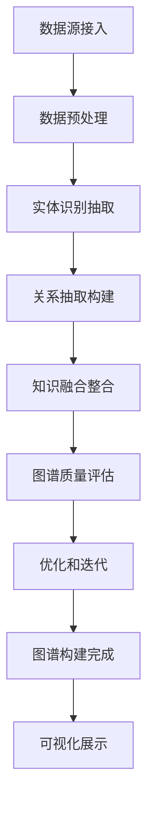
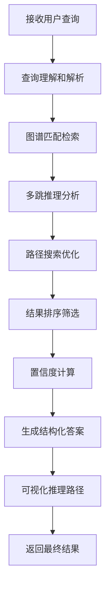

# 产品需求文档 (PRD) - Youtu GraphRAG

## 1. 项目背景与愿景

### 1.1 项目概述
- **项目名称**: Youtu GraphRAG
- **版本**: v1.0
- **创建日期**: 2025-11-03
- **最后更新**: 2025-11-03
- **项目地址**: https://github.com/TencentCloudADP/youtu-graphrag

### 1.2 问题背景
在传统RAG系统中，信息检索主要依赖向量相似度匹配，存在以下局限性：
- **缺乏深层理解**: 无法捕捉实体间的复杂关系和语义结构
- **检索精度有限**: 简单的相似度匹配难以处理复杂查询
- **可解释性不足**: 检索过程缺乏透明度和可追溯性
- **推理能力弱**: 无法进行多跳推理和复杂逻辑推理
- **知识表示零散**: 无法构建系统化的知识体系

### 1.3 产品愿景
Youtu GraphRAG 致力于将知识图谱技术与RAG深度融合，打造新一代智能检索系统，实现：
- 基于知识图谱的深层语义理解
- 多跳推理和复杂查询支持
- 高度可解释的检索过程
- 系统化的知识表示和管理
- 企业级的高性能和高可用性

### 1.4 项目范围
- **包含内容**:
  - 知识图谱自动构建和维护
  - 图神经网络检索算法
  - 多跳推理引擎
  - 可视化知识探索界面
  - 企业级部署和管理工具
  - 丰富的领域预置知识库

- **排除内容**:
  - 实时流式知识更新
  - 分布式图计算框架
  - 自定义图算法开发环境

## 2. 目标用户画像与场景

### 2.1 主要用户画像

#### 用户画像 1: 金融风控分析师
- **基本信息**: 25-45岁，银行、保险、证券等金融机构风控人员
- **技术水平**: 中等到高等，熟悉数据分析工具和业务系统
- **目标和动机**:
  - 构建全面的风险知识图谱
  - 发现潜在的风险关联和传导路径
  - 提升风险评估的准确性和效率
  - 支持复杂的风险推理和预警
- **痛点描述**:
  - 风险数据分散，缺乏关联分析
  - 传统方法难以发现复杂风险模式
  - 风险传导路径识别困难
  - 缺乏可解释的风险评估结果
- **使用场景**:
  - 企业关联风险分析
  - 反欺诈图谱构建
  - 信用风险评估
  - 监管合规分析
- **技术能力**: 熟悉SQL、Python，了解图数据库和机器学习

#### 用户画像 2: 医疗研究人员
- **基本信息**: 28-55岁，医学研究人员、临床医生、药企研发人员
- **技术水平**: 高等，深度使用医学数据库和分析工具
- **目标和动机**:
  - 构建医学知识图谱
  - 发现疾病和药物的关联关系
  - 支持精准医疗研究
  - 加速新药研发进程
- **痛点描述**:
  - 医学知识碎片化严重
  - 缺乏系统性的知识关联
  - 复杂医学推理支持不足
  - 知识更新和验证困难
- **使用场景**:
  - 疾病诊断辅助决策
  - 药物作用机制研究
  - 临床路径分析
  - 医学文献智能分析
- **技术能力**: 深度理解医学知识，熟练使用生物信息学工具

#### 用户画像 3: 企业知识管理专家
- **基本信息**: 30-50岁，大型企业KM负责人、信息架构师
- **技术水平**: 中等偏上，熟悉企业级知识管理系统
- **目标和动机**:
  - 构建企业级知识图谱
  - 提升知识发现和共享效率
  - 支持智能决策和业务创新
  - 降低知识管理成本
- **痛点描述**:
  - 企业知识孤岛严重
  - 知识关联和发现困难
  - 缺乏智能化的知识服务
  - 知识传承和创新不足
- **使用场景**:
  - 企业知识库构建
  - 专家知识图谱
  - 业务流程优化
  - 创新机会发现
- **技术能力**: 熟悉KM系统，了解图技术和AI应用

### 2.2 用户场景分析

#### 场景 1: 金融反欺诈分析
- **触发条件**: 银行需要分析可疑交易和客户关联关系
- **用户目标**: 通过知识图谱识别欺诈网络和风险传导路径
- **操作步骤**:
  1. 导入客户、账户、交易等数据
  2. 系统自动构建金融关系图谱
  3. 设置可疑节点和查询条件
  4. 执行多跳关系分析
  5. 可视化展示欺诈网络结构
  6. 生成风险报告和预警建议
- **期望结果**:
  - 识别欺诈团伙准确率>95%
  - 发现隐含关联路径>90%
  - 分析响应时间<5分钟
  - 支持百万级节点图谱分析

#### 场景 2: 医学诊断辅助
- **触发条件**: 医生需要基于患者症状和病史进行诊断
- **用户目标**: 利用医学知识图谱辅助诊断决策
- **操作步骤**:
  1. 输入患者症状和检查结果
  2. 系统在医学知识图谱中检索相关疾病
  3. 分析症状、疾病、治疗之间的关系
  4. 提供诊断建议和置信度
  5. 展示推理过程和证据链
  6. 推荐相关检查和治疗方案
- **期望结果**:
  - 诊断建议准确率>90%
  - 推理过程可解释性100%
  - 检索响应时间<3秒
  - 支持复杂疾病的多因素分析

#### 场景 3: 企业知识发现
- **触发条件**: 企业需要发现内部专家和知识的关联
- **用户目标**: 构建企业专家知识图谱，促进知识共享
- **操作步骤**:
  1. 收集员工信息、项目经验、技能数据
  2. 构建专家-技能-项目知识图谱
  3. 分析专家间的协作和知识传递关系
  4. 识别关键知识节点和潜在瓶颈
  5. 推荐知识协作和学习路径
  6. 生成知识管理优化建议
- **期望结果**:
  - 专家技能识别准确率>85%
  - 知识关联发现率>80%
  - 协作推荐有效性>75%
  - 支持千人级企业图谱

## 3. 产品目标与成功指标

### 3.1 业务目标
- **主要目标**: 成为知识图谱RAG领域的企业级解决方案领导者
- **次要目标**:
  - 推动知识图谱技术在行业的深度应用
  - 构建完整的知识图谱工具生态
  - 建立行业最佳实践和标准

### 3.2 用户目标
- **核心价值**: 让知识检索更加智能、准确、可解释
- **用户满意度**: 企业客户满意度>4.5/5.0，知识检索准确率>90%

### 3.3 成功指标 (KPIs)

#### 3.3.1 技术指标
- **图谱构建能力**: 支持千万级节点图谱
- **查询响应时间**: <3 seconds (complex queries)
- **推理准确率**: >90% (multi-hop reasoning)
- **系统可用性**: >99.9%

#### 3.3.2 业务指标
- **企业客户数**: 100+ enterprise customers
- **行业覆盖**: 10+ major industries
- **知识库规模**: 100M+ entities
- **API调用量**: 10M+ daily calls

#### 3.3.3 用户体验指标
- **图谱可视化性能**: <1 second loading
- **查询成功率**: >95%
- **用户培训时间**: <2 days
- **客户留存率**: >85%

## 4. 功能列表与优先级

### 4.1 功能优先级定义
- **P0 - 必须有**: 核心GraphRAG功能，产品价值基础
- **P1 - 应该有**: 企业级增强功能，竞争力保证
- **P2 - 可以有**: 专业化功能，行业应用扩展
- **P3 - 暂不考虑**: 未来版本考虑

### 4.2 核心功能 (P0)

#### 功能 1: 知识图谱自动构建
- **功能描述**:
  - 多源数据抽取和整合
  - 实体识别和关系抽取
  - 知识融合和冲突解决
  - 图谱质量评估和优化
- **用户价值**:
  - 自动化图谱构建流程
  - 高质量的知识表示
  - 支持多种数据源接入
- **技术要求**:
  - 先进的NLP和信息抽取技术
  - 知识融合算法
  - 图数据库优化
  - 质量评估框架
- **验收标准**:
  - 实体识别准确率>95%
  - 关系抽取准确率>90%
  - 构建速度>10K entities/minute

#### 功能 2: 图神经网络检索
- **功能描述**:
  - 基于GNN的语义检索
  - 图结构感知的相似度计算
  - 多尺度检索策略
  - 个性化检索优化
- **用户价值**:
  - 深度语义理解能力
  - 结构化的检索结果
  - 高度相关的查询返回
- **技术要求**:
  - 图神经网络模型
  - 相似度计算算法
  - 检索优化策略
  - 个性化推荐算法
- **验收标准**:
  - 检索准确率>90%
  - 响应时间<3 seconds
  - 支持复杂图查询语法

#### 功能 3: 多跳推理引擎
- **功能描述**:
  - 多步逻辑推理支持
  - 推理路径搜索和优化
  - 不确定性推理处理
  - 推理结果验证
- **用户价值**:
  - 复杂问题的深度分析
  - 可解释的推理过程
  - 高质量的推理结果
- **技术要求**:
  - 符号推理算法
  - 概率推理框架
  - 路径搜索算法
  - 知识推理验证
- **验收标准**:
  - 推理准确率>90%
  - 支持多跳推理和事实一致性
  - 多跳推理响应时间<3s
  - 支持10+步推理深度
  - 多跳推理准确率>85%

#### 功能 4: 可视化知识探索
- **功能描述**:
  - 交互式图谱可视化
  - 多层次图谱导航
  - 动态图谱分析
  - 知识洞察展示
- **用户价值**:
  - 直观的知识探索体验
  - 深度的关系分析
  - 智能的洞察发现
- **技术要求**:
  - 大规模图谱渲染
  - 交互式可视化技术
  - 动态布局算法
  - 智能分析算法
- **验收标准**:
  - 支持百万级节点可视化
  - 渲染流畅度>30fps
  - 交互响应时间<200ms

### 4.3 重要功能 (P1)

#### 功能 5: 领域知识库
- **功能描述**:
  - 行业预置知识图谱
  - 专业领域本体
  - 知识更新和维护
  - 版本管理和回滚
- **用户价值**:
  - 开箱即用的行业知识
  - 专业领域的深度支持
  - 持续的知识更新
- **技术要求**:
  - 领域专家知识整理
  - 本体工程方法
  - 知识更新机制
  - 版本控制系统
- **验收标准**:
  - 支持10+个主要行业
  - 知识覆盖率>80%
  - 更新频率：每月

#### 功能 6: 企业级部署
- **功能描述**:
  - 分布式部署支持
  - 高可用架构
  - 安全和权限控制
  - 监控和运维工具
- **用户价值**:
  - 企业级的安全保障
  - 高性能的系统能力
  - 完善的运维支持
- **技术要求**:
  - 微服务架构
  - 负载均衡和容错
  - 安全认证体系
  - 监控告警系统
- **验收标准**:
  - 支持集群部署
  - 系统可用性>99.9%
  - 安全合规性100%

### 4.4 期望功能 (P2)

#### 功能 7: 智能问答对话
- **功能描述**:
  - 基于图谱的智能问答
  - 多轮对话支持
  - 上下文理解和记忆
  - 个性化问答优化
- **用户价值**:
  - 自然的知识获取方式
  - 连续的对话体验
  - 个性化的答案服务
- **技术要求**:
  - 对话管理技术
  - 上下文建模
  - 个性化推荐
  - 自然语言生成
- **验收标准**:
  - 问答准确率>90%
  - 对话连贯性>85%
  - 支持多轮复杂对话

#### 功能 8: 知识洞察报告
- **功能描述**:
  - 自动化知识分析
  - 趋势和模式发现
  - 智能报告生成
  - 决策支持建议
- **用户价值**:
  - 深度的业务洞察
  - 自动化的分析报告
  - 智能的决策支持
- **技术要求**:
  - 数据挖掘算法
  - 模式识别技术
  - 报告生成引擎
  - 决策支持系统
- **验收标准**:
  - 洞察准确性>85%
  - 报告生成时间<5分钟
  - 建议有效性>80%

## 5. 用户流程与线框图

### 5.1 核心用户流程

#### 流程 1: 知识图谱构建流程


**流程说明**:
1. **数据源接入**: 连接各种结构化和非结构化数据源
2. **数据预处理**: 清洗、标准化和转换数据格式
3. **实体识别抽取**: 识别和抽取数据中的实体信息
4. **关系抽取构建**: 分析实体间的关系并构建图谱结构
5. **知识融合整合**: 解决冲突并融合多源知识
6. **图谱质量评估**: 评估图谱的质量和完整性
7. **优化和迭代**: 根据评估结果进行优化改进
8. **图谱构建完成**: 完成高质量的知识图谱构建
9. **可视化展示**: 提供图谱的可视化浏览和探索

#### 流程 2: 智能检索推理流程


**流程说明**:
1. **接收用户查询**: 获取用户的自然语言或结构化查询
2. **查询理解和解析**: 理解查询意图和关键信息
3. **图谱匹配检索**: 在知识图谱中匹配相关实体和关系
4. **多跳推理分析**: 执行多步推理分析深层关系
5. **路径搜索优化**: 搜索和优化推理路径
6. **结果排序筛选**: 对结果进行相关性排序和筛选
7. **置信度计算**: 计算答案的可信度和置信度
8. **生成结构化答案**: 生成结构化的答案和解释
9. **可视化推理路径**: 展示推理过程和路径
10. **返回最终结果**: 向用户返回最终答案和推理过程

### 5.2 页面线框图

#### 页面 1: 知识图谱控制台

**布局结构**:
```
┌─────────────────────────────────────────────────────────┐
│  🧠 Youtu GraphRAG   [图谱▼] [分析▼] [查询▼]  监控 [📈] │
├─────────────────────────────────────────────────────────┤
│  侧边导航栏              │        主工作区               │
│                        │                                 │
│ 🕸️ 图谱管理             │  ┌─────────────────────────┐    │
│   - 图谱列表            │  │   🧠 知识图谱概览       │    │
│   - 实体管理            │  │                         │    │
│   - 关系管理            │  │ 📊 图谱统计             │    │
│                        │  │ 节点: 1.2M  边: 8.5M    │    │
│ 🔍 智能检索             │  │ 实体类型: 156  关系: 89 │    │
│   - 图谱查询            │  │                         │    │
│   - 语义搜索            │  │ 🚀 快速操作             │    │
│   - 推理分析            │  │ [构建图谱] [数据导入]   │    │
│                        │  │ [质量检查] [智能优化]   │    │
│ 📈 分析洞察             │  │                         │    │
│   - 关系分析            │  │ 📈 系统状态             │    │
│   - 模式发现            │  │ CPU: 45%  内存: 67%     │    │
│   - 趋势预测            │  │ 查询QPS: 234  成功率: 98%│    │
│                        │  └─────────────────────────┘    │
├─────────────────────────────────────────────────────────┤
│               💡 图谱质量: 优秀  推理能力: 卓越            │
└─────────────────────────────────────────────────────────┘
```

**主要元素**:
- **导航栏**:
  - 知识图谱品牌标识
  - 核心功能模块快速访问
  - 系统监控和状态
- **侧边导航**:
  - 图谱管理功能组
  - 智能检索工具集
  - 分析洞察模块
- **主工作区**:
  - 图谱统计概览
  - 快速操作入口
  - 实时系统状态监控
- **状态指示**:
  - 图谱质量评估
  - 推理能力评级

#### 页面 2: 智能推理查询界面

**布局结构**:
```
┌─────────────────────────────────────────────────────────┐
│  ← 返回    智能推理    [高级查询] [可视化] [导出报告]     │
├─────────────────────────────────────────────────────────┤
│  查询输入区                │        结果展示区           │
│                         │                            │
│ ┌─────────────────────┐ │ ┌────────────────────────┐ │
│ │ 输入您的问题...      │ │ │ 🧠 智能推理结果        │ │
│ │                     │ │ │                        │ │
│ │ 🔍 支持复杂逻辑推理  │ │ │ 💡 核心答案           │ │
│ │ 📊 支持实体关系查询  │ │ │ 基于知识图谱的深度分析 │ │
│ └─────────────────────┘ │ │                        │ │
│                         │ │ 🔗 推理路径            │ │
│ 🎯 查询类型             │ │ A → B → C → D          │ │
│ [●] 实体查询            │ │ 置信度: 94%            │ │
│ [○] 关系查询            │ │                        │ │
│ [○] 路径查询            │ │ 📊 相关证据            │ │
│ [●] 推理查询            │ │ • 证据1 (来源: 文档A)  │ │
│                         │ │ • 证据2 (来源: 数据B)  │ │
│ ⚙️ 推理选项             │ │ • 证据3 (来源: 专家C)  │ │
│ 深度: 3跳 [────●────]   │ └────────────────────────┘ │
│ 置信度: 高 [────●────]   │                            │
│                         │ 🎯 可视化展示            │
│ 📋 查询模板             │ ┌────────────────────────┐ │
│ • 实体关联分析         │ │        图谱视图         │ │
│ • 风险传导路径         │ │   [A]──→[B]──→[C]      │ │
│ • 知识依赖关系         │ │    │       │           │ │
│                         │ │   [D]      [E]         │ │
├─────────────────────────────────────────────────────────┤
│              🚀 推理引擎: 多跳GNN  准确度: 卓越           │
└─────────────────────────────────────────────────────────┘
```

**主要元素**:
- **查询输入区**:
  - 智能查询输入框
  - 查询类型选择
  - 推理参数配置
  - 查询模板快速选择
- **结果展示区**:
  - 核心推理答案
  - 详细的推理路径
  - 支持证据展示
  - 可视化图谱视图
- **功能工具栏**:
  - 高级查询选项
  - 可视化展示切换
  - 结果导出功能

### 5.3 交互设计要点

#### 交互模式 1: 可视化图谱探索
- **触发条件**: 用户需要探索知识图谱中的关系和路径
- **操作步骤**:
  1. 在图谱视图中选择起始节点
  2. 设置探索深度和关系类型
  3. 系统动态展开相关节点和边
  4. 用户可以拖拽、缩放、筛选视图
  5. 点击节点查看详细信息
- **系统响应**:
  - 流畅的图谱动画效果
  - 实时的节点加载和渲染
  - 智能的布局优化
  - 丰富的节点信息展示
- **用户反馈**:
  - 探索效率评价
  - 可视化清晰度反馈
  - 交互流畅度评分

#### 交互模式 2: 智能推理配置
- **触发条件**: 用户需要配置复杂的推理查询
- **操作步骤**:
  1. 选择推理类型和策略
  2. 设置推理深度和约束条件
  3. 配置置信度阈值
  4. 预览推理计划
  5. 执行推理并监控进度
- **系统响应**:
  - 智能的推理建议
  - 实时的配置验证
  - 可视化的推理计划
  - 详细的执行进度
- **用户反馈**:
  - 推理准确性评价
  - 配置易用性反馈
  - 性能满意度评分

## 6. 技术要求与约束

### 6.1 技术栈

#### 图计算和存储
- **图数据库**: Neo4j, JanusGraph, TigerGraph
- **图计算框架**: Apache Giraph, GraphX, DGL
- **向量存储**: Pinecone, Weaviate, Milvus
- **关系数据库**: PostgreSQL, Oracle, MySQL

#### AI和机器学习
- **深度学习**: PyTorch, TensorFlow
- **图神经网络**: DGL, PyG (PyTorch Geometric)
- **自然语言处理**: transformers, spaCy, NLTK
- **知识图谱**: RDF, OWL, SPARQL

#### 企业级技术
- **微服务**: Spring Cloud, Kubernetes
- **消息队列**: Kafka, RabbitMQ, Redis
- **监控系统**: Prometheus, Grafana, ELK
- **安全框架**: OAuth2.0, JWT, SSL/TLS

### 6.2 性能要求
- **图谱处理能力**:
  - 节点数量: 10M+ nodes
  - 边数量: 100M+ edges
  - 查询响应: <3 seconds
  - 并发查询: 1000+ QPS
- **推理性能**:
  - 推理深度: 10+ hops
  - 推理准确率: >90%
  - 推理时间: <5 seconds
  - 并发推理: 100+ concurrent

### 6.3 兼容性要求
- **硬件要求**:
  - CPU: 64+ cores (推荐)
  - 内存: 256GB+ RAM
  - 存储: 10TB+ SSD
  - 网络: 10Gbps+ bandwidth
- **软件要求**:
  - 操作系统: Linux (RHEL, Ubuntu)
  - Java: OpenJDK 11+
  - Python: 3.8+
  - 容器: Docker 20.0+, Kubernetes 1.20+

## 7. 风险与约束

### 7.1 技术风险

#### 风险 1: 图谱构建质量
- **风险描述**: 自动构建的知识图谱质量可能不满足业务需求
- **影响程度**: 高
- **缓解措施**:
  - 多种抽取算法融合
  - 人工审核和校验机制
  - 持续的质量监控和改进
  - 领域专家知识集成

#### 风险 2: 大规模图计算性能
- **风险描述**: 大规模知识图谱的计算和查询性能可能成为瓶颈
- **影响程度**: 中
- **缓解措施**:
  - 分布式图计算架构
  - 智能图分割和索引
  - 缓存和预计算优化
  - 硬件加速和并行处理

#### 风险 3: 知识更新和一致性
- **风险描述**: 知识的动态更新可能影响图谱的一致性和准确性
- **影响程度**: 中
- **缓解措施**:
  - 增量更新机制
  - 版本控制和回滚
  - 一致性检查和修复
  - 变更影响分析

### 7.2 业务风险

#### 风险 1: 行业专业性要求高
- **风险描述**: 不同行业对知识图谱的专业性要求差异很大
- **影响程度**: 中
- **缓解措施**:
  - 分行业定制化方案
  - 领域专家合作机制
  - 可配置的本体框架
  - 行业最佳实践积累

#### 风险 2: 实施复杂度高
- **风险描述**: 企业级知识图谱实施周期长，复杂度高
- **影响程度**: 中
- **缓解措施**:
  - 分阶段实施策略
  - 标准化实施流程
  - 专业服务支持
  - 成功案例参考

### 7.3 时间约束
- **发布计划**:
  - 企业版MVP: 8个月内
  - 行业解决方案: 12个月内
  - 生态合作版: 18个月内
- **重要里程碑**:
  - Month 3: 核心图谱构建引擎
  - Month 6: GNN检索算法
  - Month 9: 多跳推理引擎
  - Month 12: 企业级部署工具
  - Month 15: 行业预置知识库
  - Month 18: 完整解决方案

## 8. 附录

### 8.1 术语表
- **知识图谱**: 用图结构表示知识和实体关系的语义网络
- **图神经网络**: 专门处理图结构数据的深度学习模型
- **多跳推理**: 通过多个中间步骤进行推理的分析方法
- **实体链接**: 将文本中的实体链接到知识图谱中的对应节点
- **关系抽取**: 从非结构化文本中自动识别和抽取实体间的关系

### 8.2 参考文档
- [Youtu GraphRAG GitHub Repository](https://github.com/TencentCloudADP/youtu-graphrag)
- [Knowledge Graph Embedding Survey](https://arxiv.org/abs/2003.00971)
- [Graph Neural Networks Review](https://arxiv.org/abs/1812.08434)
- [Knowledge Graph Construction](https://link.springer.com/book/10.1007/978-3-030-36418-4)

### 8.3 变更记录
| 版本 | 日期 | 变更内容 | 变更人 |
|------|------|----------|--------|
| v1.0 | 2025-11-03 | 初始版本，基于Youtu GraphRAG项目分析的完整PRD | Claude AI Assistant |

---

*本文档为Youtu GraphRAG项目的详细产品需求文档，专注于知识图谱与RAG技术的深度融合。Youtu GraphRAG致力于为企业客户提供基于知识图谱的智能检索解决方案，通过深度语义理解和复杂推理能力，赋能企业的数字化转型和智能化升级。*